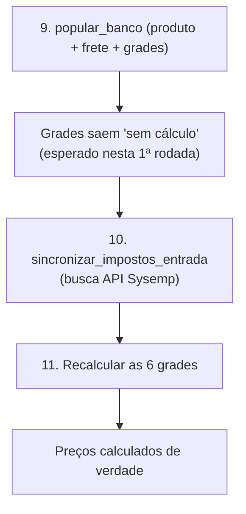

# Como Escrever Notas no Vault — Padrão Hiper-Didático

## Contexto (por que esta regra existe)

Decisão explícita do usuário (16/08/2026, 22h): a exigência de escrita didática já registrada em [[Estrutura e Convenções do Vault]] (seção "Escrita didática", 15/08/2026) não é mais suficiente — precisa ser reforçada e detalhada ao ponto de garantir, **com 100% de certeza**, que qualquer pessoa que leia uma nota entenda plenamente o que foi escrito, sem margem de dúvida nenhuma.

Isso não é preferência de estilo — é necessidade operacional, pelos mesmos 2 motivos já registrados antes (e agora elevados a padrão obrigatório, não só recomendação):

1. **O time lê o vault direto**, não só o Claude — gente que pode nunca ter visto o assunto antes.
2. **O próprio Claude depende do vault pra retomar contexto** depois de uma conversa compactada — texto vago pra humano também é texto vago pra IA.

Esta nota substitui, na prática, a antiga seção "Escrita didática" — ela continua existindo em [[Estrutura e Convenções do Vault]], mas curta, só apontando pra cá.

## O princípio central: Modo Professor

> [!important] A régua de qualidade
> Toda nota deve ser escrita como um **professor bom** explicando pra um aluno que nunca viu aquele assunto na vida — nunca como um colega experiente resumindo pra outro colega experiente. Se a explicação só faz sentido pra quem já sabe do que se trata, ela FALHOU no propósito desta nota.

Na prática, isso significa: pra qualquer afirmação, decisão, comando ou trecho de código que apareça numa nota, o texto responde — na ordem que fizer mais sentido pro caso, mas sempre respondendo as 4 — estas 4 perguntas:

| Pergunta | O que ela cobre | Exemplo de pergunta que o leitor NÃO pode ficar com vontade de fazer depois de ler |
|---|---|---|
| **O QUÊ** | O que é isso, o que aconteceu, o que este termo/campo/comando significa | "Mas o que é esse `credito_icms_entrada` afinal?" |
| **POR QUÊ** | Por que isso existe, por que essa decisão foi tomada, por que esse é o comportamento correto | "Mas por que precisa fazer isso assim?" |
| **PRA QUÊ** | Pra que serve, o que o leitor vai fazer com essa informação, qual problema ela resolve | "Ok, entendi o que é, mas pra que eu preciso saber disso?" |
| **COMO** | Como fazer/rodar/verificar na prática — passo concreto, comando literal, exemplo real | "Certo, mas como eu faço isso de verdade?" |

## As 8 regras práticas (cada uma com exemplo de ANTES × DEPOIS)

Regra sem exemplo é regra abstrata — e regra abstrata é exatamente o que esta nota existe pra proibir. Por isso, cada regra abaixo vem com um "ANTES" (do jeito vago, proibido a partir de agora) e um "DEPOIS" (do jeito exigido).

### 1. Nunca deixe um termo técnico sem explicação na primeira aparição

> [!failure] ANTES (vago)
> "O crédito de ICMS ST precisa de diferimento."

> [!success] DEPOIS (hiper-didático)
> "O crédito de **ICMS ST** (Imposto sobre Circulação de Mercadorias e Serviços, na modalidade **Substituição Tributária** — quando o fornecedor já recolhe, na sua própria nota, o imposto que seria devido na revenda futura) precisa de **diferimento**. Diferimento aqui significa: em vez de usar o valor bruto que a nota mostra, o sistema subtrai o ICMS normal do ICMS ST antes de creditar (`crédito líquido = ICMS ST − ICMS normal`). Sem essa subtração, o mesmo imposto seria creditado 2 vezes no mesmo produto."

### 2. Sempre explique o "por quê" junto do "o quê" — nunca só o "o quê"

> [!failure] ANTES
> "O comando `sincronizar_impostos_entrada` não recebe parâmetro."

> [!success] DEPOIS
> "O comando `sincronizar_impostos_entrada` não recebe parâmetro **porque ele mesmo decide o período a buscar**, sozinho — através de um registro interno chamado 'watermark', que guarda até onde a última sincronização já cobriu. Isso existe pra ninguém precisar decorar ou calcular manualmente qual data usar toda vez que for sincronizar de novo."

### 3. Nunca abrevie comando, nome de arquivo ou nome de função — sempre o nome completo, todas as vezes

> [!failure] ANTES
> "Depois, rode os 6 `calcular_grade_precificacao_*`."

> [!success] DEPOIS
> "Depois, rode os 6 comandos de grade, um de cada vez: `calcular_grade_precificacao_ml`, `calcular_grade_precificacao_tiktok`, `calcular_grade_precificacao_raia`, `calcular_grade_precificacao_amazon`, `calcular_grade_precificacao_magalu`, `calcular_grade_precificacao_shopee`."

Isso vale mesmo quando o nome é repetitivo ou já apareceu antes na mesma nota — quem está lendo pode ter pulado direto pra essa seção, sem ler o resto.

### 4. Comando pra copiar e rodar nunca fica dentro de frase — sempre em bloco de código próprio, mesmo que seja 1 linha só

> [!failure] ANTES
> "Rode o comando `python manage.py migrate` pra recriar o schema, depois rode `python manage.py iniciar_banco` pra popular a semente."

> [!success] DEPOIS
> "Rode o comando abaixo pra recriar o schema:
>
> ```bash
> python manage.py migrate
> ```
>
> Depois, rode este outro pra popular a semente:
>
> ```bash
> python manage.py iniciar_banco
> ```"

**Por quê**: crase simples (`` `assim` ``) é pra **citar** um nome dentro do texto corrido — variável, campo, nome de comando sendo mencionado de passagem, sem intenção de que o leitor copie dali. Um bloco de código (` ``` `) é totalmente diferente visualmente: fonte maior, monoespaçada, com fundo destacado e (dependendo do tema do Obsidian) botão de copiar — isolado do parágrafo, fácil de bater o olho e achar em segundos numa leitura corrida. Comando que o leitor vai **executar de verdade** sempre merece esse destaque, mesmo que seja só 1 linha — nunca fica escondido dentro de uma frase longa, ao lado de outras 3-4 informações.

### 5. Dê exemplo concreto sempre que a explicação for abstrata

Número real, produto real (nome + EAN, se aplicável), arquivo real, valor real — nunca "um produto qualquer" ou "um valor X" quando existe um exemplo de verdade disponível.

> [!failure] ANTES
> "Se o produto for de Substituição Tributária, o crédito de ICMS vira negativo quando o ICMS normal é maior que o ICMS ST."

> [!success] DEPOIS
> "Exemplo real (K-430, EAN `7908050700174`, NF 99851): ICMS ST veio R$ 91,64 e ICMS normal veio R$ 158,55. Crédito líquido = 91,64 − 158,55 = **−R$ 66,91** (bruto) → −R$ 13,382 por unidade (dividido por 5 unidades da nota). O crédito negativo está correto aqui — ele reduz o FIXO da fórmula, e é exatamente o comportamento esperado pra esse tipo de produto."

### 6. Use tabela sempre que houver 3 ou mais itens comparáveis lado a lado

Texto corrido listando "produto A tem X, produto B tem Y, produto C tem Z" é mais difícil de comparar visualmente do que uma tabela. Regra prática: **3 ou mais itens com os mesmos campos → vira tabela.**

### 7. Use 100% dos recursos do Obsidian — não só texto corrido

O Obsidian lê Markdown estendido — a maioria das notas do vault usa só uma fração pequena do que está disponível. A partir de agora, use o recurso certo pra cada situação:

| Recurso | Quando usar | Sintaxe |
|---|---|---|
| **Tabela** | Comparar 3+ itens com os mesmos campos | `\| Coluna \| Coluna \|` |
| **Negrito** | Destacar SÓ a palavra/frase-chave da frase — nunca o parágrafo inteiro | `**palavra-chave**` |
| **Crase simples (inline)** | Citar um nome de passagem dentro da frase — variável, campo, arquivo, comando sendo mencionado (não pra copiar/rodar) | `` `nome_do_campo` `` |
| **Bloco de código** | Qualquer comando que o leitor vai copiar e rodar de verdade — sempre isolado, nunca dentro de frase (ver Regra 4) | ` ```bash ` (ou a linguagem certa) seguido do comando, e ` ``` ` pra fechar |
| **Callout** | Destacar aviso, armadilha, dica ou exemplo sem quebrar o fluxo do texto | `> [!warning] Título` (ver tipos abaixo) |
| **Diagrama Mermaid** | Fluxo, sequência, dependência entre passos/comandos/decisões | ` ```mermaid ` — Obsidian renderiza nativo, sem plugin |
| **SVG cru** | Ilustração livre que o Mermaid não desenha bem (layout de tela, posição física) | `<svg>...</svg>` direto no corpo da nota |
| **Citação de fonte** | Toda afirmação sobre o código real | "arquivo `X.py`, função `Y()`, linha Z" — nunca "o sistema faz X" sem dizer onde |

Tipos de callout mais úteis pra este vault (existem mais, mas estes cobrem a maioria dos casos):

```
> [!info] Contexto ou explicação neutra
> [!tip] Sugestão ou atalho útil
> [!warning] Armadilha real, algo que já deu problema antes
> [!danger] Risco sério — pode quebrar produção/perder dado
> [!example] Exemplo concreto, número real
> [!success] Comportamento correto confirmado
> [!failure] Comportamento errado ou jeito proibido de fazer
> [!question] Dúvida em aberto, ainda sem resposta
```

**Exemplo de diagrama Mermaid** (versão simplificada do mesmo diagrama que já está na nota [[Guia de Setup - Do Zero ao Primeiro Preco Calculado]], mostrando a ordem dos passos finais e o ponto onde depende da API do Sysemp):



**Exemplo de SVG cru** (ilustração simples, só pra mostrar a sintaxe — um selo de "validado" que poderia ser usado numa nota de descoberta confirmada):

```svg
<svg viewBox="0 0 120 40" xmlns="http://www.w3.org/2000/svg">
  <rect x="1" y="1" width="118" height="38" rx="6" fill="none" stroke="currentColor" stroke-width="2"/>
  <text x="60" y="25" text-anchor="middle" font-size="14" fill="currentColor">✅ Validado</text>
</svg>
```

### 8. Feche com um exemplo prático de ponta a ponta, sempre que a nota descrever um processo

Não basta explicar "como" em abstrato — sempre que der, rode o processo inteiro 1 vez com dado real (ou mostre o resultado de quando já foi rodado), do início ao fim, e deixe esse rastro registrado na nota. É a diferença entre "explicar a receita" e "mostrar o prato pronto".

## Checklist de verificação — antes de considerar a nota pronta

Antes de terminar qualquer nota (ou editar uma existente), confirme, item por item:

- [ ] Alguém que **nunca viu esse assunto** entenderia sem precisar perguntar nada depois?
- [ ] Todo termo técnico foi explicado (ou linkado via `[[wikilink]]`) na **primeira vez** que apareceu?
- [ ] Toda instrução/decisão tem o **por quê** junto, não só o **o quê**?
- [ ] Tem pelo menos **1 exemplo concreto** (número, produto, arquivo, comando real — não hipotético)?
- [ ] Usei tabela, negrito, bloco de código, callout, diagrama ou SVG onde isso ajuda mais que texto corrido?
- [ ] Toda afirmação sobre o código cita o **arquivo real** (nunca "o sistema faz X" solto, sem fonte)?
- [ ] Nenhum comando ou nome de arquivo/função ficou abreviado com `*`, "etc." ou "e os outros"?
- [ ] Todo comando pra copiar/rodar está em bloco de código próprio (` ``` `) — nenhum escondido dentro de frase, só com crase simples?

Se qualquer item acima ficar "não", a nota não está pronta — não é sobre gastar mais palavras, é sobre não deixar nenhuma pergunta óbvia sem resposta escrita ali mesmo.

## Relacionado

- [[Estrutura e Convenções do Vault]]
- [[Guia de Setup - Do Zero ao Primeiro Preco Calculado]]
- [[Aviso Proativo Para Notas no Obsidian]]
