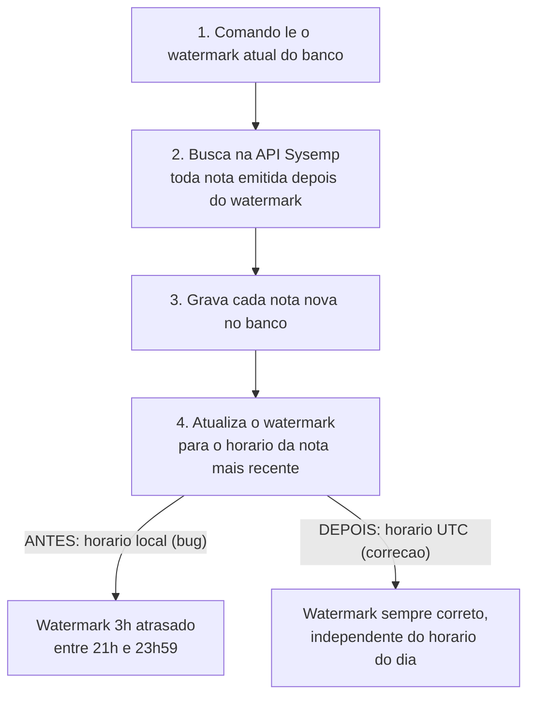

# Exemplo — Bug Conhecido (Modelo de Demonstração)

**Resumo**: o comando `sincronizar_impostos_entrada` gravava o horário local do servidor em vez de UTC no watermark de sincronização (ver [[Exemplo — Conceito (Modelo de Demonstracao)]]), fazendo notas fiscais da última hora do dia serem importadas em duplicidade. A correção foi trocar `datetime.now()` por `datetime.now(timezone.utc)` em `_atualizar_watermark()`.

> [!warning] Isto é uma nota-modelo, não um bug real
> Criada em 29/08/2026, movida e revisada em 30/08/2026 pra dentro de `Modelos_Referencia_de_Escrita/Exemplos_Ilustrativos/` (antes vivia solta na raiz do vault). Só pra mostrar como fica o padrão hiper-didático seguindo o [[Modelo de Escrita — Arco de Resolucao (Decisao, Descoberta, Bug Conhecido, Duvida)|modelo de arco de resolução]]. O bug descrito abaixo é fictício, inventado só pra ter conteúdo técnico real (Sysemp, ICMS, watermark) pra ilustrar cada regra — e serve de base pro conceito de watermark em [[Exemplo — Conceito (Modelo de Demonstracao)]] e pra história de cache usada nos outros 7 exemplos da pasta.

> [!success] CORRIGIDO em 29/08/2026 — este é o callout de status obrigatório
> **O quê**: o comando `sincronizar_impostos_entrada` estava recalculando o **watermark** (o registro interno que guarda até onde a última sincronização já cobriu — ver definição completa em [[Exemplo — Conceito (Modelo de Demonstracao)]]) usando o fuso horário local do servidor em vez de UTC — fazia notas fiscais emitidas na última hora do dia serem buscadas 2 vezes seguidas.
> **Onde foi corrigido**: função `_atualizar_watermark()`, arquivo `sysemp/services/sincronizacao.py`, linha 84 (ver seção "Correção" abaixo).
> Esta nota continua existindo como registro do bug e da correção — não é mais um problema em aberto. Isso é exatamente o que o modelo de arco de resolução propõe: qualquer pessoa (ou o Claude, depois de uma compactação) lê isto em 5 segundos e já sabe o estado atual, sem precisar abrir o frontmatter ou ler a nota inteira.

## Contexto

O comando `sincronizar_impostos_entrada` busca, na API do **Sysemp** (o ERP que registra as notas fiscais de entrada da empresa), todas as notas emitidas desde a última vez que essa busca rodou. Pra saber "desde quando" buscar, ele não pergunta pro usuário toda vez — ele lê o watermark, guardado no banco, que registra o horário exato da nota fiscal mais recente já importada.

## O problema

Notas fiscais emitidas entre 21h e 23h59 (horário de Brasília) estavam sendo importadas 2 vezes — apareciam duplicadas no banco depois de 2 rodadas seguidas do comando, mesmo sem nenhuma nota fiscal nova ter sido emitida entre elas.

## O que levou à correção — o raciocínio até a causa raiz

1. **Descartada a hipótese de atraso de rede/processamento**: se fosse isso, a diferença entre o watermark gravado e o horário real da nota mais recente variaria a cada rodada (às vezes 10 segundos, às vezes 2 minutos). Comparando os logs de 3 rodadas diferentes, a diferença foi sempre **exatamente 3 horas** — valor fixo, não variável. Diferença fixa aponta pra deslocamento de fuso horário, não pra lentidão.
2. **Descartado o horário de verão**: 3 horas é o deslocamento de `America/Sao_Paulo` (UTC−3) o ano inteiro desde que o Brasil aboliu horário de verão em 2019 — não havia mudança sazonal envolvida, então a causa tinha que estar em código, não em configuração de calendário.
3. **Isolado no código**: com as 2 hipóteses acima descartadas, a única fonte de um deslocamento fixo de 3 horas é o próprio fuso horário usado ao gravar a data. Abrindo `sysemp/services/sincronizacao.py`, a função `_atualizar_watermark()` (linha 84) confirmou a suspeita: usava `datetime.now()` (hora local do servidor) em vez de `datetime.now(timezone.utc)` (hora em UTC, o padrão que todo outro campo de data/hora do sistema já usa).

## A correção

Antes (errado):

```python
def _atualizar_watermark(self, nota_mais_recente):
    self.watermark = datetime.now()
    self.save()
```

Depois (corrigido):

```python
def _atualizar_watermark(self, nota_mais_recente):
    self.watermark = datetime.now(timezone.utc)
    self.save()
```

**Por quê UTC e não só ajustar o fuso**: todo outro campo de data/hora do sistema (criação de registro, log, atualização de nota) já é gravado em UTC — usar horário local aqui criaria uma segunda convenção de fuso dentro do mesmo banco, e o dado deixaria de ter fonte única confiável (mesma regra de [[Integridade e Fonte Unica de Dado]]).

Fluxo completo, do jeito que fica depois da correção:



## Exemplo de ponta a ponta

Rodando o comando abaixo depois da correção, às 23h50 (horário de Brasília):

```bash
python manage.py sincronizar_impostos_entrada
```

O watermark gravado passou a ser exatamente `02:50` do dia seguinte em UTC — batendo com o horário real da nota mais recente. Rodando de novo 10 minutos depois, nenhuma nota fiscal antiga foi reimportada.

## Relacionado

- [[Modelo de Escrita — Arco de Resolucao (Decisao, Descoberta, Bug Conhecido, Duvida)]]
- [[Exemplo — Conceito (Modelo de Demonstracao)]]
- [[Fluxo Decomposicao de Problemas em Micro Etapas]] — mesma lógica de quebrar um problema grande em micro-etapas, aplicada aqui à estrutura da nota (cada seção = 1 pergunta), não só ao código.
- [[Integridade e Fonte Unica de Dado]]
