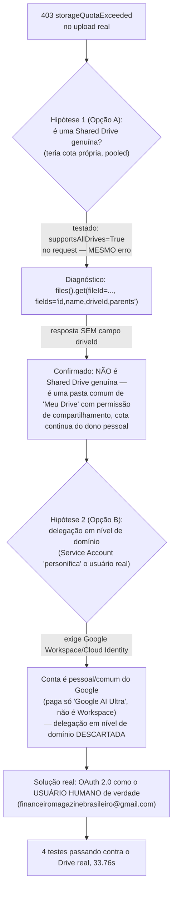

# Service Account Não Tem Cota Própria no Drive — Upload Real Exige OAuth Como Usuário Real

## Contexto

**O QUÊ**: ao implementar `enviar_arquivo()` (ver [[Checkpoint - Portal do Drive (Upload Manual de Video Real pra Marca-EAN-Videos)]]) e rodar o teste de Nível 5 contra o Google Drive real pela primeira vez, os 3 testes que faziam upload de conteúdo real falharam todos com o mesmo erro:

```
HttpError 403 storageQuotaExceeded
```

O teste de pastas (`buscar_ou_criar_subpasta`) continuava passando normalmente, com a mesma credencial. Essa diferença — pasta funciona, arquivo não — foi a pista que levou à causa raiz.

**POR QUÊ isso importa pra qualquer 1 lendo esta nota no futuro**: este projeto usa uma **Service Account** (conta de serviço do Google, sem dono humano, autenticada via arquivo JSON — `GOOGLE_DRIVE_CREDENCIAIS_JSON`) pra tudo que é LEITURA no Drive. A tentação natural, ao ver esse erro, é pensar "falta permissão" — mas a Service Account já tinha permissão de **Editor** (ler e escrever) na pasta. O problema não era permissão. Era outra coisa, mais sutil, explicada abaixo.

## A distinção central: permissão ≠ cota de armazenamento

**O QUÊ é "cota de armazenamento" (storage quota)**: todo espaço usado no Google Drive — cada byte de cada arquivo — precisa ser contado contra a cota de armazenamento de **alguma conta**. Toda conta Google (pessoal ou de serviço) tem um limite de bytes que pode "possuir".

**A regra da plataforma Google, que não depende de nenhuma configuração do projeto**: uma **Service Account nunca tem bytes de cota de armazenamento próprios — ela sempre tem 0 bytes, permanentemente**. Isso não é um limite temporário nem um bug — é assim que o produto Google Drive funciona pra esse tipo de conta, e nenhuma permissão concedida a ela muda esse número.

**Por que "criar pasta" funcionava mas "subir arquivo" não**:

| Ação | O que acontece por trás | Custa bytes de cota? |
|---|---|---|
| `buscar_ou_criar_subpasta()` — criar uma pasta | Cria só um registro de **metadado** (nome, tipo "pasta", quem é o pai) — uma pasta no Google Drive não tem "conteúdo" próprio, só existe como uma entrada organizacional. | **Não.** Por isso sempre funcionou, mesmo com a Service Account tendo 0 bytes de cota. |
| `mover_para_usados()` — mover um arquivo já existente | Troca só o campo "pai" (`parents`) do arquivo — os bytes do arquivo continuam exatamente os mesmos de antes, só a localização lógica dele muda. | **Não.** Nenhum byte novo é criado — por isso "mover" sempre funcionou. |
| `enviar_arquivo()` — subir um arquivo NOVO ou substituir conteúdo | Cria bytes novos que precisam ser contados contra a cota de armazenamento de alguém. | **Sim.** E como a Service Account tem 0 bytes de cota disponível, a chamada falha, não importa quanta permissão de Editor ela tenha na pasta. |

> [!example] A pergunta que o próprio usuário fez, e a resposta direta
> "ele consegue mover arquivos, deveria conseguir fazer upload também" — a intuição está certa sobre a permissão (a Service Account pode fazer as 2 coisas, permissão-falando), mas **mover não cria bytes novos e upload cria**. É a mesma diferença entre reorganizar pastas no seu computador (grátis, não usa mais espaço em disco) e copiar um arquivo novo pra dentro dele (usa espaço em disco de verdade). A "cota" de que o erro fala é sobre o 2º caso, nunca sobre permissão de acesso.

## Caminho de diagnóstico até a causa raiz (na ordem real em que foi investigado)



### Hipótese 1 — talvez seja uma "Shared Drive" (Drive Compartilhado) de verdade

Uma **Shared Drive** (também chamada de "Drive Compartilhado" ou "Team Drive") é um recurso **diferente** de uma pasta comum dentro do "Meu Drive" de alguém — ela tem sua própria cota de armazenamento, compartilhada entre todos os membros, e aparece na barra lateral do Google Drive sob "Drives compartilhados". Se a pasta raiz do projeto fosse uma Shared Drive genuína, ela teria cota própria, e o problema de 0-bytes-da-Service-Account nem entraria em jogo.

Foi adicionado `supportsAllDrives=True` (e `includeItemsFromAllDrives=True` em toda chamada de listagem) em todo o pacote `drive/` — parâmetros que o Google Drive API v3 exige pra qualquer operação tocar conteúdo de uma Shared Drive genuína. Só que o erro **continuou idêntico**, mesmo com o parâmetro confirmado na URL da requisição real (`...&supportsAllDrives=true&...` visível no traceback) — a 1ª pista de que a pasta talvez não fosse uma Shared Drive de verdade.

O teste definitivo veio de uma chamada direta:

```python
info = servico.files().get(
    fileId='1GT_lYwKVmrcxPS7wRqI_uZghsczvcK_X',
    fields='id,name,driveId,parents',
    supportsAllDrives=True,
).execute()
```

Resultado real:

```python
{'id': '1GT_lYwKVmrcxPS7wRqI_uZghsczvcK_X', 'name': 'MAGAZINE (ESTRUTURADA)', 'parents': ['16DUFdptScqBgKnBQddGwAGmZ7A5mftYr']}
```

**A ausência da chave `driveId`** na resposta é a prova — uma Shared Drive genuína sempre devolve esse campo. Como ele não veio, "MAGAZINE (ESTRUTURADA)" é confirmado como uma pasta comum dentro do "Meu Drive" de uma conta pessoal, só com permissão de compartilhamento concedida à Service Account — a cota continua sendo a cota pessoal do dono da pasta, nunca uma cota própria e independente.

### Hipótese 2 — delegação em nível de domínio (Domain-Wide Delegation)

Se a conta do projeto fosse uma conta do **Google Workspace** (antigo G Suite — o produto pago de empresa, com um administrador central em `admin.google.com`), existiria um recurso chamado **delegação em nível de domínio**: o administrador autoriza, 1 vez, que a Service Account "personifique" qualquer usuário real da organização (parâmetro `subject=` nas credenciais) — e aí toda operação passaria a contar contra a cota daquele usuário real, resolvendo o problema.

Essa opção foi **descartada** depois de confirmado com o usuário que a conta do Google usada aqui é uma **conta pessoal/comum** ("conta comum do Google, a única diferença é que pagamos o plano Ultra do Google AI") — delegação em nível de domínio é um recurso **exclusivo de contas Google Workspace/Cloud Identity**, não existe pra conta pessoal (`@gmail.com`). A tela de login em `admin.google.com`, ao tentar configurar isso, mostrou exatamente esse aviso pra conta `financeiromagazinebrasileiro@gmail.com`: "use uma conta de administrador em um serviço gerenciado".

### A solução real — OAuth 2.0 como o usuário humano de verdade

Com as 2 primeiras hipóteses descartadas, a solução correta pra uma conta pessoal é a autenticação OAuth 2.0 padrão do tipo "aplicativo instalado" — o mesmo fluxo que qualquer app pede quando mostra "Fazer login com o Google": o usuário humano de verdade (`financeiromagazinebrasileiro@gmail.com`, confirmado como o dono real da pasta "MAGAZINE (ESTRUTURADA)") autoriza o acesso **1 vez**, apertando "Permitir" numa tela do próprio Google — e a partir daí toda operação de escrita conta contra a cota **dele**, que é uma conta de verdade, com cota de armazenamento de verdade.

## Como foi implementado — passo a passo real

### 1. `agenda_videos/funcoes_auxiliares/drive/cliente.py` — novo caminho de autenticação só pra escrita

A leitura (`obter_servico_drive()`) continua usando a Service Account, sem nenhuma mudança. Só a escrita ganhou um caminho novo:

```python
from google.auth.transport.requests import Request as RequisicaoAtualizacaoToken
from google.oauth2.credentials import Credentials as CredenciaisOAuth

def obter_servico_drive_escrita():
    credenciais = CredenciaisOAuth.from_authorized_user_file(
        settings.GOOGLE_DRIVE_OAUTH_TOKEN_JSON, scopes=SCOPES_ESCRITA,
    )
    if credenciais.expired and credenciais.refresh_token:
        credenciais.refresh(RequisicaoAtualizacaoToken())
        with open(settings.GOOGLE_DRIVE_OAUTH_TOKEN_JSON, 'w') as arquivo_token:
            arquivo_token.write(credenciais.to_json())
    return build('drive', 'v3', credentials=credenciais)
```

O bloco `if credenciais.expired...` é o que torna isso indefinidamente reutilizável sem precisar autorizar de novo toda vez: o token de acesso (curta duração) expira sozinho, mas o **token de atualização** (`refresh_token`, de longa duração) permite pedir um token de acesso novo automaticamente — e o resultado é salvo de volta no mesmo arquivo, pra próxima vez já vir pronto.

### 2. `projeto_sistema_interno_mb_sv/settings.py` — 2 variáveis novas

```python
GOOGLE_DRIVE_OAUTH_CLIENT_SECRET_JSON = os.getenv('GOOGLE_DRIVE_OAUTH_CLIENT_SECRET_JSON')
GOOGLE_DRIVE_OAUTH_TOKEN_JSON = os.getenv('GOOGLE_DRIVE_OAUTH_TOKEN_JSON')
```

A 1ª aponta pro arquivo baixado do Google Cloud Console (identifica QUAL aplicativo está pedindo autorização). A 2ª aponta pra onde o token de atualização fica salvo depois da autorização — no computador do usuário, em `C:\Users\Win10\Desktop\CODIGOS\Github\Credenciais GOOGLE\token_drive_escrita.json`.

### 3. `autorizar_drive_oauth.py` (raiz do projeto) — ferramenta de (re)autorização, permanente

Diferente do script de correção de teste desta mesma sessão (que era descartável, rodado 1 vez e apagado), este script **fica guardado no projeto pra sempre** — é a ferramenta que qualquer 1 precisa rodar de novo se o token algum dia for revogado ou expirar de vez:

```python
import os, sys
import django
sys.path.insert(0, os.path.dirname(os.path.abspath(__file__)))
os.environ.setdefault('DJANGO_SETTINGS_MODULE', 'projeto_sistema_interno_mb_sv.settings')
django.setup()
from django.conf import settings
from google_auth_oauthlib.flow import InstalledAppFlow

SCOPES_ESCRITA = ['https://www.googleapis.com/auth/drive']

def main():
    fluxo = InstalledAppFlow.from_client_secrets_file(settings.GOOGLE_DRIVE_OAUTH_CLIENT_SECRET_JSON, SCOPES_ESCRITA)
    credenciais = fluxo.run_local_server(port=0)
    with open(settings.GOOGLE_DRIVE_OAUTH_TOKEN_JSON, 'w') as arquivo_token:
        arquivo_token.write(credenciais.to_json())
    print(f'Token salvo em {settings.GOOGLE_DRIVE_OAUTH_TOKEN_JSON}.')

if __name__ == '__main__':
    main()
```

**Como rodar** (pra quem precisar refazer isso no futuro):

```bash
python autorizar_drive_oauth.py
```

Isso abre uma aba do navegador pedindo login Google e a tela de permissão — depois de clicar "Permitir", o navegador mostra "The authentication flow has completed. You may close this window." e o terminal confirma o caminho onde o token foi salvo.

### 4. Configuração feita no Google Cloud Console (passo manual, 1 vez só)

| Passo | O que fazer | Armadilha real encontrada |
|---|---|---|
| 1 | Criar um Client ID OAuth (tipo "App para computador") em APIs e Serviços → Credenciais | Antes de criar, o Google exige configurar a "tela de consentimento" (hoje chamada "Google Auth Platform" na interface nova) — wizard com 4 passos: Informações do app → Público → Dados de contato → Concluir. |
| 2 | Baixar o JSON do client secret gerado | — |
| 3 | Adicionar `financeiromagazinebrasileiro@gmail.com` na lista de "Usuários de teste", dentro de "Público" | **Sem isso, a autorização falha com `Erro 403: access_denied`** — mesmo sendo a conta dona do próprio projeto no Google Cloud, ela precisa estar EXPLICITAMENTE nessa lista enquanto o app estiver em modo "Teste" (não publicado). |

> [!warning] Ponto não confirmado — sinalizado explicitamente por falha da ferramenta de busca
> Existe uma recomendação (de conhecimento geral, **não confirmada por pesquisa na web nesta sessão** — as 2 tentativas de busca falharam com erro de proxy) de que tokens de atualização gerados enquanto o app OAuth está em modo "Teste" podem expirar sozinhos depois de 7 dias, e que publicar o app pra "Em produção" (sem precisar da verificação formal do Google pra uso de pequena escala) evita essa expiração. Como isso não pôde ser verificado numa fonte atual, trate como algo a confirmar se o token parar de funcionar sozinho depois de uma semana — não como fato garantido.

## Resultado final — validado com dado real

```
Results (33.76s): 4 passed
```

Os 4 testes de `test_nivel_5__drive_escrita.py` passaram contra o Google Drive real, criando e substituindo arquivos de verdade dentro da pasta-sandbox `_teste_automatizado`. O usuário confirmou, olhando o navegador com a pasta de teste aberta, que as **pastas** apareceram — o arquivo em si não apareceu na mesma tela porque o navegador não atualiza a listagem sozinho (precisa recarregar a página), não porque o upload falhou.

## Tabela-resumo: Service Account × OAuth como usuário real

| Aspecto | Service Account (usada pra LEITURA) | OAuth como usuário real (usada só pra ESCRITA) |
|---|---|---|
| Cota própria de armazenamento | Sempre 0 bytes — regra da plataforma, não configurável | Cota normal de uma conta Google real |
| Precisa de interação humana pra autorizar | Não — arquivo JSON de credencial, sem tela de login | Sim, 1 vez (depois disso, renovação automática via `refresh_token`) |
| Funciona em conta pessoal/comum do Google | Sim, pra leitura | Sim — é justamente o caminho certo pra conta pessoal |
| Exige Google Workspace | Não | Não |
| Onde mora a credencial | `GOOGLE_DRIVE_CREDENCIAIS_JSON` | `GOOGLE_DRIVE_OAUTH_TOKEN_JSON` (+ `GOOGLE_DRIVE_OAUTH_CLIENT_SECRET_JSON` pra reautorizar) |

## Checklist desta nota

- [x] Explica o termo técnico (Service Account, Shared Drive, delegação em nível de domínio, OAuth) na 1ª aparição.
- [x] Todo passo tem o porquê, não só o o quê.
- [x] Exemplo concreto real (ID de pasta, resposta de API sem `driveId`, e-mail real da conta).
- [x] Tabela comparando os 2 caminhos de autenticação.
- [x] Diagrama Mermaid mostrando a cadeia de diagnóstico.
- [x] Sinaliza explicitamente o único ponto não verificado por pesquisa (expiração de token em modo Teste), em vez de apresentar como fato certo.
- [x] Fecha com o resultado real (4 passed) e a explicação de por que o navegador não mostrou o arquivo.

## Relacionado

- [[Checkpoint - Portal do Drive (Upload Manual de Video Real pra Marca-EAN-Videos)]]
- [[Padrao de Robustez para Clientes de API Externa]]
- [[Convencao de Nomenclatura de Arquivos no Drive]]
