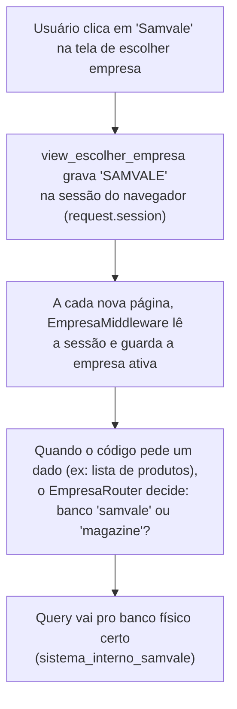

# Checkpoint — Implementação de Suporte Permanente a 2 Empresas (Roteamento por Sessão)

> [!success] Resultado desta noite (17/08/2026)
> O sistema saiu de "só funciona pra 1 empresa por vez, com truque manual" para "2 bancos completamente separados, escolhidos com 1 clique, rodando ao mesmo tempo, sem gambiarra nenhuma". As 2 empresas (Magazine Brasileiro e Samvale) já foram testadas de ponta a ponta com dado real: banco criado do zero, populado, e com os impostos de entrada sincronizados de verdade contra a API do Sysemp — pros 2 bancos, isolados um do outro.

## Contexto — por que isso começou hoje à noite

Durante o dia (17/08), no escritório, o superior do usuário pediu com urgência: "Preciso dessa planilha das 2 empresas hoje." O problema: **o sistema nunca foi construído pensando em 2 empresas ao mesmo tempo**. Até esta noite, sempre que era preciso trabalhar com a Samvale (a 2ª empresa, além da Magazine Brasileiro), a solução era manual e temporária — criar um banco de dados chamado `sistema_interno_sv_temp`, trocar variável de ambiente na mão, comentar/descomentar bloco de código, rodar o processo, e depois desfazer tudo. Esse jeito de trabalhar está documentado em [[Tutorial - Gerar Relatorio de Impostos de Entrada da Samvale (SV) em Banco Temporario]].

Essa dúvida maior — "como o sistema vai suportar as 2 empresas rodando de verdade, ao mesmo tempo, sem solução descartável" — já vinha se acumulando havia dias, registrada em [[Suporte a Multiplas Empresas MB e SV Rodando em Paralelo]]. Até hoje à noite, ela já tinha aparecido **5 vezes**, cada vez resolvida de um jeito manual e diferente (token da API do Sysemp, contas do Mercado Livre, arquivo de cadastro de produto do ERP, e até o próprio endereço de rede da API do Sysemp — ver [[Sysemp Usa Instancia Numerada Diferente por Empresa (MB e SV) — Causa Raiz do Metodo Nao Localizado]]). O padrão que se repetia era sempre o mesmo: "isso funciona pra 1 empresa, mas quebra se alguém tentar usar a outra ao mesmo tempo."

> [!info] Dado importante sobre esta sessão
> Antes de começar o trabalho de hoje à noite, o usuário apagou de propósito os 2 bancos de dados MySQL que existiam nesta máquina (a de casa) — pra não misturar dado sujo/antigo com a arquitetura nova. Tudo que está descrito abaixo foi construído e testado **100% do zero**, não é uma migração de um banco antigo.

## O que foi decidido: 1 sistema só, com um "seletor de empresa"

**O quê**: em vez de ter 2 sistemas separados (1 pra Magazine, outro pra Samvale), o sistema continua sendo **1 processo Django só**, rodando num endereço fixo (ex: `10.0.0.169:8000`, que nunca muda). O que muda é: cada pessoa que acessa esse mesmo endereço escolhe, numa tela simples, qual empresa quer usar — e a partir daí, essa pessoa só vê e só grava dado daquela empresa, até escolher trocar.

**Por quê**: antes de fechar essa decisão, o usuário pediu explicitamente pra não escolher a 1ª ideia sem comparar outras (ver o histórico completo da conversa desta noite). Foram avaliadas 4 alternativas:

| Alternativa | Como funcionaria | Por que foi descartada (ou não) |
|---|---|---|
| 2 processos Django em portas diferentes (ex: `:8000` e `:4000`) | Cada empresa teria seu próprio endereço | Quebra a exigência de "1 link único e fixo" — o usuário precisaria decorar 2 endereços diferentes, ou colocar um "hub" na frente pra esconder isso, o que só move o problema pra outro lugar, sem ganho real de isolamento. |
| Login + escolha de empresa (padrão do Sysemp) | A pessoa loga e escolhe a empresa, parecido com o app do Sysemp | **Escolhida**, com a variação abaixo (sem exigir senha real por enquanto). |
| Botão "trocar empresa" no canto da tela | Mesmo link, botão sempre visível pra trocar rapidamente | **Escolhida também** — é a mesma ideia da linha de cima, só que sem precisar de tela de login separada. |
| Hub único na frente de 2 servidores separados | Um "meio de campo" decide pra qual dos 2 servidores mandar a requisição | Tecnicamente parecido com a solução escolhida, mas mais complexo de manter — o hub teria exatamente a mesma responsabilidade que o Router do Django já resolve nativamente (ver seção técnica abaixo), só que reimplementada à mão. |

A combinação final foi: **1 tela simples pra escolher/trocar empresa** + **um selo (badge) fixo, sempre visível em toda tela**, mostrando bem grande "MAGAZINE BRASILEIRO" ou "SAMVALE" — pra nunca haver dúvida de qual empresa está ativa no momento.

**Pra quê**: isso resolve o problema real de hoje (gerar relatório de 2 empresas rapidamente) e também serve pra tudo que já existe hoje no sistema (cadastro de produto, precificação, agenda de vídeos) — sem precisar reescrever nada disso, só ensinar o sistema a saber "de qual empresa é este dado agora".

**Como (por baixo dos panos)**: o mecanismo técnico que faz isso funcionar chama-se **Database Router** — um recurso nativo do Django (não é invenção deste projeto) que decide, a cada operação no banco de dados, para qual banco físico aquela operação deve ir. A validade técnica desse padrão foi conferida contra 2 fontes externas antes de ser aplicada: a [documentação oficial do Django sobre múltiplos bancos](https://docs.djangoproject.com/en/5.2/topics/db/multi-db/) e o [guia da Microsoft sobre modelos de arquitetura multi-tenant](https://learn.microsoft.com/en-us/azure/architecture/guide/multitenant/considerations/tenancy-models) — o modelo escolhido corresponde exatamente ao padrão chamado "Horizontally partitioned deployments" (1 camada de aplicação compartilhada, 1 banco de dados dedicado por cliente/empresa).

O fluxo completo, do clique do usuário até o banco de dados certo, funciona assim:



**Termos técnicos usados acima, explicados**:
- **Sessão do navegador** (`request.session`): um espaço de armazenamento que o Django já oferece nativamente, ligado a um cookie no navegador da pessoa. Cada navegador (ou cada perfil/aba anônima diferente) tem sua própria sessão, independente — é exatamente esse mecanismo que garante que 2 pessoas diferentes (ou a mesma pessoa em 2 abas anônimas) possam usar empresas diferentes ao mesmo tempo, sem 1 interferir na outra.
- **Middleware**: um pedaço de código que roda automaticamente em toda requisição, antes da página ser mostrada. Neste projeto, o middleware novo (`EmpresaMiddleware`) roda logo no início de cada requisição e "avisa o resto do sistema" qual é a empresa ativa daquela sessão.
- **Database Router**: outro pedaço de código, também um recurso nativo do Django, que é consultado toda vez que o sistema precisa ler ou gravar algo no banco de dados. Ele responde "usa o banco X" — e o Django obedece, sem o resto do código precisar saber nada sobre isso.

## Nomes decididos (Fase A)

| Item | Valor |
|---|---|
| Banco de dados MySQL — Magazine | `sistema_interno_magazine` |
| Banco de dados MySQL — Samvale | `sistema_interno_samvale` |
| Apelido interno do Django (`DATABASES`) — Magazine | `magazine` |
| Apelido interno do Django (`DATABASES`) — Samvale | `samvale` |
| Valor fixo usado em sessão, `--empresa` e no selo da tela | `MAGAZINE` / `SAMVALE` |

## Checklist de execução — status final

| Fase | O que envolve | Status |
|---|---|---|
| **A — Decisões rápidas** | Nomes de banco, apelido e valores de empresa fechados. | ✅ Concluída |
| **B — Peça central** | `settings.py`, Database Router, middleware, tela de escolher/trocar empresa, selo fixo no template. | ✅ Concluída |
| **C — Comandos de terminal** | Base reaproveitável (`ComandoComEmpresa`) exigindo `--empresa` em todo comando que mexe em dado de 1 empresa só. | ✅ Concluída |
| **D — Arquivo/credencial por empresa** | Relatório do ERP e token/URL do Sysemp resolvidos sozinhos, sem comentar/descomentar nada à mão. | ✅ Concluída |
| **E — Rodar os 2 bancos do zero** | `migrate`, `iniciar_banco`, `popular_banco`, `sincronizar_impostos_entrada`, `createsuperuser` — pros 2 bancos. | ✅ Concluída (os 2 bancos populados e com impostos sincronizados de verdade) |
| **F — Validar** | Badge, troca de empresa, F5 mantendo a empresa, 2 perfis de navegador simultâneos, comando sem `--empresa` barrando. | ✅ Concluída (todos os testes abaixo confirmados) |
| **G — Vault** | Fechar a dúvida antiga como resolvida, aposentar o tutorial de banco temporário. | ✅ Concluída — [[Suporte a Multiplas Empresas MB e SV Rodando em Paralelo]] marcada como `resolvida`, [[Tutorial - Gerar Relatorio de Impostos de Entrada da Samvale (SV) em Banco Temporario]] marcada como `obsoleta`, e o [[Guia de Setup - Do Zero ao Primeiro Preco Calculado]] reescrito com os comandos `--empresa`/`--database` novos. |

## Bugs reais encontrados e corrigidos hoje

Esta seção documenta cada problema real que apareceu durante a implementação — não são problemas hipotéticos, são erros de verdade que aconteceram testando o sistema, junto da causa raiz e da correção aplicada. Ler esta seção evita repetir o mesmo erro caso uma peça parecida seja construída no futuro.

### Bug 1 — a sessão "esquecia" a empresa escolhida a cada F5

> [!danger] Sintoma observado
> Escolher "Samvale" funcionava na hora — o selo mudava certinho. Mas ao apertar F5 ou navegar pra outra tela, o selo voltava sozinho pra "Magazine", como se a escolha nunca tivesse acontecido.

**Por que aconteceu (causa raiz)**: o Database Router criado na Fase B (arquivo `core/database_router.py`) foi desenhado, no primeiro rascunho, pra decidir o banco de **qualquer** operação — inclusive a tabela de sessão do próprio Django (`django_session`, que é onde a escolha "Samvale" fica gravada). Isso criou uma referência circular: pra saber em qual banco procurar a sessão, o sistema perguntava ao Router "qual banco usar?" — e o Router respondia com base na empresa ativa, que é justamente o dado que ainda não tinha sido lido da sessão. Resultado: a sessão era gravada num banco (o que estava ativo ANTES da troca) e lida de outro (o que ficou ativo DEPOIS) — sessão nunca encontrada, sistema criava uma sessão vazia nova, e a empresa voltava pro valor padrão (Magazine).

**Como foi corrigido**: o `EmpresaRouter` (arquivo `core/database_router.py`) passou a ter uma lista de exceção — apps de infraestrutura do próprio Django (`sessions`, `admin`, `contenttypes`, `auth`) nunca são divididos por empresa, ficam sempre no mesmo banco (`default`, que aponta pra `magazine`). Só os dados de negócio de verdade (Produto, impostos, agenda de vídeos, etc.) são roteados por empresa.

> [!example] Efeito colateral esperado, não é bug
> Como a tabela de usuários (`auth_user`) agora também está na lista de exceção, existe **1 pool de usuários só**, compartilhado entre as 2 empresas — não existe hoje um `teste_magazine` e um `teste_samvale` completamente separados. Isso bateu de frente com um teste real: um usuário criado com `python manage.py createsuperuser --database=samvale` nunca conseguia logar, porque o login sempre lê a tabela de usuários do banco `magazine`. A correção prática foi simples: criar o usuário sempre com `--database=magazine` (ou sem informar `--database` nenhum, já que esse é o valor padrão), independente de qual empresa a pessoa pretende usar depois. Login por empresa de verdade continua sendo um objetivo pro futuro, não desta rodada.

### Bug 2 — `migrate` quebrava numa migração antiga, só ao rodar num banco 100% vazio

> [!danger] Sintoma observado
> Rodar `python manage.py migrate --database=samvale` num banco recém-criado (vazio) quebrava com o erro `OperationalError: Unknown column 'agenda_videos_configuracaofase.quantidade_postagens'`, numa migração antiga (`agenda_videos/migrations/0009_preparacaovideofase_quantidade_no_clique.py`) que nunca tinha dado esse problema antes.

**Por que aconteceu (causa raiz)**: essa migração antiga tem um trecho de código (chamado "migração de dados", ou `RunPython`) que lê um campo chamado `quantidade_postagens` de dentro do banco, usando o ORM do Django (`ConfiguracaoFase.objects.all()`) sem dizer explicitamente qual dos 2 bancos usar. Antes de hoje, isso nunca foi problema, porque só existia 1 banco (`default`). A partir do momento em que o Router da Fase B entrou em ação, essa leitura sem banco explícito passou a ser decidida pelo Router — e, durante o `migrate --database=samvale`, o Router (por não ter nenhuma sessão web ativa naquele momento) direcionava essa leitura específica pro banco `magazine`, que já estava com a estrutura mais avançada (o campo já tinha sido removido lá por uma migração posterior) — daí o erro de "coluna desconhecida".

**Como foi corrigido**: o trecho da migração (arquivo `agenda_videos/migrations/0009_preparacaovideofase_quantidade_no_clique.py`) passou a dizer explicitamente qual banco usar, através do método `.using(schema_editor.connection.alias)` — travando a leitura no banco que está sendo migrado naquele momento, não importa o que o Router decida.

### Bug 3 — comandos de terminal sempre mexiam no banco errado, sem avisar

**O quê**: comandos como `popular_banco` e `sincronizar_impostos_entrada`, rodados direto no terminal (fora de uma sessão web), não tinham nenhum jeito de saber qual das 2 empresas usar.

**Por quê**: diferente de uma sessão de navegador, um comando de terminal não passa por nenhum middleware — então não existia, antes de hoje, nenhum "avisador" da empresa ativa.

**Como foi corrigido**: foi criada uma classe base reaproveitável, `ComandoComEmpresa` (arquivo novo `core/management/commands/_base_empresa.py`), que exige um parâmetro `--empresa`, sem valor padrão — digitar errado ou esquecer já barra o comando antes dele rodar. Essa base foi aplicada em todos os comandos que mexem em dado de 1 empresa só:

```bash
python manage.py popular_banco --empresa=MAGAZINE
python manage.py iniciar_banco --empresa=SAMVALE
python manage.py sincronizar_impostos_entrada --empresa=MAGAZINE
```

Comandos afetados: `popular_banco`, `iniciar_banco`, `sincronizar_impostos_entrada`, `reprocessar_impostos_entrada_de_json`, `reprocessar_impostos_entrada_do_bruto` (este último quase ficou de fora — só foi lembrado numa auditoria extra, por tocar nos mesmos arquivos json do Sysemp), e os 6 comandos de grade de precificação: `calcular_grade_precificacao_ml`, `calcular_grade_precificacao_tiktok`, `calcular_grade_precificacao_raia`, `calcular_grade_precificacao_amazon`, `calcular_grade_precificacao_magalu`, `calcular_grade_precificacao_shopee`.

### Bug 4 — o relatório do ERP e o Sysemp exigiam comentar/descomentar código à mão

**O quê**: pra importar o cadastro de produto da Samvale, o arquivo `core/management/commands/popular_banco_suporte/importar_produtos_erp.py` exigia comentar a linha da Magazine e descomentar a linha da Samvale, na mão, antes de rodar — e depois desfazer isso na mão de novo. O mesmo valia pro token e endereço da API do Sysemp (arquivo `api_sysemp/__init__.py`), que precisavam ser sobrescritos manualmente por variável de ambiente a cada chamada.

**Por que isso era um risco real**: é fácil esquecer de desfazer o comentário depois de usar — e aí o próximo uso "normal" (Magazine) silenciosamente usaria o arquivo ou o token errado, sem nenhum aviso.

**Como foi corrigido**: os 2 pontos agora resolvem a empresa sozinhos, a partir da mesma "empresa ativa" que o Router já usa — nenhum comentar/descomentar nunca mais:
- `importar_produtos_erp.py` — o caminho do arquivo do ERP (Ativos/Inativos) é escolhido automaticamente com base em `--empresa`.
- `api_sysemp/__init__.py` — o token (`MB_SYSEMP_API_TOKEN` / `SV_SYSEMP_API_TOKEN`, já existentes no `.env`) e o endereço da API (`https://api.sysemp.com.br/61` pra Magazine, `/84` pra Samvale) são escolhidos automaticamente, mesmo padrão.

### Bug 5 — os arquivos json de retorno da API do Sysemp eram compartilhados entre as 2 empresas

**O quê**: o arquivo `integracao_sysemp/servicos/arquivos_retorno_api.py` sempre salvava os 4 arquivos json de retorno da API (o "bruto", o "filtrado", as "notas mais recentes por produto" e os "erros") numa única pasta fixa, sem separação por empresa.

**Por quê isso era grave**: rodar `sincronizar_impostos_entrada --empresa=MAGAZINE` e depois `--empresa=SAMVALE` sobrescreveria o json da Magazine com o da Samvale — inclusive o "bruto", que é exatamente o dado mais caro de recuperar de novo (cada chamada à API do Sysemp é lenta e tem custo). Esse problema foi encontrado **antes** de gastar qualquer chamada real, porque o usuário pediu explicitamente pra conferir isolamento de arquivo em disco antes de rodar a sincronização de verdade — checagem que se mostrou necessária.

**Como foi corrigido**: os jsons agora são salvos numa subpasta por empresa: `integracao_sysemp/retorno_api/dados_impostos_xml_entrada/magazine/` e `.../samvale/`, mantendo compatibilidade total com os testes automatizados existentes (que redirecionam a pasta base pra uma pasta temporária e não usam empresa nenhuma — nesse caso, o sistema cai de volta no comportamento antigo, sem subpasta, sem quebrar nada).

## Melhoria extra: log de sincronização mais completo e informativo

Durante a validação, o usuário observou que o log do comando `sincronizar_impostos_entrada` mostrava pouca informação (só "buscando página X, total Y") — sem mostrar de qual período os dados estavam sendo buscados, nem um resumo claro no final. Isso foi reformulado usando a biblioteca `rich` (já usada no projeto), sem inventar nenhum dado novo — só passou a **mostrar** informação que já existia, mas nunca tinha sido exibida.

> [!example] Antes × Depois (dado real da sincronização da Magazine, 17/08/2026)
> **Antes**: `⠹ Buscando na API — página 82 (+100, total 8200) 0:01:21` — sem contexto nenhum sobre datas ou completude.
>
> **Depois**:
> ```text
> Empresa MAGAZINE
> Nenhuma sincronização anterior registrada — primeira carga.
> Buscando agora: 01/05/2020 → 17/08/2026
>
>                CFOPs mantidos no filtro
> ┏━━━━━━━┳━━━━━━━━━━━━━━━━━━━━━━━━━━━━━━━━━━━━━┳━━━━━━━┓
> ┃ CFOP  ┃ Descrição                           ┃ Notas ┃
> ┡━━━━━━━╇━━━━━━━━━━━━━━━━━━━━━━━━━━━━━━━━━━━━━╇━━━━━━━┩
> │ 1.102 │ Compra p/ revenda — mesmo estado    │  9953 │
> │ 2.102 │ Compra p/ revenda — outro estado    │  8017 │
> │ 1.403 │ Compra p/ revenda ST — mesmo estado │   407 │
> │ 2.403 │ Compra p/ revenda ST — outro estado │    50 │
> └───────┴─────────────────────────────────────┴───────┘
>
> ╭──────────── Sincronização concluída — MAGAZINE ────────────╮
> │ Selecionados        3692                                   │
> │ Sincronizados       1027                                   │
> │ Sem produto no ERP  2665                                   │
> │ Com erro               0                                   │
> ╰──────────────────────────────────────────────────────────────╯
> ```

Arquivos alterados: `integracao_sysemp/servicos/filtro_cfop.py` (nova função `contar_por_cfop`), `integracao_sysemp/servicos/orquestrador.py` (novo parâmetro `informar_pagina` e novo campo `contagem_por_cfop`), `integracao_sysemp/management/commands/sincronizar_impostos_entrada.py` (reescrito, usando `rich.panel.Panel` e `rich.table.Table`).

## Validação final — resultado real, com dado real

Os 2 bancos foram testados de ponta a ponta, do zero, nesta ordem, pras 2 empresas:

```bash
python manage.py migrate --database=magazine
python manage.py migrate --database=samvale
python manage.py iniciar_banco --empresa=MAGAZINE
python manage.py popular_banco --empresa=MAGAZINE
python manage.py sincronizar_impostos_entrada --empresa=MAGAZINE
python manage.py iniciar_banco --empresa=SAMVALE
python manage.py popular_banco --empresa=SAMVALE
python manage.py sincronizar_impostos_entrada --empresa=SAMVALE
```

Resultado real da sincronização de impostos de entrada, comparando as 2 empresas lado a lado:

| Métrica | Magazine | Samvale |
|---|---|---|
| Notas brutas buscadas na API | 8.200 (aprox., mesma ordem de grandeza) | 8.200 |
| Produtos selecionados | 3.692 | 3.586 |
| Produtos sincronizados com sucesso | 1.027 | 518 |
| Sem produto correspondente no ERP | 2.665 | 3.068 |
| Com erro | 0 | 0 |

> [!question] "Sem produto correspondente" é bug?
> Não — foi investigado e explicado. O comando `importar_produtos_erp` só processa o relatório de produtos **Ativos** do ERP no momento (decisão do próprio usuário, tomada hoje mais cedo, registrada em comentário no código, arquivo `core/management/commands/popular_banco_suporte/importar_produtos_erp.py`, método `rodar_importacao_completa`). Como o histórico de notas fiscais buscado vai desde 2020, é esperado que boa parte aponte pra produtos já descontinuados no ERP (portanto "Inativos", nunca importados) — daí a taxa alta e parecida nas 2 empresas.

Rodar o mesmo comando de novo, sem nenhum dado novo a buscar, também foi testado e se comportou corretamente (idempotência confirmada):

```text
$ python manage.py sincronizar_impostos_entrada --empresa=MAGAZINE
Empresa MAGAZINE
Cobertura atual no banco: 01/05/2020 → 17/08/2026
Dados já atualizados — nada a fazer.
```

Os demais testes da Fase F também foram confirmados: badge trocando corretamente, F5 mantendo a empresa escolhida (depois do Bug 1 corrigido), 2 perfis de navegador anônimos usando empresas diferentes ao mesmo tempo sem interferência, e comando de terminal sem `--empresa` barrando com erro claro (`the following arguments are required: --empresa`) em vez de rodar silenciosamente no banco errado.

## Estado atual (17/08/2026, 23:20)

Todas as 7 fases (A a G) concluídas. O objetivo do dia — "2 bancos independentes rodando sem gambiarras, hoje" — foi alcançado por completo: arquitetura implementada, validada com dado real nos 2 bancos, e a documentação do vault inteira (este checkpoint, a dúvida antiga, e os 2 tutoriais afetados) atualizada no mesmo padrão Hiper-Didático.

## Relacionado

- [[Suporte a Multiplas Empresas MB e SV Rodando em Paralelo]]
- [[Sysemp Usa Instancia Numerada Diferente por Empresa (MB e SV) — Causa Raiz do Metodo Nao Localizado]]
- [[Contexto Geral - Retomada em Outro Computador (Sysemp Multi-Empresa e Relatorio Fiscal Samvale)]]
- [[Tutorial - Gerar Relatorio de Impostos de Entrada da Samvale (SV) em Banco Temporario]]
- [[Migracao da API do Mercado Livre com Suporte a Multiplas Contas (MB e SV)]]
- [[Como Escrever Notas no Vault — Padrao Hiper-Didatico]]
