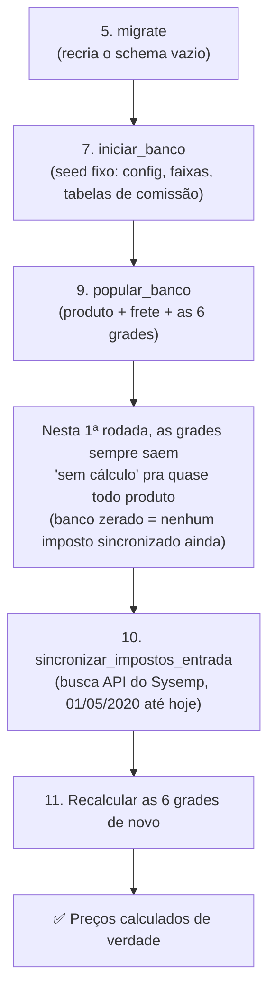

# Guia de Setup — Do Zero ao Primeiro Preço Calculado

## Contexto

Passo a passo completo, do zero absoluto (máquina nova, banco vazio) até o estado real "produtos do ERP importados + impostos de entrada do Sysemp sincronizados + preço calculado de verdade pros 6 marketplaces". Motivado originalmente pelo onboarding de Cauã e Lucas (15/08/2026) — mesmo caminho que Matheus percorreu e validou.

> [!info] Esta nota fundiu 2 notas que existiam separadas (16/08/2026, 23h55)
> Existia um "Guia de Setup" (15/08) cobrindo do clone do repositório até `sincronizar_impostos_entrada`, e um "Ordem de Comandos Para Reconstruir o Banco do Zero" (16/08) cobrindo só a parte de banco/precificação, com um passo a mais que o guia antigo não tinha: recalcular as grades depois de sincronizar o imposto. As 2 notas tinham sobreposição de conteúdo e, pior, o guia antigo terminava dizendo "sistema pronto pro uso normal" sem esse passo final — informação errada, corrigida aqui. As 2 notas originais foram apagadas depois da fusão; esta é a única fonte de verdade sobre este assunto a partir de agora.

**Se o banco já existe e só precisa re-sincronizar o imposto** (não é um setup do zero), pule direto pro Passo 10.

## Pré-requisitos (instalar antes de qualquer passo)

| Software | Versão | Por quê |
|---|---|---|
| Python | 3.12 a 3.15 | Exigido em `pyproject.toml` (`requires-python`) |
| Poetry | qualquer versão recente | Gerenciador de dependência do projeto — não usa `pip install -r requirements.txt` |
| MySQL Server | rodando localmente, acessível | Banco real do projeto (`settings.py` usa `django.db.backends.mysql`) |
| Git | qualquer versão | Clonar o repositório |

## Passo 1 — Clonar o repositório

```bash
git clone https://github.com/MatheusAp-MB/Projeto_Sistema_Interno_V2
cd Projeto_Sistema_Interno_V2
git checkout dev
```

A branch de trabalho é sempre `dev` — nunca desenvolver direto em `main`/`master`.

## Passo 2 — Instalar as dependências

```bash
poetry install
```

Lê `pyproject.toml`/`poetry.lock` e monta um ambiente virtual próprio com todas as bibliotecas do projeto (Django, pandas, openpyxl, mysqlclient, rich, etc.). Não precisa criar/ativar `venv` manualmente — o Poetry cuida disso. Todo comando depois deste passo roda prefixado com `poetry run` (ou dentro de `poetry shell`).

## Passo 3 — Colocar o arquivo `.env`

O `.env` **nunca vem do git** — está no `.gitignore` de propósito, porque carrega segredo real (senha de banco, token de API). Matheus envia esse arquivo por chat; salva na raiz do projeto, no mesmo nível do `manage.py`.

Variáveis que o arquivo contém (nomes, não os valores — os valores reais só existem no `.env` que Matheus te mandar):

| Variável | Pra que serve |
|---|---|
| `SECRET_KEY` | Chave interna do Django (segurança de sessão/CSRF) |
| `DEBUG` | `True` só em desenvolvimento, nunca em produção |
| `ALLOWED_HOSTS` | Hosts que o Django aceita servir (padrão: `127.0.0.1,localhost`) |
| `AGENTE_TOKEN` | Autentica o agente local (`agente_local/`) contra a API do Django |
| `DB_NAME` / `DB_USER` / `DB_PASSWORD` / `DB_HOST` / `DB_PORT` | Credenciais do MySQL |
| `GOOGLE_DRIVE_CREDENCIAIS_JSON` / `GOOGLE_DRIVE_PASTA_RAIZ_ID` | Acesso ao Google Drive (Agenda de Vídeos) |
| Token(s) de API do Sysemp / Mercado Livre | Nome exato conforme o `.env` que você recebeu |

## Passo 4 — Criar o banco de dados MySQL

```sql
CREATE DATABASE <valor de DB_NAME no seu .env> CHARACTER SET utf8mb4 COLLATE utf8mb4_unicode_ci;
```

O projeto usa `utf8mb4` de propósito (suporte completo a acento e caractere especial do português, ver comentário em `settings.py`) — nunca criar com `utf8` puro.

## Passo 5 — Rodar as migrações

```bash
poetry run python manage.py migrate
```

O que este comando faz: recria todas as tabelas do banco (a estrutura, as colunas), a partir do histórico de migrations de cada app — é só o "esqueleto" do banco, sem nenhum dado dentro ainda. Precisa rodar antes de qualquer comando que grave dado (todos os passos seguintes dependem disso).

## Passo 6 (opcional, recomendado) — Criar um usuário admin

```bash
poetry run python manage.py createsuperuser
```

Permite logar em `/admin/` e inspecionar/editar dado direto pela interface do Django — útil pra conferir visualmente se cada passo abaixo gravou o que devia, sem precisar abrir o MySQL na mão.

## Passo 7 — Seed inicial (dado fixo do sistema)

```bash
poetry run python manage.py iniciar_banco
```

Não depende de nenhum arquivo externo — só popula dado fixo, que não muda com o tempo e só precisa existir 1 vez: Marketplaces, Critérios de Qualidade, Configuração Operacional (os campos `fator_coleta` — percentual usado no cálculo de custo de coleta do produto — e `período_armazenagem` — quantos dias de estoque parado entram na conta de custo de armazenagem) + as 4 Faixas de Armazenagem, Configuração do Mercado Livre (Clássico/Premium), Tabela de Comissão Shopee, Tabela de Comissão TikTok, Taxa de Kg Adicional Amazon, e a Régua de Fases da Agenda de Vídeos (esse último item não tem relação com a precificação, mas está dentro do mesmo comando). Roda 1 única vez por banco (setup, não rotina) — mas é seguro rodar de novo se precisar, porque usa `get_or_create` em cada item (verifica se já existe antes de criar, nunca duplica).

> [!tip] Não é esquecimento
> As configurações da Amazon, Magalu, Shopee, TikTok e Raia (comissão, frete padrão/fixo, taxa de unidade) **não aparecem** neste comando — cada uma se cria sozinha, com valor padrão, na primeira vez que qualquer fórmula de precificação chamar `.obter()`. É assim que foi projetado, não precisa se preocupar em "esquecer" de seedar essas 5.

## Passo 8 — Conseguir os 6 arquivos externos

Nenhum desses arquivos vem do `git clone` — as 2 pastas onde eles moram são propositalmente ignoradas pelo git (dado real de negócio nunca é versionado). Receba os 6 arquivos de Matheus (chat, Drive, etc.) e salve exatamente nos caminhos abaixo, com o nome exatamente como está escrito — o código busca por nome de arquivo fixo, não por "qualquer .xlsx que estiver na pasta".

### Grupo A — Cadastro de Produtos do ERP (2 arquivos, dado que muda com frequência)

Pasta: `Arquivos usados para Popular Banco/Produtos ERP/`

- `Relatorio_Todos_Produtos_Ativos_Tela_Cadastro_Produtos_ERP_MB.xlsx`
- `Relatorio_Todos_Produtos_Inativos_Tela_Cadastro_Produtos_ERP_MB.xlsx`

Vêm da tela "Cadastro de Produtos" do Sysemp, exportados 1x pra cada status (Ativo/Inativo). O sistema lê a coluna `Inativo` de cada linha (`T`=inativo, `F`=ativo) pra decidir o status real do produto — o nome do arquivo em si é só organização, quem manda é a coluna.

Colunas que o código espera encontrar (nomes exatos, confirmados em `importar_produtos_erp.py`):

`Codigo Auxiliar`, `Codigo de Barras`, `Detalhes do Produto`, `Codigo do Fabricante`, `Categoria`, `Marca` (aparece 2x na planilha — nome legível e ID numérico interno; o sistema já distingue sozinho pelo tipo do valor), `ncm`, `Estoque`, `Custo`, `Inativo`, `Altura`, `Largura`, `Comprimento`, `Peso Bruto`, `Embalagem Altura`, `Embalagem Largura`, `Embalagem Comprimento`, `Emablagem Peso` (sim, com esse erro de digitação — é assim que vem do ERP de verdade, não corrigir manualmente), `URL 1`, `Ultima Compra`, `dt_cadastro`.

**Se um desses 2 arquivos faltar:** `popular_banco` quebra com erro de arquivo não encontrado — esta etapa não tem proteção hoje (diferente do Grupo B abaixo). Linha sem `Codigo de Barras` é descartada (contada no relatório final, nunca ignorada silenciosamente).

### Grupo B — Tabelas de Frete (4 arquivos, referência manual, muda raramente)

Pasta: `Arquivos_de_Importação/`

| Arquivo | Estrutura |
|---|---|
| `Tabela_Frete_ML.xlsx` | Matriz peso × faixa de preço (29 linhas × 8 colunas de preço; peso mín/máx nas colunas 10/11) |
| `Tabela_Frete_Magalu.xlsx` | Peso × faixa de reputação. A=label (ignorada), B=`<92%`, C=`92-97%`, D=`>97%`, E=peso mínimo (sempre preenchido, inclusive na última faixa), F=peso máximo (vazio de verdade na última faixa, sem teto) |
| `Tabela_Frete_TikTok.xlsx` | Peso × valor único, sem faixa de reputação. A=label, B=valor médio, C=peso mínimo, D=peso máximo |
| `Tabela_Frete_Amazon.xlsx` | 2 abas nomeadas exatamente `Frete Amazon_DBA` e `Frete Amazon_FBA` (o tipo vem do NOME DA ABA, não de coluna). Colunas: A=peso mínimo, B=peso máximo, C=preço mínimo, D=preço máximo, E=valor |

Essas 4 são planilhas mantidas manualmente (não são exportação de tela do Sysemp) — normalmente já existem de uma vez anterior, só precisam ser repassadas.

**Se um desses 4 faltar:** `popular_banco` **não quebra** — o código já verifica se o arquivo existe antes de tentar ler; se não existir, só imprime `[FRETE <X>] Arquivo ... não encontrado — pulando essa etapa` e segue pras próximas. Diferença real e importante em relação ao Grupo A.

## Passo 9 — Popular o banco com dado real (1ª tentativa das grades)

```bash
poetry run python manage.py popular_banco
```

Roda em sequência: Produtos ERP → Indicadores da Agenda de Vídeos → 4 tabelas de frete → organizar/comparar a dimensão de envio (as medidas físicas — altura/largura/comprimento/peso — que definem em qual faixa de frete cada produto cai) → as 6 grades de precificação (ML, Magalu, Raia, Shopee, TikTok, Amazon) → recomendação final de precificação (qual marketplace/preço o sistema sugere como melhor opção pra cada produto). Demora alguns minutos, dependendo do tamanho das planilhas. Gera log completo em `logs/popular_banco_<timestamp>.log`, além do que aparece no terminal.

Ao final, o terminal mostra quantos produtos foram criados/atualizados, quantas linhas sem EAN foram descartadas, e quantas dimensões de embalagem vieram fisicamente absurdas do ERP — isso é esperado (o sistema reporta pra corrigir na origem, nunca inventa ou corrige sozinho, ver [[Sistema Espelha Dado Bruto do ERP Mesmo Quando E Fisicamente Absurdo]]).

Visão geral do que falta depois deste passo, antes do preço sair calculado de verdade:



> [!warning] Vai acontecer nesta 1ª rodada — e é esperado, não é erro
> Como nenhum produto ainda tem imposto de entrada sincronizado neste momento, as 6 grades calculadas aqui dentro (que rodam automaticamente como parte do `popular_banco`, através dos mesmos 6 comandos que aparecem individualmente no Passo 11 — `calcular_grade_precificacao_ml`, `calcular_grade_precificacao_tiktok`, `calcular_grade_precificacao_raia`, `calcular_grade_precificacao_amazon`, `calcular_grade_precificacao_magalu`, `calcular_grade_precificacao_shopee`) vão sair com a imensa maioria (ou 100%) dos produtos em "sem cálculo possível". Isso acontece porque a fórmula de precificação **se recusa de propósito** a calcular preço sem `impostos_entrada` — é uma decisão de projeto, não uma falha (ver [[Migracao da Precificacao Real para Usar Impostos de Entrada Validados]]). O Passo 11, mais abaixo, resolve isso.

## Passo 10 — Sincronizar os impostos de entrada do Sysemp

```bash
poetry run python manage.py sincronizar_impostos_entrada
```

O que este comando faz: busca o manifesto de notas fiscais de entrada direto da API do Sysemp e grava o crédito fiscal (ICMS, ICMS ST, IPI, PIS, COFINS) por produto, vinculando pelo EAN a um `Produto` já existente — por isso a **ordem importa: só rodar depois do Passo 9**; se o banco de produtos ainda estiver vazio, quase tudo cai em "sem correspondência" à toa.

Não tem nenhum parâmetro pra passar: o próprio comando decide o período a buscar sozinho, através de um registro interno chamado "watermark" (guarda até onde a última sincronização já cobriu — ver [[Sincronizacao Incremental com Watermark para Manifesto de Notas de Entrada]]). Como o banco está zerado, não existe watermark ainda — então, só nesta primeira vez, ele busca **desde 01/05/2020 até hoje**, de uma vez só (essa data mínima é fixa no código, é o início do dado fiscal útil pro sistema). Sincronizações seguintes são incrementais (só a janela nova) e muito mais rápidas.

> [!danger] Este é, de longe, o passo mais demorado — mas o tempo real já foi medido
> O cliente da API do Sysemp usa um **throttle fixo de 1 segundo entre cada chamada** (proteção deliberada contra sobrecarregar a API — ver [[Padrao de Protecao do Cliente Sysemp (Throttle Backoff Sem Circuit Breaker)]]). Buscar mais de 6 anos de manifesto (01/05/2020 até hoje), página por página, é bem mais lento que as sincronizações incrementais do dia a dia. Validado em produção (15/08/2026): **entre 4 e 8 minutos**, dependendo da API do Sysemp no momento. Não travou se demorar dentro dessa faixa — é esperado. Não tem como acelerar sem mexer no throttle, e o throttle é proteção deliberada, não deve ser desligado nem reduzido.

Ao final, o terminal mostra: produtos selecionados, sincronizados, sem correspondência, e com erro. Uma proporção relevante de "sem correspondência" é esperada hoje — ver [[Orquestracao da Sincronizacao de Impostos de Entrada via XML]] pra entender por quê (hipótese em validação: item de uso/consumo do Sysemp, ex: combustível, que nunca vira Produto de catálogo).

## Passo 11 — Recalcular as 6 grades de novo (agora com o imposto já sincronizado)

```bash
poetry run python manage.py calcular_grade_precificacao_ml
poetry run python manage.py calcular_grade_precificacao_tiktok
poetry run python manage.py calcular_grade_precificacao_raia
poetry run python manage.py calcular_grade_precificacao_amazon
poetry run python manage.py calcular_grade_precificacao_magalu
poetry run python manage.py calcular_grade_precificacao_shopee
```

O que estes comandos fazem: recalculam, um por um, o preço de cada marketplace — agora usando os produtos que já têm `impostos_entrada` sincronizado pelo Passo 10. Este é o passo que faltava no guia antigo, e é o motivo de "sistema pronto pro uso normal" ser uma afirmação incompleta sem ele — sem este passo, o preço salvo continua sendo o calculado no Passo 9 (majoritariamente "sem cálculo").

> [!tip] Alternativa mais simples, só que mais lenta
> Rodar `popular_banco` de novo (o mesmo comando do Passo 9) também funciona — ele reprocessa tudo, incluindo produto e frete, então chega no mesmo resultado. É só mais lento, porque refaz trabalho que já tinha sido feito no Passo 9.

## Estado final esperado

Banco criado e migrado, seed inicial populado, produtos do ERP importados, frete/dimensão calculados, impostos de entrada do Sysemp sincronizados, **e as 6 grades de precificação recalculadas com esse imposto** — os preços que o sistema mostra já são reais, não placeholders. Continuar vendo uma fatia pequena de produtos em "sem cálculo possível" depois do Passo 11 é normal (margem genuinamente inatingível pra aquele produto/faixa de frete) — não indica erro. O que não pode mais acontecer, depois do Passo 11, é a **maioria** dos produtos ficar sem cálculo por falta de imposto sincronizado.

## Por que a ordem do Passo 10 → Passo 11 importa (e por que não é automático)

`sincronizar_impostos_entrada` (passo 10) e os 6 comandos de grade — `calcular_grade_precificacao_ml`, `calcular_grade_precificacao_tiktok`, `calcular_grade_precificacao_raia`, `calcular_grade_precificacao_amazon`, `calcular_grade_precificacao_magalu`, `calcular_grade_precificacao_shopee` (passo 11) — são comandos **completamente independentes entre si**: nenhum dos 2 chama o outro, e não existe nenhum gatilho automático ligando um ao outro.

`sincronizar_impostos_entrada` só atualiza a tabela `impostos_entrada` (`ImpostosECustosXMLEntradaProduto`, 1 linha por produto). Se, depois disso, ninguém rodar os 6 comandos de grade de novo, o preço salvo continua sendo o preço **antigo**, calculado com o imposto de antes — mesmo com o dado fiscal já atualizado no banco. Isso vale pras 6 tabelas de resultado, uma por marketplace: `GradePrecificacaoML`, `GradePrecificacaoTiktok`, `GradePrecificacaoRaia`, `GradePrecificacaoAmazon`, `GradePrecificacaoMagalu` e `GradePrecificacaoShopee`. Não existe um sinal de "isso mudou, recalcula" — é sempre 2 passos manuais, na ordem certa.

**Ou seja, a garantia de sincronia não é automática hoje — é operacional**: toda vez que quiser os preços refletindo o imposto mais recente (seja amanhã, seja daqui a 15 dias), a rotina é sempre a mesma — primeiro `sincronizar_impostos_entrada`, depois os 6 comandos de grade do Passo 11 (executados um de cada vez — ou `popular_banco` inteiro, que já roda os 6 dentro dele). Rodar só um dos 2 passos deixa o sistema com dado parcialmente desatualizado, sem nenhum aviso.

> [!question] Melhoria futura possível, não implementada hoje
> Ligar os 2 comandos automaticamente — por exemplo, `popular_banco` chamar `sincronizar_impostos_entrada` antes de calcular as grades, ou um comando novo que já faz os 2 em sequência. Não decidido nem priorizado ainda — fica registrado aqui como ideia, caso o esquecimento desse passo vire problema recorrente na prática.

## O que fica de fora deste guia (por decisão, não por esquecimento)

- **Anúncios do Mercado Livre** (JSON da API) — etapas desativadas em 15/08/2026 dentro do `popular_banco`, aguardando um comando próprio e dedicado pra API do ML (mesmo padrão já usado no Sysemp).
- **Automação de Postagem/Replicação** (Agenda de Vídeos, `agente_local/`) — escopo totalmente separado, com guia próprio quando for necessário.
- **Promoções / Qualidade / Competição de catálogo do ML** — mesma situação dos anúncios, aguardando o comando dedicado.

## Relacionado

- [[Reducao de Comandos de Management e Rotina Vira Botao]]
- [[Padrao de Qualidade e Clareza Estrutural do Repositorio]]
- [[Redesenho do Popular Banco - Fontes de Dados e Escopo]]
- [[Orquestracao da Sincronizacao de Impostos de Entrada via XML]]
- [[Regras de Colaboracao no Repositorio de Codigo (Branch Dev)]]
- [[Checklist de Execucao — Migracao da Precificacao para Impostos de Entrada (16-08)]]
- [[Migracao da Precificacao Real para Usar Impostos de Entrada Validados]]
- [[Sincronizacao Incremental com Watermark para Manifesto de Notas de Entrada]]
- [[Padrao de Protecao do Cliente Sysemp (Throttle Backoff Sem Circuit Breaker)]]
- [[Validacao dos 3 Cenarios de Tributacao Normal Reducao e ST Pos-Migracao da Precificacao]]
- [[Como Escrever Notas no Vault — Padrao Hiper-Didatico]]
