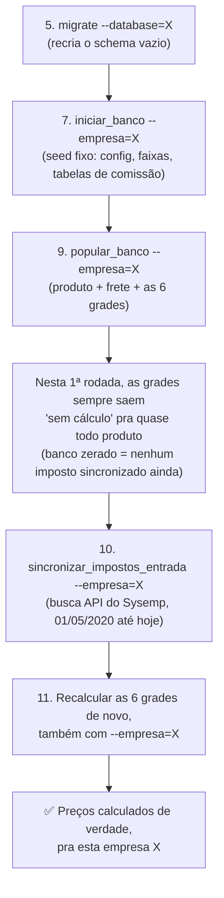

# Guia de Setup — Do Zero ao Primeiro Preço Calculado

## Contexto

Passo a passo completo, do zero absoluto (máquina nova, banco vazio) até o estado real "produtos do ERP importados + impostos de entrada do Sysemp sincronizados + preço calculado de verdade pros 6 marketplaces". Motivado originalmente pelo onboarding de Cauã e Lucas (15/08/2026) — mesmo caminho que Matheus percorreu e validou.

> [!success] Atualização grande (17/08/2026, 23h20) — o sistema agora suporta 2 empresas de verdade
> Até 17/08/2026, este guia assumia **1 empresa só** (Magazine Brasileiro). A partir de hoje, o sistema suporta **2 empresas completamente separadas — Magazine Brasileiro e Samvale — rodando ao mesmo tempo, sem nenhuma solução manual ou descartável**. Isso mudou praticamente todo comando deste guia: onde antes era `python manage.py popular_banco`, agora é `python manage.py popular_banco --empresa=MAGAZINE` (ou `--empresa=SAMVALE`). Leia a seção "O que é a arquitetura de 2 empresas" logo abaixo antes de seguir os passos — ela explica o "por quê" de cada `--empresa`/`--database` que você vai ver daqui pra frente. Detalhe técnico completo (o que foi decidido, os bugs reais encontrados no caminho, e a validação com dado real): [[Checkpoint - Implementacao de Suporte Permanente a 2 Empresas (Roteamento por Sessao)]].

> [!info] Esta nota fundiu 2 notas que existiam separadas (16/08/2026, 23h55)
> Existia um "Guia de Setup" (15/08) cobrindo do clone do repositório até `sincronizar_impostos_entrada`, e um "Ordem de Comandos Para Reconstruir o Banco do Zero" (16/08) cobrindo só a parte de banco/precificação, com um passo a mais que o guia antigo não tinha: recalcular as grades depois de sincronizar o imposto. As 2 notas tinham sobreposição de conteúdo e, pior, o guia antigo terminava dizendo "sistema pronto pro uso normal" sem esse passo final — informação errada, corrigida aqui. As 2 notas originais foram apagadas depois da fusão; esta é a única fonte de verdade sobre este assunto a partir de agora.

**Se o banco já existe e só precisa re-sincronizar o imposto** (não é um setup do zero), pule direto pro Passo 10.

## O que é a arquitetura de 2 empresas (leia antes de seguir os passos)

**O quê**: o projeto continua sendo **1 sistema Django só** — 1 repositório, 1 servidor, 1 endereço. O que existe agora são **2 bancos de dados MySQL completamente separados**, um pra cada empresa: `sistema_interno_magazine` e `sistema_interno_samvale`. Nenhum dado de uma empresa é visível ou acessível a partir da outra — é o mesmo código rodando, só que "olhando" pra um banco físico diferente dependendo de qual empresa está ativa no momento.

**Por quê**: até 16/08/2026, o sistema só sabia lidar com 1 empresa. Quando surgiu a necessidade real de gerar relatório também pra Samvale, a solução usada foi manual e descartável (banco temporário, variável de ambiente sobrescrita na hora, trecho de código comentado/descomentado) — funcionava pra 1 pessoa, 1 uso pontual, mas quebrava se 2 pessoas precisassem usar as 2 empresas ao mesmo tempo. A decisão de 17/08/2026 substitui essa solução manual por uma arquitetura permanente.

**Pra quê**: pra você (seguindo este guia) isso significa 1 coisa prática: **quase todo comando de terminal deste guia agora exige dizer explicitamente qual empresa**, através de um parâmetro chamado `--empresa` (que só aceita os valores `MAGAZINE` ou `SAMVALE`) ou `--database` (que só aceita `magazine` ou `samvale`, dependendo do comando — a tabela abaixo mostra qual é qual). Esquecer esse parâmetro não faz o comando rodar no banco errado silenciosamente — ele simplesmente recusa rodar e mostra um erro claro, pedindo o parâmetro.

**Como**: nos comandos deste guia, sempre que você ver `--empresa=MAGAZINE`, isso pode ser trocado por `--empresa=SAMVALE` se o setup que você está fazendo é da Samvale, não da Magazine. **Se você precisa configurar as 2 empresas na mesma máquina, o caminho é rodar este guia inteiro 2 vezes** — 1ª vez do início ao fim com `MAGAZINE`, 2ª vez do início ao fim com `SAMVALE`. Os 2 bancos não têm nenhuma dependência um do outro.

Pra acessar pelo navegador (depois que o `runserver` estiver de pé, Passo 11 em diante), existe uma tela nova de "Escolher empresa" — a primeira coisa que aparece ao abrir o sistema. Depois de escolher, um selo fixo (ex: "SAMVALE") aparece em toda tela, pra nunca haver dúvida de qual empresa está ativa naquele navegador. Cada navegador (ou cada aba anônima) guarda sua própria escolha, de forma independente — 2 pessoas diferentes (ou a mesma pessoa em 2 abas anônimas) podem usar as 2 empresas ao mesmo tempo, sem 1 interferir na outra.

## Pré-requisitos (instalar antes de qualquer passo)

| Software | Versão | Por quê |
|---|---|---|
| Python | 3.12 a 3.15 | Exigido em `pyproject.toml` (`requires-python`) |
| Poetry | qualquer versão recente | Gerenciador de dependência do projeto — não usa `pip install -r requirements.txt` |
| MySQL Server | rodando localmente, acessível | Banco real do projeto (`settings.py` usa `django.db.backends.mysql`) — os 2 bancos das 2 empresas vivem no mesmo servidor MySQL, só com nomes diferentes |
| Git | qualquer versão | Clonar o repositório |

## Passo 1 — Clonar o repositório

```bash
git clone https://github.com/MatheusAp-MB/Projeto_Sistema_Interno_V2
cd Projeto_Sistema_Interno_V2
git checkout dev
```

A branch de trabalho é sempre `dev` — nunca desenvolver direto em `main`/`master`.

## Passo 2 — Instalar as dependências

```bash
poetry install
```

Lê `pyproject.toml`/`poetry.lock` e monta um ambiente virtual próprio com todas as bibliotecas do projeto (Django, pandas, openpyxl, mysqlclient, rich, etc.). Não precisa criar/ativar `venv` manualmente — o Poetry cuida disso. Todo comando depois deste passo roda prefixado com `poetry run` (ou dentro de `poetry shell`).

## Passo 3 — Colocar o arquivo `.env`

O `.env` **nunca vem do git** — está no `.gitignore` de propósito, porque carrega segredo real (senha de banco, token de API). Matheus envia esse arquivo por chat; salva na raiz do projeto, no mesmo nível do `manage.py`.

Variáveis que o arquivo contém (nomes, não os valores — os valores reais só existem no `.env` que Matheus te mandar):

| Variável | Pra que serve |
|---|---|
| `SECRET_KEY` | Chave interna do Django (segurança de sessão/CSRF) |
| `DEBUG` | `True` só em desenvolvimento, nunca em produção |
| `ALLOWED_HOSTS` | Hosts que o Django aceita servir (padrão: `127.0.0.1,localhost`) |
| `AGENTE_TOKEN` | Autentica o agente local (`agente_local/`) contra a API do Django |
| `DB_USER` / `DB_PASSWORD` / `DB_HOST` / `DB_PORT` | Credenciais de acesso ao servidor MySQL — **compartilhadas pelas 2 empresas**, já que os 2 bancos vivem no mesmo servidor |
| `GOOGLE_DRIVE_CREDENCIAIS_JSON` / `GOOGLE_DRIVE_PASTA_RAIZ_ID` | Acesso ao Google Drive (Agenda de Vídeos) |
| `MB_SYSEMP_API_TOKEN` / `SV_SYSEMP_API_TOKEN` | Token da API do Sysemp, 1 por empresa — o sistema escolhe sozinho qual usar, com base na empresa ativa (`--empresa`) |
| Token(s) da API do Mercado Livre | Nome exato conforme o `.env` que você recebeu (prefixo `MB_`/`SV_`, mesmo padrão do Sysemp) |

> [!info] `DB_NAME` não existe mais nesta lista (mudança de 17/08/2026)
> Antes, o nome do banco vinha do `.env` (`DB_NAME=...`). Isso mudou: agora os 2 nomes de banco (`sistema_interno_magazine` e `sistema_interno_samvale`) são fixos dentro do próprio código (`settings.py`), porque eles nunca mudam — não existe mais motivo pra isso ser configurável por ambiente. Se o `.env` que você recebeu ainda tiver uma linha `DB_NAME=`, pode ignorá-la sem problema.

## Passo 4 — Criar os 2 bancos de dados MySQL

Diferente de antes (1 banco só), agora são **sempre 2 bancos**, com nomes fixos — nunca escolhidos por você:

```sql
CREATE DATABASE sistema_interno_magazine CHARACTER SET utf8mb4 COLLATE utf8mb4_unicode_ci;
CREATE DATABASE sistema_interno_samvale CHARACTER SET utf8mb4 COLLATE utf8mb4_unicode_ci;
```

O projeto usa `utf8mb4` de propósito (suporte completo a acento e caractere especial do português, ver comentário em `settings.py`) — nunca criar com `utf8` puro. **Se você só vai configurar 1 das 2 empresas agora**, ainda assim é seguro criar as 2 (a que não for usada fica só vazia, sem custo real) — evita precisar voltar aqui depois.

## Passo 5 — Rodar as migrações, nos 2 bancos

```bash
poetry run python manage.py migrate --database=magazine
poetry run python manage.py migrate --database=samvale
```

O que este comando faz: recria todas as tabelas de cada banco (a estrutura, as colunas), a partir do histórico de migrations de cada app — é só o "esqueleto" do banco, sem nenhum dado dentro ainda. O parâmetro `--database` é um recurso nativo do próprio Django (não é invenção deste projeto) que diz exatamente qual dos 2 bancos migrar — sem ele, o Django tentaria migrar só o banco padrão (`magazine`). Precisa rodar os 2 comandos (mesmo se for usar só 1 empresa por enquanto) antes de qualquer comando que grave dado.

## Passo 6 (opcional, recomendado) — Criar um usuário admin

```bash
poetry run python manage.py createsuperuser --database=magazine
```

Permite logar em `/admin/` e inspecionar/editar dado direto pela interface do Django — útil pra conferir visualmente se cada passo abaixo gravou o que devia, sem precisar abrir o MySQL na mão.

> [!warning] Sempre `--database=magazine`, mesmo se seu trabalho principal for na Samvale
> A tabela de usuários (login/senha) é **compartilhada pelas 2 empresas** — existe só 1 lista de usuários, guardada sempre no banco `magazine`, nunca duplicada no banco `samvale`. Isso é de propósito (login por empresa separado ainda não foi implementado, fica pro futuro). Se você criar o usuário com `--database=samvale` por engano, ele vai existir fisicamente naquele banco, mas o sistema **nunca vai encontrá-lo** na hora do login (que sempre lê `magazine`) — foi um erro real encontrado durante o teste desta arquitetura em 17/08/2026, documentado em [[Checkpoint - Implementacao de Suporte Permanente a 2 Empresas (Roteamento por Sessao)]].

## Passo 7 — Seed inicial (dado fixo do sistema)

```bash
	poetry run python manage.py iniciar_banco --empresa=MAGAZINE
```

(Troque `MAGAZINE` por `SAMVALE` se estiver configurando a Samvale.)

Não depende de nenhum arquivo externo — só popula dado fixo, que não muda com o tempo e só precisa existir 1 vez **em cada banco**: Marketplaces, Critérios de Qualidade, Configuração Operacional (os campos `fator_coleta` — percentual usado no cálculo de custo de coleta do produto — e `período_armazenagem` — quantos dias de estoque parado entram na conta de custo de armazenagem) + as 4 Faixas de Armazenagem, Configuração do Mercado Livre (Clássico/Premium), Tabela de Comissão Shopee, Tabela de Comissão TikTok, Taxa de Kg Adicional Amazon, e a Régua de Fases da Agenda de Vídeos (esse último item não tem relação com a precificação, mas está dentro do mesmo comando). Roda 1 única vez por banco (setup, não rotina) — mas é seguro rodar de novo se precisar, porque usa `get_or_create` em cada item (verifica se já existe antes de criar, nunca duplica). O parâmetro `--empresa` é obrigatório — rodar sem ele faz o comando recusar e mostrar erro, em vez de adivinhar qual banco usar.

> [!tip] Não é esquecimento
> As configurações da Amazon, Magalu, Shopee, TikTok e Raia (comissão, frete padrão/fixo, taxa de unidade) **não aparecem** neste comando — cada uma se cria sozinha, com valor padrão, na primeira vez que qualquer fórmula de precificação chamar `.obter()`. É assim que foi projetado, não precisa se preocupar em "esquecer" de seedar essas 5.

## Passo 8 — Conseguir os arquivos externos

Nenhum desses arquivos vem do `git clone` — as 2 pastas onde eles moram são propositalmente ignoradas pelo git (dado real de negócio nunca é versionado). Receba os arquivos de Matheus (chat, Drive, etc.) e salve exatamente nos caminhos abaixo, com o nome exatamente como está escrito — o código busca por nome de arquivo fixo, não por "qualquer .xlsx que estiver na pasta".

### Grupo A — Cadastro de Produtos do ERP (dado que muda com frequência, 1 arquivo por empresa)

Pasta: `Arquivos usados para Popular Banco/Produtos ERP/`

| Empresa | Arquivo esperado |
|---|---|
| Magazine | `Relatorio_Todos_Produtos_Ativos_Tela_Cadastro_Produtos_ERP_MB.xlsx` |
| Samvale | `Relatorio_Todos_Produtos_Ativos_Tela_Cadastro_Produtos_ERP_SV.xlsx` |

> [!info] Só o relatório de Ativos é lido hoje, nas 2 empresas
> Decisão do usuário, registrada em código (`core/management/commands/popular_banco_suporte/importar_produtos_erp.py`, 17/08/2026): o relatório de Produtos **Inativos** não é processado no momento — não precisa nem existir em disco. Se essa decisão mudar no futuro, este guia precisa ser atualizado.

Vêm da tela "Cadastro de Produtos" do Sysemp, exportados 1x pra cada status. O sistema escolhe sozinho qual dos 2 arquivos acima ler, com base no `--empresa` passado no Passo 9 — não existe mais nenhum arquivo pra comentar/descomentar manualmente (essa era a solução antiga, substituída em 17/08/2026).

Colunas que o código espera encontrar (nomes exatos, confirmados em `importar_produtos_erp.py`):

`Codigo Auxiliar`, `Codigo de Barras`, `Detalhes do Produto`, `Codigo do Fabricante`, `Categoria`, `Marca` (aparece 2x na planilha — nome legível e ID numérico interno; o sistema já distingue sozinho pelo tipo do valor), `ncm`, `Estoque`, `Custo`, `Inativo`, `Altura`, `Largura`, `Comprimento`, `Peso Bruto`, `Embalagem Altura`, `Embalagem Largura`, `Embalagem Comprimento`, `Emablagem Peso` (sim, com esse erro de digitação — é assim que vem do ERP de verdade, não corrigir manualmente), `URL 1`, `Ultima Compra`, `dt_cadastro`.

> [!warning] O ERP da Samvale usa nomes de coluna diferentes do ERP da Magazine
> Colunas como `Código Auxiliar` (SV) em vez de `Codigo Auxiliar` (MB), `inativo` minúsculo (SV) em vez de `Inativo` (MB), e `Produto` (SV) em vez de `Detalhes do Produto` (MB). Se o arquivo da Samvale vier assim, ele precisa ter o cabeçalho corrigido pra bater com os nomes exatos acima **antes** do Passo 9 — conferir com Matheus se o arquivo já recebido está corrigido ou não.

**Se o arquivo da empresa que você está configurando faltar:** `popular_banco` quebra com erro de arquivo não encontrado — esta etapa não tem proteção hoje (diferente do Grupo B abaixo). Linha sem `Codigo de Barras` é descartada (contada no relatório final, nunca ignorada silenciosamente).

### Grupo B — Tabelas de Frete (4 arquivos, compartilhados pelas 2 empresas)

Pasta: `Arquivos_de_Importação/`

| Arquivo | Estrutura |
|---|---|
| `Tabela_Frete_ML.xlsx` | Matriz peso × faixa de preço (29 linhas × 8 colunas de preço; peso mín/máx nas colunas 10/11) |
| `Tabela_Frete_Magalu.xlsx` | Peso × faixa de reputação. A=label (ignorada), B=`<92%`, C=`92-97%`, D=`>97%`, E=peso mínimo (sempre preenchido, inclusive na última faixa), F=peso máximo (vazio de verdade na última faixa, sem teto) |
| `Tabela_Frete_TikTok.xlsx` | Peso × valor único, sem faixa de reputação. A=label, B=valor médio, C=peso mínimo, D=peso máximo |
| `Tabela_Frete_Amazon.xlsx` | 2 abas nomeadas exatamente `Frete Amazon_DBA` e `Frete Amazon_FBA` (o tipo vem do NOME DA ABA, não de coluna). Colunas: A=peso mínimo, B=peso máximo, C=preço mínimo, D=preço máximo, E=valor |

> [!info] Confirmado com o usuário (17/08/2026): estas 4 tabelas são as mesmas pras 2 empresas
> São tabelas públicas de cada marketplace (não dependem de qual das 2 empresas está vendendo) — por isso não existe (e não precisa existir) uma versão "MB" e uma versão "SV" pra elas, diferente do Grupo A acima.

**Se um desses 4 faltar:** `popular_banco` **não quebra** — o código já verifica se o arquivo existe antes de tentar ler; se não existir, só imprime `[FRETE <X>] Arquivo ... não encontrado — pulando essa etapa` e segue pras próximas. Diferença real e importante em relação ao Grupo A.

## Passo 9 — Popular o banco com dado real (1ª tentativa das grades)

```bash
poetry run python manage.py popular_banco --empresa=MAGAZINE
```

(Troque `MAGAZINE` por `SAMVALE` se estiver configurando a Samvale — e lembre que os 2 bancos são independentes: rodar este comando pra Magazine não popula nada na Samvale.)

Roda em sequência: Produtos ERP → Indicadores da Agenda de Vídeos → 4 tabelas de frete → organizar/comparar a dimensão de envio (as medidas físicas — altura/largura/comprimento/peso — que definem em qual faixa de frete cada produto cai) → as 6 grades de precificação (ML, Magalu, Raia, Shopee, TikTok, Amazon) → recomendação final de precificação (qual marketplace/preço o sistema sugere como melhor opção pra cada produto). Demora alguns minutos, dependendo do tamanho das planilhas. Gera log completo em `logs/popular_banco_<timestamp>.log`, além do que aparece no terminal.

Ao final, o terminal mostra quantos produtos foram criados/atualizados, quantas linhas sem EAN foram descartadas, e quantas dimensões de embalagem vieram fisicamente absurdas do ERP — isso é esperado (o sistema reporta pra corrigir na origem, nunca inventa ou corrige sozinho, ver [[Sistema Espelha Dado Bruto do ERP Mesmo Quando E Fisicamente Absurdo]]).

Visão geral do que falta depois deste passo, antes do preço sair calculado de verdade:



> [!warning] Vai acontecer nesta 1ª rodada — e é esperado, não é erro
> Como nenhum produto ainda tem imposto de entrada sincronizado neste momento, as 6 grades calculadas aqui dentro (que rodam automaticamente como parte do `popular_banco`, através dos mesmos 6 comandos que aparecem individualmente no Passo 11 — `calcular_grade_precificacao_ml`, `calcular_grade_precificacao_tiktok`, `calcular_grade_precificacao_raia`, `calcular_grade_precificacao_amazon`, `calcular_grade_precificacao_magalu`, `calcular_grade_precificacao_shopee`) vão sair com a imensa maioria (ou 100%) dos produtos em "sem cálculo possível". Isso acontece porque a fórmula de precificação **se recusa de propósito** a calcular preço sem `impostos_entrada` — é uma decisão de projeto, não uma falha (ver [[Migracao da Precificacao Real para Usar Impostos de Entrada Validados]]). O Passo 11, mais abaixo, resolve isso.

## Passo 10 — Sincronizar os impostos de entrada do Sysemp

```bash
poetry run python manage.py sincronizar_impostos_entrada --empresa=MAGAZINE
```

(Troque `MAGAZINE` por `SAMVALE` conforme a empresa.)

O que este comando faz: busca o manifesto de notas fiscais de entrada direto da API do Sysemp e grava o crédito fiscal (ICMS, ICMS ST, IPI, PIS, COFINS) por produto, vinculando pelo EAN a um `Produto` já existente — por isso a **ordem importa: só rodar depois do Passo 9**; se o banco de produtos ainda estiver vazio, quase tudo cai em "sem correspondência" à toa. O parâmetro `--empresa` também decide, automaticamente, qual token e qual endereço da API do Sysemp usar (Magazine e Samvale são 2 instâncias numeradas diferentes na Sysemp) — não é mais preciso sobrescrever variável de ambiente na mão pra isso.

Não tem nenhum outro parâmetro pra passar além de `--empresa`: o próprio comando decide o período a buscar sozinho, através de um registro interno chamado "watermark" (guarda até onde a última sincronização já cobriu, separado por empresa — ver [[Sincronizacao Incremental com Watermark para Manifesto de Notas de Entrada]]). Como o banco está zerado, não existe watermark ainda — então, só nesta primeira vez, ele busca **desde 01/05/2020 até hoje**, de uma vez só (essa data mínima é fixa no código, é o início do dado fiscal útil pro sistema). Sincronizações seguintes são incrementais (só a janela nova) e muito mais rápidas.

> [!danger] Este é, de longe, o passo mais demorado — mas o tempo real já foi medido
> O cliente da API do Sysemp usa um **throttle fixo de 1 segundo entre cada chamada** (proteção deliberada contra sobrecarregar a API — ver [[Padrao de Protecao do Cliente Sysemp (Throttle Backoff Sem Circuit Breaker)]]). Buscar mais de 6 anos de manifesto (01/05/2020 até hoje), página por página, é bem mais lento que as sincronizações incrementais do dia a dia. Validado em produção com dado real das 2 empresas (17/08/2026): **entre 4 e 5 minutos** cada uma. Não travou se demorar dentro dessa faixa — é esperado. Não tem como acelerar sem mexer no throttle, e o throttle é proteção deliberada, não deve ser desligado nem reduzido. **Evite interromper com Ctrl+C no meio de uma sincronização longa** — o mecanismo que salva o progresso parcial em caso de falha não reconhece interrupção manual como uma falha, então tudo que já tinha sido buscado se perde e a busca recomeça do zero.

Desde 17/08/2026, o terminal mostra bem mais informação que antes: a cobertura de datas já sincronizada anteriormente, o período sendo buscado agora, uma tabela com quantas notas caíram em cada código fiscal (CFOP), uma tabela com o tempo gasto em cada etapa, e um resumo final com produtos selecionados/sincronizados/sem correspondência/com erro — ver exemplo real completo em [[Checkpoint - Implementacao de Suporte Permanente a 2 Empresas (Roteamento por Sessao)]]. Uma proporção relevante de "sem correspondência" é esperada, principalmente na 1ª carga (histórico desde 2020, incluindo produtos hoje descontinuados no ERP, que nunca são importados porque só o relatório de Ativos é lido — ver Passo 8).

## Passo 11 — Recalcular as 6 grades de novo (agora com o imposto já sincronizado)

```bash
poetry run python manage.py calcular_grade_precificacao_ml --empresa=MAGAZINE
poetry run python manage.py calcular_grade_precificacao_tiktok --empresa=MAGAZINE
poetry run python manage.py calcular_grade_precificacao_raia --empresa=MAGAZINE
poetry run python manage.py calcular_grade_precificacao_amazon --empresa=MAGAZINE
poetry run python manage.py calcular_grade_precificacao_magalu --empresa=MAGAZINE
poetry run python manage.py calcular_grade_precificacao_shopee --empresa=MAGAZINE
```

(Troque `MAGAZINE` por `SAMVALE`, nos 6 comandos, se estiver configurando a Samvale.)

O que estes comandos fazem: recalculam, um por um, o preço de cada marketplace — agora usando os produtos que já têm `impostos_entrada` sincronizado pelo Passo 10. Este é o passo que faltava no guia antigo, e é o motivo de "sistema pronto pro uso normal" ser uma afirmação incompleta sem ele — sem este passo, o preço salvo continua sendo o calculado no Passo 9 (majoritariamente "sem cálculo").

> [!tip] Atalho novo (17/08/2026): 1 comando só, em vez de 6
> Em vez de rodar os 6 comandos acima um por um, dá pra rodar só:
>
> ```bash
> poetry run python manage.py calcular_todas_as_grades_precificacao --empresa=MAGAZINE
> ```
>
> Ele chama os mesmos 6 comandos, na mesma ordem, um atrás do outro (por dentro, usa `call_command()` do próprio Django) — é só um atalho de conveniência por cima deles, não uma substituição. **Os 6 comandos individuais continuam existindo e funcionando exatamente como antes** — continuam sendo o jeito certo de recalcular só 1 marketplace específico depois de um ajuste pontual (ex: só a Shopee, depois de mudar a comissão dela), sem precisar rodar os outros 5 à toa. Validado com dado real nas 2 empresas em 17/08/2026: 1280 produtos na Magazine e 592 na Samvale, os 6 cálculos completos em poucos segundos, mesmo `--empresa` inválido (ex: `SAmvale` com "a" minúsculo) barrado com o mesmo erro claro dos outros comandos.

> [!tip] Alternativa mais simples, só que mais lenta
> Rodar `popular_banco --empresa=MAGAZINE` de novo (o mesmo comando do Passo 9) também funciona — ele reprocessa tudo, incluindo produto e frete, então chega no mesmo resultado. É só mais lento, porque refaz trabalho que já tinha sido feito no Passo 9.

## Passo 12 — Subir o sistema e escolher a empresa pelo navegador

```bash
poetry run python manage.py runserver
```

Ao abrir o endereço mostrado no terminal (ex: `127.0.0.1:8000`), a primeira tela é a de **escolher empresa** — clique em "Magazine Brasileiro" ou "Samvale", dependendo de qual você quer usar naquele navegador. Depois de escolher, um selo fixo aparece em toda tela do sistema, mostrando bem grande qual empresa está ativa — se você configurou as 2 empresas e quer usar as 2 ao mesmo tempo, abra uma aba anônima nova pra cada uma (cada aba guarda sua própria escolha, de forma independente, sem 1 interferir na outra).

## Estado final esperado

Os 2 bancos criados e migrados, seed inicial populado, produtos do ERP importados, frete/dimensão calculados, impostos de entrada do Sysemp sincronizados, **e as 6 grades de precificação recalculadas com esse imposto** — os preços que o sistema mostra já são reais, não placeholders. Continuar vendo uma fatia pequena de produtos em "sem cálculo possível" depois do Passo 11 é normal (margem genuinamente inatingível pra aquele produto/faixa de frete) — não indica erro. O que não pode mais acontecer, depois do Passo 11, é a **maioria** dos produtos ficar sem cálculo por falta de imposto sincronizado. Repita os Passos 5 a 12 pra segunda empresa, se ainda não tiver feito.

## Por que a ordem do Passo 10 → Passo 11 importa (e por que não é automático)

`sincronizar_impostos_entrada` (passo 10) e os 6 comandos de grade — `calcular_grade_precificacao_ml`, `calcular_grade_precificacao_tiktok`, `calcular_grade_precificacao_raia`, `calcular_grade_precificacao_amazon`, `calcular_grade_precificacao_magalu`, `calcular_grade_precificacao_shopee` (passo 11) — são comandos **completamente independentes entre si**: nenhum dos 2 chama o outro, e não existe nenhum gatilho automático ligando um ao outro.

`sincronizar_impostos_entrada` só atualiza a tabela `impostos_entrada` (`ImpostosECustosXMLEntradaProduto`, 1 linha por produto). Se, depois disso, ninguém rodar os 6 comandos de grade de novo, o preço salvo continua sendo o preço **antigo**, calculado com o imposto de antes — mesmo com o dado fiscal já atualizado no banco. Isso vale pras 6 tabelas de resultado, uma por marketplace: `GradePrecificacaoML`, `GradePrecificacaoTiktok`, `GradePrecificacaoRaia`, `GradePrecificacaoAmazon`, `GradePrecificacaoMagalu` e `GradePrecificacaoShopee`. Não existe um sinal de "isso mudou, recalcula" — é sempre 2 passos manuais, na ordem certa, **pra cada empresa separadamente**.

**Ou seja, a garantia de sincronia não é automática hoje — é operacional**: toda vez que quiser os preços refletindo o imposto mais recente (seja amanhã, seja daqui a 15 dias), a rotina é sempre a mesma — primeiro `sincronizar_impostos_entrada --empresa=X`, depois os 6 comandos de grade do Passo 11 (executados um de cada vez, também com `--empresa=X` — ou `popular_banco --empresa=X` inteiro, que já roda os 6 dentro dele). Rodar só um dos 2 passos deixa o sistema com dado parcialmente desatualizado, sem nenhum aviso. E rodar pra uma empresa não afeta a outra — são bancos completamente separados.

> [!info] Atualização parcial (17/08/2026) — os 6 comandos de grade agora têm atalho, o encadeamento com o `sincronizar_impostos_entrada` continua manual
> `calcular_todas_as_grades_precificacao --empresa=X` (ver Passo 11 acima) resolve a parte "6 comandos, 1 de cada vez" — mas não resolve a ordem entre Passo 10 e Passo 11. `sincronizar_impostos_entrada` continua sem chamar esse recálculo sozinho: ainda são 2 passos manuais, na ordem certa (10 antes de 11), sem nenhum aviso automático se você esquecer o 2º. Ligar os 2 de ponta a ponta (ex: `sincronizar_impostos_entrada` já chamar o recálculo de grade ao final) continua sendo ideia registrada, não decidida nem priorizada.

## O que fica de fora deste guia (por decisão, não por esquecimento)

- **Anúncios do Mercado Livre** (JSON da API) — etapas desativadas em 15/08/2026 dentro do `popular_banco`, aguardando um comando próprio e dedicado pra API do ML (mesmo padrão já usado no Sysemp).
- **Automação de Postagem/Replicação** (Agenda de Vídeos, `agente_local/`) — escopo totalmente separado, com guia próprio quando for necessário.
- **Promoções / Qualidade / Competição de catálogo do ML** — mesma situação dos anúncios, aguardando o comando dedicado.
- **Login por empresa separado** — hoje existe 1 lista de usuários só, compartilhada pelas 2 empresas (ver Passo 6). Contas totalmente separadas por empresa, com registro de "quem alterou o quê", ficam pro futuro.

## Relacionado

- [[Reducao de Comandos de Management e Rotina Vira Botao]]
- [[Padrao de Qualidade e Clareza Estrutural do Repositorio]]
- [[Redesenho do Popular Banco - Fontes de Dados e Escopo]]
- [[Orquestracao da Sincronizacao de Impostos de Entrada via XML]]
- [[Regras de Colaboracao no Repositorio de Codigo (Branch Dev)]]
- [[Checklist de Execucao — Migracao da Precificacao para Impostos de Entrada (16-08)]]
- [[Migracao da Precificacao Real para Usar Impostos de Entrada Validados]]
- [[Sincronizacao Incremental com Watermark para Manifesto de Notas de Entrada]]
- [[Padrao de Protecao do Cliente Sysemp (Throttle Backoff Sem Circuit Breaker)]]
- [[Validacao dos 3 Cenarios de Tributacao Normal Reducao e ST Pos-Migracao da Precificacao]]
- [[Como Escrever Notas no Vault — Padrao Hiper-Didatico]]
- [[Checkpoint - Implementacao de Suporte Permanente a 2 Empresas (Roteamento por Sessao)]]
