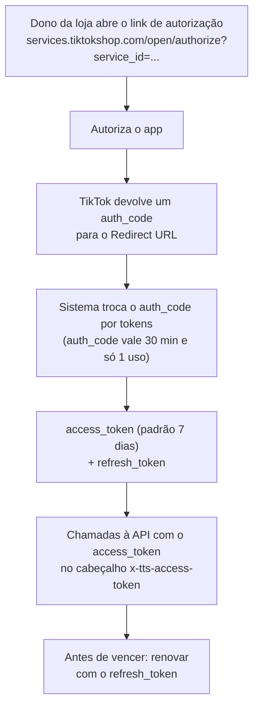

# Pausa da Investigação da API do TikTok Shop — Loja Magazine Sem Account Manager

**Resumo**: investigação de como o Sistema Interno V2 acessaria a API do TikTok Shop das lojas MB e SV, pausada em 09/10/2026 — o Brasil é suportado e o caminho é virar "desenvolvedor vendedor" com 1 app Custom por loja, mas o cadastro da Magazine foi recusado porque a loja não tem Account Manager; nada foi criado, e a nota guarda o que se aprendeu e os passos para retomar.

> [!warning] Status: decisão ativa — investigação pausada
> **09/10/2026, 18h56.** Matheus decidiu não dar continuidade a esta frente por enquanto ("não iremos dar continuidade nisso por agora") e pediu só o registro no vault. Nenhum app foi criado, nenhuma chave existe, nenhuma linha de código do V2 foi alterada por causa disto, e o chamado para a TikTok **não foi enviado**. Quem retomar começa pela seção "Como retomar".

## Contexto

**O quê.** O TikTok Shop é um dos 6 marketplaces onde a Magazine Brasileiro (MB) e a Samvale (SV) vendem. Cada empresa tem a **sua própria loja** no TikTok Shop. O Sistema Interno V2 (o projeto Django com 2 bancos, um por empresa) já calcula preço de TikTok — fórmula, grade de precificação, tabela de frete e comissão de afiliado (ver [[Comissao de Afiliado na Precificacao - Base de Calculo, Local de Configuracao e Escopo do Prefixo de SKU]]) — e gera arquivos de promoção. Até onde foi possível verificar nesta conversa, o V2 **não tem nenhum cliente da API do TikTok Shop**: ele não conversa com a loja, só trabalha com dados que entram por planilha ou arquivo.

**Pra quê.** Matheus quis investigar o acesso à API para, no futuro, o V2 poder ler dados reais da loja. As ideias abaixo são **hipóteses** — ainda não foram confirmadas contra a lista de endpoints (as páginas de referência de API não foram lidas):

| Ideia | O que resolveria |
|---|---|
| Comparar o preço que está hoje no TikTok com o preço da grade de precificação | Descobrir anúncio com preço desatualizado, sem abrir o Seller Center (o painel web do vendedor) |
| Ler a comissão e o repasse reais de cada pedido, incluindo afiliado | Conferir se a margem calculada pelo V2 bate com o que o TikTok de fato cobrou |
| Ler pedidos e devoluções | Alimentar relatórios sem exportar planilha à mão |

## O problema / a pergunta

**Como a MB e a SV conseguem acesso oficial à API do TikTok Shop, e o que está impedindo isso hoje?**

## O que levou à resposta

O caminho abaixo foi montado lendo as páginas oficiais da documentação (Partner Center), que Matheus salvou em HTML e mandou para Claude. A documentação só abre com JavaScript, por isso Claude não consegue lê-la por link direto.

### 1. Qual é a API certa

O primeiro link que Matheus mandou (`developers.tiktok.com`) é de **outro produto** (TikTok for Developers, voltado a login e conteúdo). A API de **vendedor** do TikTok Shop fica no **Partner Center**, no endereço `partner.tiktokshop.com`.

### 2. O Brasil é suportado

O Brasil (`BR`, idioma `pt-BR`) aparece na lista oficial de regiões suportadas (página atualizada em 06/07/2026). O Brasil usa o Partner Center "do resto do mundo" (`partner.tiktokshop.com`). Os Estados Unidos têm um Partner Center separado (`partner.us.tiktokshop.com`) e as credenciais não são compartilhadas entre os dois.

### 3. Que tipo de desenvolvedor a MB e a SV precisam ser

| Tipo | Para que serve | Serve para nós? |
|---|---|---|
| **Desenvolvedor vendedor** (na tela de cadastro aparece como "Desenvolvedor inhouse do vendedor / Vendedor do TikTok Shop") | Construir um app **Custom** que conversa só com a **própria** loja | **Sim** — é o nosso caso |
| **ISV** (Independent Software Vendor — empresa que cria um sistema e o oferece a vários vendedores) | Criar app **público**, instalável por muitas lojas | Não — e quem se cadastra como vendedor fica **inelegível** para as categorias de ISV |

### 4. Regras do desenvolvedor vendedor

| Regra | O que significa na prática |
|---|---|
| A loja precisa ter passado pela verificação cadastral (KYB para empresa, KYC para pessoa) | Já deve estar cumprida em lojas que vendem |
| A loja precisa ter um **Account Manager** (gerente de conta atribuído pelo TikTok) | **Esta é a trava.** Não dá para pedir diretamente: a plataforma atribui por país, categoria, porte e desempenho |
| Só a conta **dona** da loja pode ser vinculada | Login de subconta dá erro |
| 1 conta de vendedor = 1 conta no Partner Center | MB e SV precisam de 2 contas de Partner Center, uma para cada loja |
| O e-mail de verificação precisa ser o e-mail da própria loja | Não vale e-mail pessoal |
| Revisão de conformidade e segurança (formulário em inglês; 3 reprovações seguidas levam à lista negra) | Sempre exigida nos EUA e no Reino Unido; a página de onboarding diz "caso a caso" para os demais países, mas o FAQ do onepager diz "obrigatória para vendedor". **Não confirmado para o Brasil** |

### 5. O que aconteceu na tela (o bloqueio)

Matheus entrou no Partner Center com o login da loja Magazine Brasileiro, escolheu Brasil / Brasil / categoria "Vendedor do TikTok Shop" e confirmou. A tela seguinte, "Verificação da conta do vendedor", recusou o cadastro com a mensagem:

> Conta não qualificada para cadastro de desenvolvedor para vendedores

A página oficial "Common Error for Seller Developer" (que Matheus salvou) confirma que o motivo é a **falta de Account Manager**. No Seller Center da Magazine nenhum Account Manager aparece. Os números vistos no print de 09/10/2026 (nota 4,4 de 5,0; cerca de R$ 874 e 4 pedidos nos últimos 7 dias) indicam uma loja de **escala pequena**, o que provavelmente pesa na atribuição — isso é uma leitura nossa, não uma informação do TikTok.

### 6. Como se pede um Account Manager

Não existe botão para isso. O caminho oficial é abrir um **chamado na Central de Ajuda** pedindo uma "Account Manager eligibility review" (análise de elegibilidade para Account Manager), informando: ID da loja, país, categoria principal; vendas (GMV — valor bruto vendido), pedidos e crescimento dos últimos 30 e 90 dias; nota da loja, SPS (Shop Performance Score, a pontuação de desempenho da loja) e histórico de violações; planos de anúncios, lives e afiliados; e em que a loja precisa do apoio do Account Manager. Um rascunho está na seção "Como retomar".

## Decisão

**Pausar toda a frente da API do TikTok Shop por tempo indeterminado**, sem tentar contornar a trava do Account Manager agora. Valem, até Matheus dizer o contrário:

- Não criar app, não pedir escopo, não guardar credencial.
- Não alterar o V2 para chamar a API do TikTok Shop.
- O fluxo atual do V2 para TikTok (cálculo de preço e arquivos de promoção) **continua exatamente como está**.

## Por que é assim e não de outro jeito

| Alternativa considerada | Por que não agora |
|---|---|
| Insistir no cadastro da Magazine | A trava é regra da plataforma, não erro nosso — sem Account Manager o cadastro não passa |
| Tentar pela Samvale | Também exigiria Account Manager e o login do dono da loja; não foi tentado, e o porte da Samvale no TikTok Shop não foi verificado |
| Plano B: usar um integrador brasileiro (ERPs como Bling, Olist ou UpSeller integram o TikTok Shop com apps públicos que o vendedor instala no Seller Center) | Foi só mencionado, **não avaliado** (preço, dados que entregam e se atendem o V2 não foram checados) |
| Plano B: exportar relatórios manualmente do Seller Center | Funciona hoje sem API, mas é o trabalho manual que a API evitaria |
| **Pausar (escolhido)** | A decisão é de Matheus: o assunto não é prioridade agora, e o próximo passo (chamado) depende de resposta de terceiros |

## Estado exato ao pausar

| Item | Estado em 09/10/2026 |
|---|---|
| Conta de desenvolvedor da Magazine no Partner Center | Cadastro iniciado, **travado** na "Verificação da conta do vendedor" |
| Conta de desenvolvedor da Samvale | Não iniciada |
| Chamado de Account Manager | Rascunho feito, **não enviado** (faltam os dados da loja) |
| App Custom, App Key e App Secret | Não existem |
| Código do V2 para a API do TikTok Shop | Não existe |
| Páginas da documentação já lidas | Tipos de desenvolvedor, onboarding, regiões e idiomas, visão geral de autorização, onepager do desenvolvedor vendedor, escopos de acesso, erro comum do desenvolvedor vendedor |

## Como retomar

1. **Juntar os dados da loja Magazine**: vendas e pedidos dos últimos 30 e 90 dias, nota, SPS, violações e planos. O código da loja que aparece em "Configurar loja" no Seller Center é `BRBRLCH2LL8U` (confirmar se é este o "ID da loja" que o chamado pede).
2. **Enviar o chamado** pela Central de Ajuda. Rascunho (trocar cada `[PREENCHER]`):

   ```text
   Subject: Account Manager eligibility review - Shop [PREENCHER nome da loja]

   Hello TikTok Shop team,

   We would like to request an Account Manager eligibility review for our shop.
   Our goal is to register as a Seller Developer and build a Custom app that
   connects only our own shop to our internal system, to read orders, finance,
   returns and product data.

   Shop name: [PREENCHER]
   Shop ID: [PREENCHER]
   Site: Brazil
   Primary category: [PREENCHER]
   GMV and orders, last 30 days: [PREENCHER]
   GMV and orders, last 90 days: [PREENCHER]
   Growth trend: [PREENCHER]
   Shop rating: [PREENCHER]
   SPS (Shop Performance Score): [PREENCHER]
   Violation history: [PREENCHER]
   Plans for ads, LIVE and affiliates: [PREENCHER]
   Where we need Account Manager support: access to the Seller Developer
   registration in Partner Center and API setup.

   Thank you.
   ```

3. **Opcional — tentar a Samvale**: precisa do login do dono da loja e de Account Manager; usar um perfil de navegador separado, porque 1 conta de vendedor é 1 conta de Partner Center.
4. **Quando o Account Manager for atribuído**: concluir o cadastro e salvar em HTML estas páginas da documentação, que ainda não foram lidas: "Sign your API request" (como assinar cada chamada), "Common parameters", "Rate limits", "Create your App" e as páginas de referência de pedidos, finanças e produtos.
5. **Criar o app Custom** em Partner Center → App & Service → Create app & service → Custom → categoria "TikTok Shop Seller". Decidir o nome, o Redirect URL e só os escopos de leitura necessários.
6. **Guardar as credenciais por empresa** no `.env` do V2 — **nunca no chat nem no vault**.
7. **Testar** na loja de desenvolvimento (Development Shop, antiga Sandbox) e na ferramenta de teste de API (API Testing Tool); depois publicar o app e copiar o link de autorização.
8. **Desenhar no V2** onde guardar e como renovar os tokens de cada empresa, no mesmo padrão de bancos e roteamento por empresa (ver [[Checkpoint - Implementacao de Suporte Permanente a 2 Empresas (Roteamento por Sessao)]]).

## O que já se aprendeu sobre o funcionamento (para não reler a documentação)

### Vocabulário

| Termo | Significado |
|---|---|
| **App Custom** | Aplicativo feito para **uma única loja** (a do próprio vendedor). Autoriza só 1 loja, então MB e SV precisam de 1 app cada |
| **App Key / App Secret** | "Usuário" e "senha" do app. O App Secret é secreto: nunca vai para chat, vault ou código versionado |
| **Redirect URL** | Endereço do nosso sistema para onde o TikTok devolve o dono da loja depois que ele autoriza o app |
| **Webhook URL** | Endereço opcional onde o TikTok avisa o sistema de eventos (pedido novo, por exemplo) |
| **OAuth** | Padrão de autorização em que o dono da loja libera o app sem entregar a senha dele |
| **Escopo** | Permissão específica do app (ler pedidos, alterar produto etc.) |
| **Loja de desenvolvimento** | Loja de mentira para testar o app sem mexer na loja real |

### Fluxo de autorização (depois que o app existe)



- A troca do `auth_code` é uma chamada `GET` para `https://auth.tiktok-shops.com/api/v2/token/get` (a documentação usa `grant_type=authorized_code`, escrito assim mesmo); a renovação usa `/api/v2/token/refresh` com `grant_type=refresh_token`.
- A resposta traz `access_token`, `refresh_token`, datas de vencimento em formato Unix (`*_expire_in`), `open_id`, `seller_name`, `seller_base_region`, `user_type` (0 = vendedor) e `granted_scopes`.
- O vencimento do `refresh_token` é igual à duração de autorização que o dono da loja concedeu: **ler da resposta, nunca fixar um número no código**.
- O App Secret viaja na URL (query string) dessa chamada: ela deve ser feita **no servidor** e a URL nunca pode ir para log.
- Um app Custom **não pode ser apagado**, só desativado — e um app desativado nunca mais volta a ficar online. Por isso, pensar bem no nome e no uso antes de criar o primeiro.
- As chamadas à API também precisam ser **assinadas** (HMAC-SHA256); os detalhes estão na página "Sign your API request", ainda não lida.

### Escopos que serviriam ao V2

Os escopos públicos já vêm liberados por padrão quando o app é criado (o vendedor ainda precisa autorizar). Pedir escopo a mais alonga a análise do app e reduz a taxa de autorização, então o certo é pedir só o necessário. Escopos sensíveis ("custom") são pedidos em Partner Console → App & Service → Manage → Manage API.

| Para quê no V2 | Escopo | Situação |
|---|---|---|
| Ver pedidos | Order Information | Público |
| Ver devoluções e reembolsos | Return & Refund Basic | Público |
| Comissão e repasse real por pedido | Finance Information | Público |
| Ver produto e preço atual | Product Basic | Público |
| Ver promoções | Promotion Information | Público |
| Alterar preço pelo sistema | Product Modify | **Não confirmado** que cobre preço — checar nas páginas de endpoints |

### Ainda não confirmado

| Dúvida | Onde confirmar |
|---|---|
| A revisão de conformidade e segurança vale para vendedor no Brasil? | Perguntar no chamado ou no fim do cadastro |
| O Redirect URL aceita endereço local ou sem HTTPS (importante enquanto o V2 não tem domínio próprio)? | Página "Create your App" |
| Existe um tipo de app que atenda várias lojas de vendedor de uma vez? | Página "Create your App" e tipos de desenvolvedor |
| Quanto tempo leva a análise de Account Manager e quais números de loja ela exige? | Resposta do chamado |
| Dados de fonte **não oficial** vistos mas não verificados: limite de cerca de 50 chamadas por segundo por loja e app, existência de webhooks para pedido, devolução e produto, e o identificador `shop_cipher` que identificaria a loja nas chamadas | Páginas oficiais "Rate limits", "Webhooks" e "Common parameters" |

## Exemplo

O que aconteceu de verdade em 09/10/2026, de ponta a ponta:

1. Matheus abriu o Seller Center da Magazine e achou o código da loja em "Configurar loja".
2. Abriu o Partner Center e iniciou o cadastro com o e-mail da loja.
3. Escolheu Brasil / Brasil / "Vendedor do TikTok Shop" e confirmou.
4. Recebeu "Conta não qualificada para cadastro de desenvolvedor para vendedores".
5. Claude leu a página oficial de erro comum, identificou a falta de Account Manager e montou o rascunho do chamado (seção "Como retomar").
6. Matheus decidiu pausar, às 18h56.

## Fontes

Páginas oficiais do Partner Center, no formato `partner.tiktokshop.com/docv2/page/<nome>` (HTML salvo por Matheus): `tts-developer-types`, `developer-onboarding`, `authorization-overview-202407`, `regions-and-languages`, `seller-developer-onboarding-onepager`, `access-scope`, e a página "Common Error for Seller Developer". Tudo o que está marcado "não confirmado" acima veio de fonte não oficial ou ainda não foi lido.

## Relacionado

- [[Comissao de Afiliado na Precificacao - Base de Calculo, Local de Configuracao e Escopo do Prefixo de SKU]]
- [[Gerencie seu Aplicativo na API do Mercado Livre]]
- [[Achados Reais na Configuracao dos Aplicativos Mercado Livre (Magazine e Samvale)]]
- [[Checkpoint - Implementacao de Suporte Permanente a 2 Empresas (Roteamento por Sessao)]]
