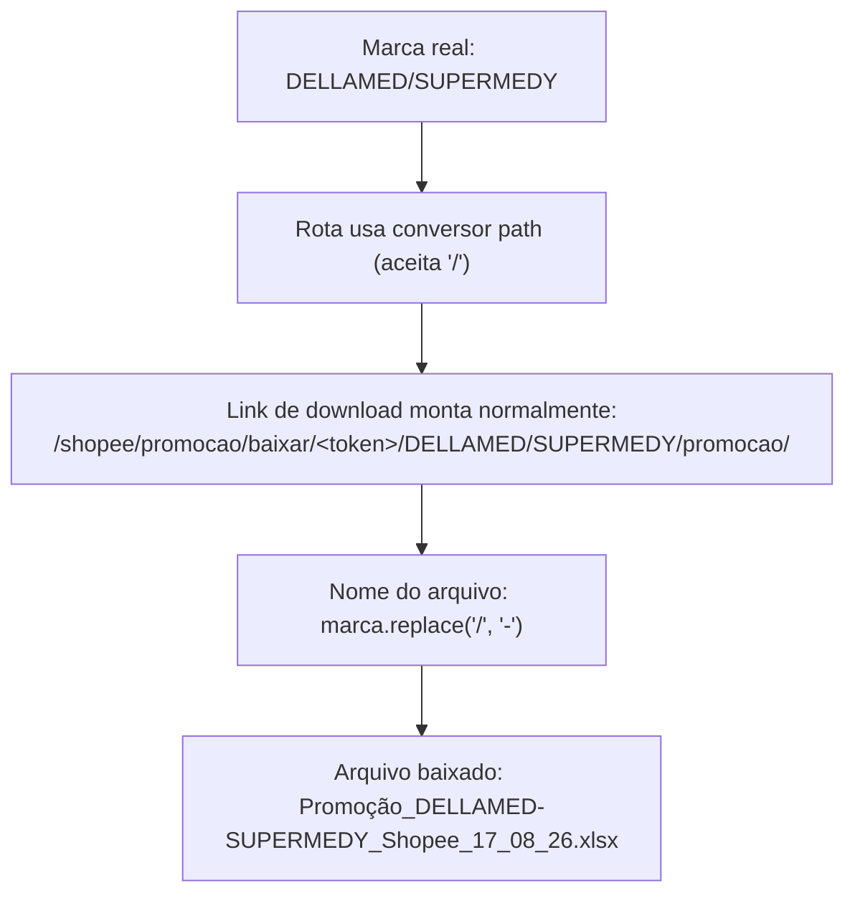

# Marca com Barra Quebra Link de Download de Promoção

**Resumo**: gerando promoção da Shopee pra uma marca real com "/" no nome ("DELLAMED/SUPERMEDY"), o link de download quebrava com `NoReverseMatch` — o conversor de rota do Django (`str`) não aceita "/" no valor. O TikTok tinha a mesma falha latente (mesma rota), só não tinha aparecido ainda. Corrigido trocando o conversor pra `path` nos 2 apps, e sanitizando o nome do arquivo baixado.

> [!success] CORRIGIDO em 17/08/2026
> **O quê**: o link de download da promoção quebrava sempre que o nome da marca continha uma barra ("/").
> **Onde foi corrigido**: `shopee/urls.py` e `tiktok/urls.py`, rota `..._baixar_promocao` — conversor trocado de `str` pra `path`. Nome do arquivo baixado também sanitizado nas views `view_baixar_promocao` e `view_baixar_todas_promocao` dos 2 apps.

## Contexto

Depois que a Shopee ganhou o Modo Arquivo (ver [[Shopee Ganha Modo Arquivo de Promocao Igual ao TikTok]]), o usuário testou a tela com um arquivo real exportado da Shopee. Uma das marcas reais do catálogo é "DELLAMED/SUPERMEDY" — uma marca cujo nome de verdade contém uma barra ("/") no meio, porque a empresa representa 2 fabricantes ao mesmo tempo sob esse nome combinado.

A tela de resultado da promoção mostra, pra cada marca, um botão de download que leva pra uma URL construída dinamicamente com o nome da marca dentro dela — por exemplo, `shopee/promocao/baixar/<token>/<marca>/<tipo>/`. O Django resolve essa URL usando a função `reverse()` (ou a tag de template ``), que monta o link real a partir do nome da rota e dos valores das variáveis.

## O problema

Ao tentar gerar o link de download pra marca "DELLAMED/SUPERMEDY", a tela quebrou com este erro:

```
NoReverseMatch at /shopee/promocao/resultado/<token>/
Reverse for 'shopee_baixar_promocao' with arguments '(<token>, 'DELLAMED/SUPERMEDY', 'promocao')' not found.
```

`NoReverseMatch` é o erro que o Django levanta quando ele não consegue montar (ou não consegue reconhecer de volta) uma URL a partir dos valores fornecidos — nesse caso, o próprio Django estava recusando construir o link porque um dos valores (o nome da marca) tinha um caractere que a rota não aceitava.

## O que levou à correção — a causa raiz

A rota de download usa `marca` como um segmento normal da URL, declarado no Django assim: `shopee/promocao/baixar/<str:token>/<str:marca>/<str:tipo>/`. O prefixo `<str:...>` é o que o Django chama de **conversor de rota** — ele define que tipo de valor aquele pedaço da URL aceita, e como ele deve ser lido de volta.

O conversor `str` (o tipo mais comum, usado por padrão) aceita qualquer texto — **exceto barra ("/")**. Isso é proposital no Django: a barra é o caractere que separa os segmentos de uma URL entre si, então, por padrão, nenhum valor de rota pode conter uma barra dentro dele, ou o Django não saberia mais onde um segmento termina e o próximo começa. Como o nome real da marca ("DELLAMED/SUPERMEDY") continha uma barra, não existia nenhum jeito do Django reverter (nem resolver) essa URL usando o conversor `str` — o erro não era um bug de lógica, era o comportamento correto e esperado do conversor `str` diante de um valor que ele nunca foi feito pra aceitar.

O TikTok usa exatamente o mesmo padrão de rota pra download de promoção — a mesma falha existia lá também, de forma latente, só que ainda não tinha aparecido, porque nenhuma marca do catálogo do TikTok tinha barra no nome até esse momento.

Um problema adjacente, com a mesma raiz, também foi identificado durante a investigação: o nome do arquivo baixado (`Promoção_{marca}_Shopee_...xlsx`) também usava o nome da marca direto, sem tratamento. Uma barra dentro de um nome de arquivo quebra no Windows (a barra também é o separador de pasta lá). E dentro do "baixar todas" (que empacota vários arquivos num `.zip`), a biblioteca `zipfile` do Python interpretaria a barra do nome como um separador de pasta, criando uma subpasta dentro do zip sem nenhum aviso — o arquivo pareceria ter sumido, quando na verdade só estaria 1 nível mais fundo do que o esperado.

## A correção

1. **Trocado o conversor de rota de `str` pra `path`** (aceita "/") na rota `..._baixar_promocao`, nos 2 apps:

```python
# Antes (shopee/urls.py e tiktok/urls.py):
path('promocao/baixar/<str:token>/<str:marca>/<str:tipo>/', views.view_baixar_promocao, name='shopee_baixar_promocao'),

# Depois:
path('promocao/baixar/<str:token>/<path:marca>/<str:tipo>/', views.view_baixar_promocao, name='shopee_baixar_promocao'),
```

   O conversor `path` é o único, entre os conversores nativos do Django, que aceita barra dentro do valor — foi feito exatamente pra casos onde o segmento da URL pode conter um caminho ou um texto com "/" dentro. Testado antes de aplicar: a regex interna do conversor `path` (que usa `.+`, "1 ou mais caracteres, incluindo barra") consegue separar corretamente "DELLAMED/SUPERMEDY" (a marca, mesmo com barra) de "promocao" (o segmento seguinte, `tipo`), porque o conversor `str` de `tipo` continua exigindo que ESSE segmento não tenha barra — a ambiguidade só existia pro segmento da marca, não pros outros.

2. **Nome do arquivo sanitizado** — tanto no download individual (`view_baixar_promocao`) quanto dentro do zip de "baixar todas" (`view_baixar_todas_promocao`), nos 2 apps:

```python
marca_para_nome_arquivo = marca.replace('/', '-')
```

   Essa troca acontece só na hora de montar o nome do arquivo — mantém acento e espaço do nome original (o nome ainda precisa ser legível pra quem abre a pasta de downloads depois), e neutraliza só o caractere que quebraria o sistema de arquivos.

Nenhuma mudança foi feita em `chave_cache_segura` (a função que gera a chave usada pra guardar o arquivo no cache do servidor, antes do download) — ela já lidava bem com barra no nome da marca, porque já trocava qualquer caractere que não fosse letra ou número por `_` antes de montar a chave.

## Exemplo de ponta a ponta

Antes da correção, gerando promoção pra "DELLAMED/SUPERMEDY": a tela de resultado carregava normalmente, mas o botão de download dessa marca quebrava a página inteira com `NoReverseMatch` assim que o Django tentava montar o link.

Depois da correção, o mesmo fluxo:



O mesmo tratamento vale pro "baixar todas": o arquivo dessa marca entra no `.zip` como `Promoção_DELLAMED-SUPERMEDY_Shopee_17_08_26.xlsx`, um arquivo normal dentro do zip, sem nenhuma subpasta criada por engano.

## Relacionado

- [[Shopee Ganha Modo Arquivo de Promocao Igual ao TikTok]]
