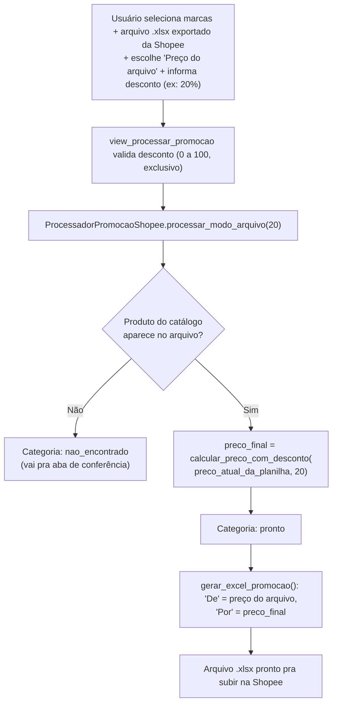

# Shopee Ganha Modo Arquivo de Promoção Igual ao TikTok

**Resumo**: a tela de gerar promoção da Shopee só calculava o preço "De"/"Por" a partir da Grade do sistema — ganhou um 2º modo, "Preço do arquivo", que usa o preço já correto na própria plataforma + um desconto manual, sem checar Grade, estoque ou divergência. Espelha ponto a ponto a arquitetura que já existia no TikTok Shop desde 23/07/2026. Validado com upload real de arquivo da Shopee em 17/08/2026.

> [!success] ATIVA — decisão implementada e validada com dado real
> Os 2 modos (Grade e Arquivo) convivem na mesma tela da Shopee desde 17/08/2026, sem que 1 afete o outro. Durante a validação com arquivo real apareceu 1 bug adjacente (marca com "/" quebrando o link de download) — corrigido em nota própria, ver [[Marca com Barra Quebra Link de Download de Promocao]].

## Contexto

O Sistema Interno tem uma tela "Gerar Promoção" pra cada marketplace (Shopee, TikTok Shop, e futuramente outros) — ela monta, automaticamente, o arquivo de planilha que aquela plataforma aceita pra subir uma promoção em massa, pra várias marcas de uma vez.

Até 17/08/2026, a Shopee só tinha 1 jeito de calcular o preço "Por" (o preço com desconto) dessa promoção: o **Modo Grade**. Nesse modo, o sistema usa a tabela `GradePrecificacaoShopee` — uma tabela que o próprio motor de precificação do Sistema Interno já preenche pra cada produto, calculando o preço "De" (preço cheio, de exibição) e o preço "Por" (preço com desconto) a partir de custo, comissão da Shopee, frete e a margem escolhida (Competição/Mínima/Padrão/Máxima).

O TikTok Shop, por outro lado, já tinha um **2º modo** desde 23/07/2026: o **Modo Arquivo**. Em vez de usar o preço que o sistema calculou, esse modo lê o preço que já está publicado de verdade na própria plataforma — o usuário exporta uma planilha direto do TikTok Shop, o sistema lê o preço de cada produto ali, e aplica só um desconto percentual informado manualmente, sem checar nada da Grade.

## A questão a decidir

Pedido explícito do usuário em 17/08/2026: a Shopee deveria ganhar esse mesmo 2º modo? O motivo dado foi que, pra Shopee, o preço já publicado na plataforma é precificado por fora do Sistema Interno, e o usuário confia 100% nele — não faz sentido nenhum desse preço ser "corrigido" ou "travado" por uma divergência contra a Grade do sistema, que nesse caso nem é a fonte real do preço.

## O que levou à decisão — alternativas consideradas

| Alternativa | Descrição | Por que foi descartada ou escolhida |
|---|---|---|
| Manter só o Modo Grade na Shopee | Não mexer em nada, Shopee continua só com o preço calculado pelo sistema | Descartada — não atendia o pedido: o usuário queria gerar promoção a partir do preço que já está na plataforma, sem depender do cálculo interno |
| Desenhar um modo novo, específico pra Shopee | Criar uma lógica própria do zero pra esse comportamento na Shopee | Descartada — o TikTok já tinha exatamente esse modo, validado e funcionando havia quase 1 mês (desde 23/07/2026); desenhar de novo do zero seria retrabalho sem ganho nenhum |
| **Espelhar a arquitetura do TikTok ponto a ponto (escolhida)** | Replicar a mesma lógica do TikTok pra dentro da Shopee, adaptando só a diferença estrutural real entre as 2 plataformas | Mais rápida, e consistente com o padrão de "app independente" já usado no projeto inteiro: Raia, Magalu, TikTok e Shopee nunca importam código um do outro — cada marketplace duplica sua própria versão da mesma lógica de propósito, pra nenhum ficar acoplado aos outros |

A única diferença estrutural real entre as 2 plataformas, que a cópia precisou respeitar: a Shopee tem só 1 SKU por produto, enquanto o TikTok tem 2 (o par "Com Afiliado" e "Sem Afiliado" do mesmo produto) — então tudo que no TikTok lida com esse par, na Shopee vira mais simples, sem par nenhum.

## Decisão tomada

Replicar, dentro do app `shopee`, a mesma arquitetura de 2 modos que já existia no app `tiktok`:

- **Campo novo `preco_final`** na classe `ResultadoProduto` (arquivo `shopee/funcoes_auxiliares/promocao/processador_promocao_shopee.py`) — é o preço "Por" definitivo de cada produto, sempre preenchido quando o produto está pronto pra promoção (`categoria='pronto'`), não importa de qual modo ele veio: no Modo Grade vem de `grade.preco`, no Modo Arquivo vem calculado a partir do preço do arquivo + o desconto. O gerador do arquivo Excel de promoção passou a ler só este campo — ele nunca mais olha `grade.preco` direto, então nem precisa saber qual dos 2 modos gerou aquele resultado.

- **Função `calcular_preco_com_desconto(preco_referencia, desconto_percentual)`** — calcula o preço final a partir do preço de referência (o que já está na plataforma) menos o desconto percentual informado:

```python
def calcular_preco_com_desconto(preco_referencia, desconto_percentual):
    fator = Decimal('1') - (desconto_percentual / Decimal('100'))
    return (preco_referencia * fator).quantize(Decimal('0.01'))
```

  Essa função é uma cópia exata da mesma função que já existia em `tiktok/funcoes_auxiliares/promocao/processador_promocao_tiktok.py` — duplicada de propósito, seguindo o padrão de "app independente" explicado acima.

- **Método novo `processar_modo_arquivo(desconto_percentual)`**, na classe `ProcessadorPromocaoShopee` — reaproveita o mesmo índice de produtos por SKU (com fallback pro SKU de referência quando o SKU principal não bate) que o método `processar()` original (Modo Grade) já usava. A diferença central: esse método **não verifica Grade, não verifica estoque, e não bloqueia por divergência nenhuma** — o único caso que impede gerar uma linha de promoção é o produto do catálogo simplesmente não aparecer no arquivo exportado da plataforma (categoria `nao_encontrado`).

- **`gerar_excel_promocao()`** (gerador do arquivo de subida) — o preço "De" exibido no arquivo final passa a vir de 2 fontes possíveis, dependendo do modo: no Modo Grade, vem de `grade.preco_de_exibicao` (calculado pelo sistema); no Modo Arquivo, vem de `linha_arquivo.preco_atual` (o preço que já estava na planilha exportada da Shopee) — mesma lógica de referência que o TikTok já usava.

- **`view_processar_promocao`** (arquivo `shopee/views.py`) — ganhou o parâmetro `fonte_preco`, que aceita 2 valores: `'grade'` (comportamento padrão, intocado) ou `'arquivo'` (ativa o novo modo). Quando `fonte_preco='arquivo'`, a view também valida o campo `desconto_percentual` enviado pelo formulário — precisa ser um número maior que 0 e menor que 100 (0% não seria promoção nenhuma, 100% seria dar o produto de graça), senão a tela mostra erro e pede pra corrigir antes de continuar.

- **Template e JavaScript da tela** (`shopee/templates/shopee/estrutura_gerar_promocao.html` e `shopee/static/shopee/js/script_gerar_promocao.js`) — ganharam uma seção nova, "Fonte do preço 'De'", com um toggle (botão de alternância) entre Grade e Arquivo. Quando o usuário escolhe Arquivo, a seção de "Margem de referência" (que só faz sentido no Modo Grade) some da tela — não tem motivo pra mostrar uma margem que não vai ser usada pra nada nesse modo. Nenhum CSS novo precisou ser criado pra essa seção: o arquivo `layout_gerar_promocao.css` da Shopee já tinha as mesmas classes visuais que o TikTok usava pra esse mesmo toggle — a única diferença visual entre as 2 telas é a cor de destaque da marca (`#ee4d2d`, o laranja característico da Shopee).

- **Correção lateral, achada durante essa mudança**: o JavaScript que destaca visualmente o card de margem selecionado usava um seletor genérico demais (`querySelectorAll('.promocao-margem-card')`, pegando TODOS os cards da tela). Isso funcionava enquanto só existia 1 grupo de botões de rádio na tela inteira — com a chegada do novo grupo "Fonte do preço", esse seletor genérico ia apagar visualmente o destaque do card ativo do OUTRO grupo sempre que qualquer um dos 2 grupos mudasse. Corrigido escopando o seletor só pro grupo certo (`input[name="margem"]`), do mesmo jeito que o TikTok já fazia.

## Exemplo de ponta a ponta

Fluxo completo de uma geração de promoção pelo Modo Arquivo, do clique do usuário até o arquivo final:



Exemplo numérico real do cálculo: um produto que está publicado na Shopee a R$ 89,90 (esse é o `preco_atual` lido da planilha exportada), com desconto de 20% informado pelo usuário — `calcular_preco_com_desconto(Decimal('89.90'), Decimal('20'))` calcula `fator = 1 − 0,20 = 0,80`, resultando em `preco_final = 89,90 × 0,80 = R$ 71,92`. Esse é o valor que entra na coluna "Preço de desconto" do arquivo final, sem nenhuma verificação contra a Grade do sistema.

## Relacionado

- [[Marca com Barra Quebra Link de Download de Promocao]]
