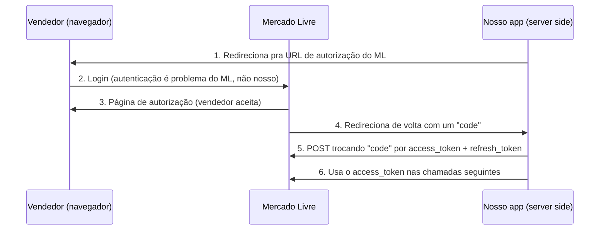

# Autenticação e Autorização na API do Mercado Livre

## O quê é esta nota, e por que ela é diferente das anteriores

**O quê**: 4ª nota da camada superior do estudo da API do Mercado Livre. Cobre como o Mercado Livre garante que só aplicativos autorizados acessem dado privado de vendedor — o protocolo OAuth 2.0, o ciclo de vida do token de acesso, e os erros específicos desse processo.

**Por quê esta nota é diferente**: ao ler essa doc lado a lado com o código real do projeto, apareceu um achado concreto — não só conhecimento sobre a API, mas uma inconsistência real no nosso próprio código de autenticação. Esse achado foi registrado à parte, como bug conhecido, em [[Autorizacao Inicial Nao Segue o Padrao Multi-Conta (Sem Prefixo MB SV)]] — esta nota aqui foca no conhecimento sobre a API em si.

**Fonte**: documentação oficial do Mercado Livre para desenvolvedores, página "Autenticação e Autorização" (sem data de última atualização explícita informada na página, diferente das anteriores).

## Autenticação vs. Autorização — a diferença exata

**Autenticação**: confirma **quem é** a pessoa (baseado em senha, no caso do Mercado Livre).

**Autorização**: define **o que essa pessoa deixou o aplicativo fazer** em nome dela — quais recursos, e se é "só leitura" ou "leitura e escrita".

São 2 processos separados: a autenticação acontece dentro do próprio Mercado Livre (o vendedor loga lá, nunca no nosso sistema); a autorização é o que o nosso aplicativo recebe como resultado — um token que representa "este vendedor permitiu que este app faça X e Y em nome dele".

## O protocolo: OAuth 2.0, fluxo Server Side, com PKCE

O Mercado Livre usa OAuth 2.0, especificamente o **Authorization Code Grant Type** (fluxo "Server Side" — pensado pra aplicativos que rodam código do lado do servidor, como é o nosso caso em Python/Django).

Resumo do fluxo, em 6 passos:

**PKCE** (Proof Key for Code Exchange) é uma camada extra de segurança opcional — mas, uma vez habilitada pro aplicativo, passa a ser obrigatória em toda chamada. Funciona assim: antes de redirecionar o vendedor, o app gera um `code_verifier` (string aleatória) e deriva dele um `code_challenge` (hash SHA-256 do verifier, codificado). O `code_challenge` vai na URL de autorização; o `code_verifier` original só é revelado depois, na troca do `code` pelo token — isso garante que só quem gerou o `code_verifier` original consegue completar a troca, mesmo que o `code` seja interceptado no meio do caminho.

> [!success] Confirmado no nosso código — usamos PKCE corretamente
> `api_mercado_livre/core/auth/autorizacao_inicial.py`, função `gerar_pkce()`, implementa exatamente esse par: `code_verifier` via `secrets.token_urlsafe(64)`, `code_challenge` via SHA-256 + base64 urlsafe, com `code_challenge_method: S256` (o método recomendado pela doc — o método alternativo, `plain`, é desaconselhado por segurança e não é o que usamos).

## Ciclo de vida do token — o que confirmamos batendo com o nosso código

| Regra da API | Valor documentado | O que nosso código faz |
|---|---|---|
| Duração do access token | 6 horas (`expires_in: 21600` segundos) | `gerenciador_token.py`, `DURACAO_TOKEN_SEGUNDOS = 21600` — bate exatamente. |
| Quando renovar | Recomendação: só renovar quando perto de expirar, não à toa | `RENOVAR_ANTES_SEGUNDOS = 1800` (30 min de antecedência) — segue a recomendação, sem renovar cedo demais. |
| `refresh_token` é de uso único | Cada renovação devolve um `refresh_token` NOVO — o antigo se torna inválido depois de usado | `_salvar_token_atomico()` grava `dados_novos["refresh_token"]` (o novo) a cada renovação — **confirmado correto**, nunca reaproveita o antigo. |
| Expiração por inatividade | Access token pode invalidar cedo se o app não chamar a API por 4 meses; `refresh_token` expira sozinho depois de 6 meses sem uso | Risco baixo na prática — os 3 comandos (`buscar_mlbs`/`buscar_detalhes`/`buscar_dados_sku_completo`) rodam com frequência bem menor que esses prazos, e cada renovação bem-sucedida reinicia o relógio (gera token novo). |

## Referência de erros específicos de autenticação

A doc lista 9 códigos de erro próprios do fluxo OAuth (diferentes dos erros "de dado" já vistos em [[Erro 403 (Forbidden) da API do Mercado Livre]]):

| Código | O que significa |
|---|---|
| `invalid_client` | `client_id` e/ou `client_secret` inválido. |
| `invalid_grant` | `authorization_code` ou `refresh_token` inválido, expirado, revogado, usado no fluxo errado, ou pertence a outro cliente. |
| `invalid_scope` | O escopo pedido é inválido ou mal formatado — valores aceitos: `offline_access`, `write`, `read`. |
| `invalid_request` | Faltou parâmetro obrigatório, ou tem parâmetro repetido/mal formado. |
| `unsupported_grant_type` | Só `authorization_code` e `refresh_token` são aceitos como `grant_type`. |
| `forbidden` (403) | Token de outro usuário, IP bloqueado, ou scope faltando — ver [[Erro 403 (Forbidden) da API do Mercado Livre]]. |
| `local_rate_limited` (429) | Chamada excessiva, bloqueio temporário — mesma família do 429 já estudado. |
| `unauthorized_client` | O aplicativo não tem "grant" (permissão concedida) com aquele usuário. |
| `unauthorized_application` | O aplicativo em si está bloqueado — não pode operar até resolver. |

> [!info] Novo campo de erro encontrado: `error_description`
> O exemplo de `invalid_grant` na doc mostra um formato de erro com um campo que ainda não tínhamos visto: `error_description` (em vez de, ou além de, `message`). Isso reforça o achado já registrado em [[Tratamento Detalhado e Relatorio Estruturado de Erros de Chamada a API do Mercado Livre]] — o formato de erro do Mercado Livre varia bastante, e a lista de campos possíveis (`status`, `error`, `message`, `cause`, `code`, `error_description`) precisa ser tratada como não-fechada.

## Requisito operacional: usuário deve ser administrador, não operador

A doc avisa que quem faz login durante a autorização inicial precisa ser o **usuário administrador** da conta — se for um operador/colaborador, a autorização falha com erro `invalid_operator_user_id`. Isso não é algo que o código controla (é uma decisão humana, de quem loga no navegador durante o passo 1) — só fica registrado como pré-requisito, caso um dia seja necessário reautorizar a Magazine ou a Samvale do zero.

## Recomendações de segurança oficiais — o que já cumprimos, e o que falta

Doc complementar, "Recomendações de Autenticação e Token" (última atualização 30/12/2025), com 5 práticas recomendadas pra reduzir risco de fraude/roubo de credencial no fluxo OAuth.

> [!success] Confirmado certo, sem ação necessária
> **Parâmetros do `POST /oauth/token` sempre no corpo (body), nunca na querystring** — os 2 scripts que trocam credencial por token (`gerenciador_token.py`, na renovação, e `autorizacao_inicial.py`, na troca inicial de `code`) usam `requests.post(TOKEN_URL, data=payload, ...)`. O parâmetro `data=` do `requests` sempre manda como corpo `application/x-www-form-urlencoded`, nunca como querystring — bate exatamente com a recomendação. **Access token sempre no header** — já confirmado antes, em `chamar_api()`.

> [!warning] Gap real, mas de baixa prioridade — sem `state` na URL de autorização
> A doc recomenda (como medida **opcional**) gerar um valor aleatório seguro e enviá-lo como parâmetro `state` na URL de autorização — depois, ao receber o `code` de volta, conferir se o `state` devolvido é o mesmo que foi enviado, como proteção contra um tipo de fraude (alguém completar o fluxo de autorização em nome de outra pessoa, sem que ela tenha iniciado). Lendo `autorizacao_inicial.py`, a função `montar_url_autorizacao()` **não envia `state` nenhum** — só `response_type`, `client_id`, `redirect_uri`, `code_challenge`, `code_challenge_method`. O risco real é baixo porque esse script roda manualmente, por 1 pessoa, colando a URL de retorno na mão — não é um servidor público esperando requisição de qualquer origem. **Decisão do usuário (26/08/2026, 22:46): registrar como conhecimento, sem corrigir agora — sem prioridade nenhuma.**

> [!info] Lembrete pro futuro — validação de origem de webhook
> A doc também recomenda validar a origem de toda notificação de webhook recebida (confirmar que é o Mercado Livre mesmo, não outra fonte) e revisar as URLs de recurso vindas na notificação antes de consultá-las. Isso não é implementável ainda porque o callback dos nossos 2 aplicativos aponta pra um serviço de teste (`webhook.site`), não pra um endpoint real — ver [[Achados Reais na Configuracao dos Aplicativos Mercado Livre (Magazine e Samvale)]]. Quando esse endpoint real for construído, essa validação de origem precisa ser parte do mesmo trabalho, não um passo separado feito depois.

## Achado real: inconsistência no script de autorização inicial

> [!warning] Ver bug conhecido separado
> Cruzando esta doc com o código, foi encontrada uma divergência real entre `autorizacao_inicial.py` (que não segue o padrão de prefixo por conta) e `gerenciador_token.py` (que exige esse prefixo). Detalhe completo, impacto, e decisão de não corrigir agora em [[Autorizacao Inicial Nao Segue o Padrao Multi-Conta (Sem Prefixo MB SV)]].

## Relacionado

- [[Erro 403 (Forbidden) da API do Mercado Livre]]
- [[Tratamento Detalhado e Relatorio Estruturado de Erros de Chamada a API do Mercado Livre]]
- [[Migracao da API do Mercado Livre com Suporte a Multiplas Contas (MB e SV)]]
- [[Autorizacao Inicial Nao Segue o Padrao Multi-Conta (Sem Prefixo MB SV)]]
- [[Como Escrever Notas no Vault — Padrao Hiper-Didatico]]
