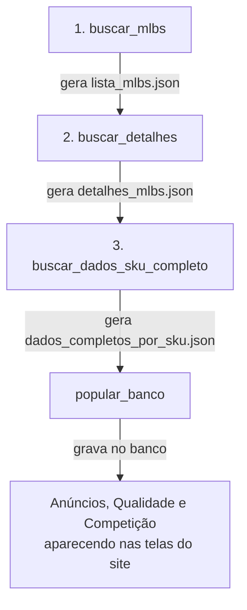

# Tutorial — Comandos de Coleta de Dados da API do Mercado Livre

## Contexto (por que este tutorial existe)

Em 26/08/2026, a integração com a API do Mercado Livre ganhou 3 comandos novos de terminal — `buscar_mlbs`, `buscar_detalhes` e `buscar_dados_sku_completo` — que trazem dado real do Mercado Livre pra dentro do sistema. Este tutorial explica **cada um dos 3**: o que ele faz, por que ele existe (que problema real ele resolve) e o que você obtém rodando ele. O histórico técnico completo da migração (decisões, achados, testes) mora em [[Migracao dos Scripts Consumidores (buscar_mlbs e buscar_detalhes) e Pipeline de Popular Banco]] — esta nota aqui é o "como usar", não o "como foi construído".

## Visão geral: por que são 3 comandos, e não 1 só

**O quê**: os 3 comandos formam uma corrente — cada um lê o resultado do anterior e produz um arquivo novo (`.json`) que o próximo vai ler. Nenhum deles fala direto com o banco de dados do sistema — eles só conversam com a API do Mercado Livre e escrevem arquivo em disco.

**Por quê**: a API do Mercado Livre não tem um único endpoint que devolva "todos os seus anúncios, com todos os detalhes, já prontos". Cada tipo de informação exige uma chamada diferente, e algumas chamadas só fazem sentido depois que você já sabe o resultado da chamada anterior (por exemplo: só dá pra buscar o detalhe de um anúncio se você já souber o identificador dele). Dividir em 3 comandos pequenos, cada um com 1 responsabilidade só, também segue a mesma regra de engenharia já usada no resto do sistema — ver [[Fluxo Decomposicao de Problemas em Micro Etapas]].

**Pra quê**: depois que os 3 rodam, o comando `popular_banco` (que já existia antes desta migração) lê os 3 arquivos gerados e grava tudo no banco de dados — é isso que faz os anúncios, a nota de qualidade e a competição de catálogo aparecerem nas telas do sistema.

O fluxo completo, do início ao fim:



> [!warning] Ordem importa, sempre
> Cada comando **exige** que o arquivo do comando anterior já exista pra aquela empresa. Se você rodar `buscar_detalhes` sem antes rodar `buscar_mlbs`, ele recusa e mostra um erro claro (`RuntimeError`) pedindo pra rodar `buscar_mlbs` primeiro — nunca falha silenciosamente nem inventa dado.

## Conceitos que você precisa saber antes de rodar qualquer comando

| Termo | O que é |
|---|---|
| **MLB** | O identificador de **1 anúncio individual** dentro do Mercado Livre — por exemplo, `MLB1683028746`. Cada variação de um produto (cor, tamanho) e cada versão (Base/Catálogo) do mesmo produto tem o seu próprio MLB, diferente dos outros. |
| **MLBU** (também chamado de `user_product_id` na API) | Um identificador que **2 anúncios diferentes compartilham** quando um é a versão "Base" e o outro é a versão "Catálogo" do mesmo produto físico. Serve pra saber que 2 MLBs diferentes são, na prática, o mesmo produto visto de 2 formas — e pra não buscar a mesma informação de qualidade 2 vezes à toa. |
| **Base / Catálogo / Simples** | As 3 formas que um anúncio pode assumir no Mercado Livre. **Simples**: anúncio independente, sem vínculo de catálogo. **Base**: quando o produto entrou na "Página de Catálogo" do Mercado Livre (uma página só, com várias lojas vendendo o mesmo produto) e o seu anúncio é a versão que você mesmo criou e controla. **Catálogo**: a versão do mesmo produto que o Mercado Livre gerou automaticamente pra representar sua oferta dentro da página de catálogo compartilhada — Base e Catálogo sempre andam em par, ligados pelo mesmo MLBU. |
| **Fecho transitivo** | O nome técnico do processo de "achar todos os MLBs relacionados a 1 SKU, navegando pelas ligações entre eles" — 1 SKU pode ter vários MLBs Simples, 1 ou mais pares Base/Catálogo, tudo isso junto. É a função `encontrar_fecho_transitivo()`, hoje em `mercado_livre/funcoes_auxiliares/classificacao_catalogo.py`. |
| **Performance** | O "boletim de qualidade" de um anúncio no Mercado Livre — nota, nível (`level_wording`) e detalhamento por critério (`buckets`). Vem do endpoint `/user-product/{MLBU}/performance`. |
| **Price to Win** | O dado de **competição** de um anúncio de Catálogo — status frente aos concorrentes, preço atual, e o preço que "ganharia" a página de catálogo. Vem do endpoint `/items/{MLB}/price_to_win` — só existe pra MLBs classificados como Catálogo (Base e Simples não competem em página de catálogo, então a API nem aceita a chamada pra eles). |
| **`--empresa`** | Parâmetro obrigatório nos 3 comandos, aceita `magazine` ou `samvale` (minúsculo, diferente do `--empresa=MAGAZINE` maiúsculo usado em `popular_banco` — cada comando define sua própria convenção de caixa). Sem ele, o comando recusa rodar — nunca assume uma empresa padrão silenciosamente. |

## Onde os arquivos são salvos

Cada comando escreve seu resultado numa pasta isolada por empresa, dentro do app novo `integracao_mercado_livre/`:

```
integracao_mercado_livre/Arquivos_API/Magazine/lista_mlbs.json
integracao_mercado_livre/Arquivos_API/Magazine/detalhes_mlbs.json
integracao_mercado_livre/Arquivos_API/Magazine/dados_completos_por_sku.json
integracao_mercado_livre/Arquivos_API/Samvale/lista_mlbs.json
integracao_mercado_livre/Arquivos_API/Samvale/detalhes_mlbs.json
integracao_mercado_livre/Arquivos_API/Samvale/dados_completos_por_sku.json
```

Cada comando também grava um arquivo de log próprio, em `integracao_mercado_livre/logs/<Empresa>/<nome_do_comando>.log` — útil pra investigar depois se algo deu errado numa execução longa.

## Comando 1 — `buscar_mlbs`

**O quê**: descobre **todos os MLBs ativos** de uma empresa no Mercado Livre e gera `lista_mlbs.json`.

**Por quê existe**: a API do Mercado Livre não tem um endpoint de "me dá todos os seus MLBs" — só busca filtrada por características específicas (status do anúncio, tipo de logística, tipo de anúncio, se é catálogo ou não). Pra não arriscar deixar nenhum MLB de fora, o comando varre **todas as 168 combinações possíveis** dessas 4 características (6 status × 7 tipos de logística × 2 tipos de anúncio × 2 classificações de catálogo — 6×7×2×2 = 168), gerada automaticamente via `itertools.product` (função pronta do Python que monta todas as combinações entre listas, sem precisar escrever 168 linhas na mão).

**Comando**:

```bash
poetry run python manage.py buscar_mlbs --empresa magazine
poetry run python manage.py buscar_mlbs --empresa samvale
```

**O que você obtém**: `lista_mlbs.json`, com 1 registro por MLB encontrado — `{mlb, status, logistica, tipo, catalogo}`. Resultado real, validado em 26/08/2026: **Magazine — 5.640 MLBs encontrados**, em 35 das 168 combinações possíveis (as outras 133 combinações simplesmente não tinham nenhum anúncio daquele tipo), 0 combinação com erro, 132,9 segundos no total. Samvale também rodado e confirmado funcionando pelo usuário.

## Comando 2 — `buscar_detalhes`

**O quê**: pega a lista de MLBs gerada pelo comando 1 e busca o **detalhe completo** de cada um — título, preço, SKU, imagens, datas, quantidade vendida, e mais. Gera `detalhes_mlbs.json`.

**Por quê existe**: a lista do comando 1 só diz "estes MLBs existem" — não diz nada sobre o produto em si. Pra saber o que cada MLB realmente é (nome, preço, foto), é preciso 1 chamada adicional por grupo de MLBs ao endpoint `/items?ids=...`, que aceita até 20 identificadores por chamada — por isso o comando processa em lotes de 20.

**Depende de**: `lista_mlbs.json` (saída do comando 1) já existir pra aquela empresa — sem isso, o comando para e mostra um erro claro, pedindo pra rodar `buscar_mlbs` primeiro.

**Comando**:

```bash
poetry run python manage.py buscar_detalhes --empresa magazine
poetry run python manage.py buscar_detalhes --empresa samvale
```

**O que você obtém**: `detalhes_mlbs.json`, 1 registro por variação do produto (um MLB com 3 variações de cor vira 3 registros). Resultado real, validado em 26/08/2026: **Magazine — 5.906 registros**, a partir de 5.640 MLBs processados (100%, 0 erros de lote, 0 erros de item), em 282 lotes, 165,3 segundos no total. **Samvale — 3.545 registros**, a partir de 3.280 MLBs (100%, 0 erros), 86,8 segundos. Nos 2 casos, o número de registros é maior que o de MLBs porque cada variação de produto vira 1 registro a mais.

> [!tip] Retomada automática se a execução cair no meio
> Este comando salva um arquivo de progresso (`detalhes_progresso.json`) a cada lote de 20. Se a execução for interrompida (queda de conexão, computador desligado), rodar o comando de novo continua exatamente de onde parou, em vez de começar tudo de novo — o arquivo de progresso só é apagado quando a execução termina 100% sem nenhum erro.

## Comando 3 — `buscar_dados_sku_completo`

**O quê**: agrupa os MLBs por **SKU** (o código do produto no seu próprio catálogo, não o MLB do Mercado Livre) e busca 2 blocos de dado por MLB: **Performance** (qualidade) e **Price to Win** (competição de catálogo). Gera `dados_completos_por_sku.json`.

**Por quê existe**: qualidade e competição não são um dado "por MLB isolado" — são um dado "por produto real", que pode envolver vários MLBs ao mesmo tempo (o par Base/Catálogo, mais qualquer Simples do mesmo SKU). Antes de buscar esses 2 blocos, o comando precisa primeiro descobrir **quais MLBs pertencem ao mesmo SKU** — é aqui que entra o **fecho transitivo** (ver tabela de conceitos acima). Depois de agrupado, o comando chama Performance pra todo MLB que tiver MLBU, e chama Price to Win só pros MLBs classificados como Catálogo (Base e Simples nem têm esse dado disponível na API).

**Depende de**: `detalhes_mlbs.json` (saída do comando 2) já existir pra aquela empresa.

**2 modos de execução**:

- **Produção** — roda **todos** os SKUs distintos da base, com retomada automática em caso de queda (mesmo esquema do comando 2). Aviso real: rodar a base inteira pode levar **mais de 1h30**.

  ```bash
  poetry run python manage.py buscar_dados_sku_completo --empresa magazine
  ```

- **Teste pontual** — roda só os SKUs informados, sem esperar a base inteira. Nunca apaga o resultado de uma execução de produção anterior — faz *merge*, atualizando só os SKUs testados e preservando o resto do arquivo.

  ```bash
  poetry run python manage.py buscar_dados_sku_completo --empresa magazine --skus F7908050719121.001
  ```

**O que você obtém**: `dados_completos_por_sku.json`, com 1 bloco por SKU, cada bloco listando todos os MLBs daquele SKU e o resultado de Performance/Price to Win pra cada um. Resultado real do teste pontual, validado em 26/08/2026 — SKU `F7908050719121.001` (Magazine): **19 MLBs encontrados pelo fecho transitivo** (7 Base, 6 Simples, 6 Catálogo). Performance chamada com sucesso nos 19. Price to Win chamada só nos 6 Catálogo (os outros 13 ficaram `chamado: False`, exatamente como esperado — Base e Simples não têm esse dado).

## Depois dos 3 comandos: `popular_banco`

**O quê**: `popular_banco` (comando que já existia antes desta migração) lê os 3 arquivos `.json` acima e grava o dado no banco do Django — é só depois disso que o dado aparece de fato nas telas do sistema.

**Comando**:

```bash
poetry run python manage.py popular_banco --empresa MAGAZINE
```

(Note que aqui a empresa vai em **maiúsculo** — `popular_banco` usa essa convenção, diferente dos 3 comandos novos, que usam minúsculo. Confira sempre a caixa certa pra cada comando.)

> [!info] Nem toda etapa de ML está ligada ainda
> `popular_banco` tem 5 etapas relacionadas ao Mercado Livre. 4 delas (Anúncios ML, Dimensões Declaradas ML, Qualidade, Competição) já estão religadas e funcionando. A 5ª (Promoções ML) segue propositalmente desligada — é um assunto pausado à parte, sem relação com os 3 comandos deste tutorial.

## Exemplo prático de ponta a ponta (dado real, Magazine, 26/08/2026)

```bash
poetry run python manage.py buscar_mlbs --empresa magazine
# → 5.640 MLBs encontrados, 132,9s

poetry run python manage.py buscar_detalhes --empresa magazine
# → 5.906 registros (5.640 MLBs, 100%, 0 erros), 165,3s

poetry run python manage.py buscar_dados_sku_completo --empresa magazine --skus F7908050719121.001
# → 19 MLBs pro SKU testado (7 Base, 6 Simples, 6 Catálogo)

poetry run python manage.py popular_banco --empresa MAGAZINE
# → gauge de qualidade e status de competição aparecendo na tela do site, confirmado visualmente
```

> [!success] Validação real, não só "o dado chegou"
> A confirmação final de que tudo funcionou não foi só ver o arquivo `.json` cheio — foi abrir a tela do site de verdade e ver o gauge de qualidade e o status de competição aparecendo pra esse SKU. Teste de dado sem checar a tela real prova só que o arquivo existe, não que o sistema usa ele direito.

## Armadilhas conhecidas

> [!warning] Rodar sem `--empresa` não funciona
> Os 3 comandos recusam rodar sem `--empresa` — não existe empresa padrão. Se esquecer, o próprio comando avisa com um erro claro, nunca roda "só pra ver" contra a empresa errada.

> [!warning] Rodar fora de ordem
> Rodar `buscar_detalhes` sem `lista_mlbs.json` já existir, ou `buscar_dados_sku_completo` sem `detalhes_mlbs.json` já existir, gera um erro claro (`RuntimeError`) — nunca um resultado incompleto silencioso.

> [!warning] `buscar_dados_sku_completo` sem `--skus` demora
> Rodar em modo produção (todos os SKUs) pode passar de 1h30. Pra testar rápido, sempre use `--skus SKU1,SKU2` primeiro.

## Relacionado

- [[Migracao dos Scripts Consumidores (buscar_mlbs e buscar_detalhes) e Pipeline de Popular Banco]]
- [[Migracao da API do Mercado Livre com Suporte a Multiplas Contas (MB e SV)]]
- [[Padrao de Robustez para Clientes de API Externa]]
- [[Como Escrever Notas no Vault — Padrao Hiper-Didatico]]
- [[Guia de Setup - Do Zero ao Primeiro Preco Calculado]]
