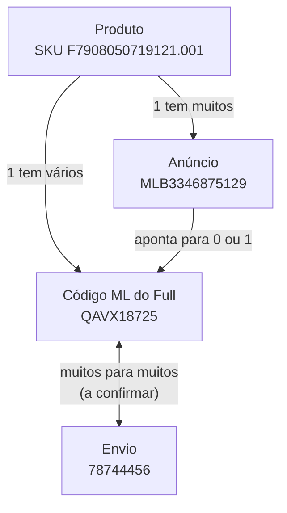

# Níveis de Granularidade do Full e Como os Dados se Ligam

## Resumo

Tudo que olhamos no Full (estoque, venda, reposição, envio) pertence a um de **4 níveis de detalhe**: **Produto**, **Anúncio**, **Código ML do Full** e **Envio**. Cada nível tem identificador próprio, fonte de dado própria e responde a uma pergunta diferente. Esta nota é o **mapa**: o que cada nível é, como um se liga ao outro e de onde o dado vem hoje — separando o que está **confirmado** do que ainda é **hipótese**.

## Contexto

Em 07/10/2026 o usuário parou a análise de dados do Full (testes da fórmula do "A caminho", leitura de PDFs, telas do Magiic) com um diagnóstico: estávamos pulando de PDF em PDF, misturando dados de muitos lugares, sem um norte. A decisão dele foi:

1. **Primeiro definir o fluxo de uso (UX flow)**: o que a pessoa que usa o sistema quer achar e por quê. Só depois pensar no *como* (qual API, qual PDF).
2. **Quebrar o problema grande em vários micro-problemas**, começando por entender os níveis de detalhe e como um dado se liga ao outro.
3. Pergunta-guia: *"se eu quiser saber sobre o envio 78310187, como eu faço isso?"*.

Fontes de dado disponíveis: a **API do Mercado Livre** e os **PDFs** dos envios (o mesmo acesso que o Magiic tem). Em 07/10 só havia os PDFs baixados pelo Magiic; o acesso ao site do ML só voltava em 08/10, depois das 7h.

## O que é

### Granularidade, em uma frase

**Granularidade** é o "zoom" do dado: o mesmo assunto (Full) pode ser olhado de longe (um produto inteiro) ou de perto (uma remessa específica). Quem usa o sistema precisa de zooms diferentes em telas diferentes — por isso precisamos dar nome a cada zoom antes de desenhar qualquer tela.

### Os 4 níveis

| Nível | Pergunta que esse nível responde | Identificador | Exemplo real | Onde vive hoje |
|---|---|---|---|---|
| **Produto** | "O que eu vendo?" | SKU (`F` + EAN + `.001`) e EAN | SKU `F7908050719121.001` (Brudden SS20-B 20L), EAN `7908050719121` | Nosso banco (dado do ERP — a tela mostra "Estoque (ERP)") |
| **Anúncio** | "Como esse produto aparece à venda no ML?" | MLB | `MLB3346875129` | Nosso banco (vem da coleta de anúncios) |
| **Código ML do Full** | "Quanto desse produto está dentro do Full e precisa de reposição?" | `inventory_id` (ligado a um MLBU) | `QAVX18725` (MLBU `MLBU1099556282`) | API do ML, consultada só por botão |
| **Envio** | "O que eu mandei (ou vou mandar) para o Full numa remessa?" | Número do envio | `78744456` | PDF do ML; página do Seller Center (ainda não vista) |

Termos, um por um:

- **SKU**: código interno do produto no nosso sistema/ERP. Padrão da casa: `F` + EAN + `.001`.
- **MLB**: número do anúncio no Mercado Livre. Os tipos (Base de Catálogo, Anúncio de Catálogo, Simples) estão em [[Nomenclatura Base Catalogo Simples Pagina De Catalogo]].
- **Código ML do Full**: o nome que usamos na tela para o `inventory_id` do ML — a "etiqueta" do estoque físico guardado nos centros de distribuição (CDs) do Full. É nele que o ML conta estoque, vendas e reposição.
- **MLBU (`user_product_id`)**: "produto do vendedor". O ML agrupa sob um MLBU os anúncios do mesmo produto físico; cada Código ML do Full pertence a um MLBU (a tela mostra "Produto do vendedor: MLBU…"). Ver [[MLBU Compartilhado Entre Base E Catalogo Pareado]].
- **Envio** (em inglês, *inbound*): a remessa que o vendedor manda do seu depósito para um CD do Full. Tem um número (ex.: 78744456). No PDF aparece como "Frete #78744456"; na URL do Seller Center, como `inbounds/78744456/details`.
- **REPOS** e **ESTOQUE**: nomes que damos às 2 chamadas de API do nível Código ML — REPOS = `GET /marketplace/fbm/user-products/{upid}/replenishment?country=BR` (reposição); ESTOQUE = `GET /inventories/{inv}/stock/fulfillment` (estoque no Full).

### Como os níveis se ligam

| Ligação | Quantos de cada lado | Exemplo real (07/10/2026) | Situação |
|---|---|---|---|
| Produto → Anúncio | 1 produto tem muitos anúncios | SKU `F7908050719121.001` tem 20 anúncios na tela (6 com Código ML + 14 sem) | Confirmado |
| Produto → Código ML | 1 produto pode ter vários Códigos ML | O mesmo SKU tem 3: `RWBD51502`, `OPXW24140`, `QAVX18725` | Confirmado |
| Anúncio → Código ML | Cada anúncio aponta para 0 ou 1 Código; cada Código atende vários anúncios | Cada um dos 3 Códigos atende 2 anúncios; os 14 anúncios sem Código não têm estoque nem reposição no Full | Confirmado na tela |
| Código ML ↔ Envio | Muitos para muitos, por desenho | O envio `78419404` lista 5 Códigos diferentes | "Envio com vários Códigos": confirmado. "Código em vários envios": **a confirmar** (ainda não observado) |

**Onde mora o elo Envio ↔ Código ML:** no **PDF do envio** ("Frete #N – Lista de produtos e instruções de preparação"). Para cada item ele traz Código ML, EAN/código universal, SKU, unidades, identificação e instruções de preparação. Como o PDF carrega **o SKU e o Código ML juntos**, ele é a ponte entre o nível Envio e os níveis Produto/Código ML.

### De onde vem cada nível hoje

| Nível | Fonte | Como chega ao sistema | Observação |
|---|---|---|---|
| Produto | ERP | Já está no nosso banco | Tela lê do banco |
| Anúncio | API do ML (coleta de anúncios) | Já está no nosso banco | Tela lê do banco |
| Código ML do Full | API do ML: REPOS + ESTOQUE | Só quando o usuário clica ("Consultar de novo" ou "Sincronizar todos os Códigos ML") | Regra do projeto: nenhuma chamada automática à API |
| Envio | PDF do envio; página do Seller Center | PDF baixado pelo Magiic (hoje); página nunca vista | Não achamos, nas docs oficiais lidas, endpoint que devolva um envio **antes** do recebimento |
| Envio, depois de recebido | API de operações: `GET /stock/fulfillment/operations/search` | Operação do tipo `INBOUND_RECEPTION` com `external_references.inbound_id` | **A confirmar** se esse `inbound_id` é o mesmo número do envio (a doc só dá o exemplo "0001") |

Sobre o **Magiic**: é um canal de terceiros, não a fonte de verdade. O "Trânsito" dele vem de PDFs que o time sobe (ação `upload_pdf`), mais lançamento manual e "Dar baixa" manual; o campo "Data coleta" também é manual. Serve hoje como o único meio de baixar os PDFs, e como lista dos envios pendentes.

### Como responder "quero saber sobre o envio 78310187"

| O que a pessoa quer saber | Fonte | Situação |
|---|---|---|
| O que tem dentro (Códigos, SKUs, unidades) | PDF do envio | Confirmado como fonte (PDF do envio `78419404` lido). Para o `78310187` só temos o resumo do Magiic: 6 produtos, 200 unidades — os Códigos ainda não foram vistos |
| De quais produtos e anúncios nossos são esses itens | Cruzar o SKU/Código do PDF com o nosso banco | Possível hoje, depende só de ter o PDF |
| Em que situação está (a caminho, recebido, parcial) | Página do Seller Center; ou Magiic (manual) | **A confirmar** — a página nunca foi vista |
| Quanto já chegou versus o declarado | API de operações (após recebimento); ou Seller Center | **A confirmar** (depende do `inbound_id`) |
| Para qual CD vai | Desconhecido | **A confirmar** — ainda não achamos de onde sai |

### O que a tela faz hoje

A tela "Full — Planejamento de envios" é **orientada a produto**: abre um produto, mostra seus Códigos ML (um cartão por Código) e, dentro de cada um, os anúncios que o usam. Ou seja, cobre Produto → Código ML → Anúncio. O nível **Envio ainda não tem tela**.

## Por que é assim e não de outro jeito

- **Por que 4 níveis separados:** cada um responde a uma pergunta diferente, vive numa fonte diferente e tem cardinalidade diferente (um envio mistura produtos; um produto passa por vários envios ao longo do tempo). Tratar "envio" como atributo do produto esconderia exatamente isso.
- **Por que o estoque do Full pertence ao Código ML e não ao Anúncio:** os dois anúncios de um mesmo Código mostram o mesmo valor de "Estoque" (30 e 30 no `RWBD51502`; 95 e 95 no `OPXW24140`; 221 e 221 no `QAVX18725`) — sinal de que o número é do Código, e o anúncio só o exibe. Atenção: esse "Estoque" é o valor guardado do anúncio, que **não** coincide com os números consultados no Full (no `QAVX18725`, 221 no anúncio contra 178 disponíveis na consulta de 07/10 13:47).
- **Alternativa descartada — atacar o problema "macro":** misturar PDFs, telas do Magiic e API na mesma análise rendeu horas de leitura sem nada utilizável. Sem saber a que nível cada dado pertence, qualquer número (por exemplo "A caminho") fica sem dono. Decisão do usuário em 07/10/2026: **níveis → fluxo de uso (o quê e por quê) → só então o como**.
- **Por que o Magiic não é a fonte de verdade:** os números dele dependem de PDFs subidos e de lançamento manual; ele só nos dá o acesso aos PDFs e à lista de envios pendentes.

## Exemplo

Produto Brudden SS20-B 20L, SKU `F7908050719121.001`, como estava na tela em 07/10/2026:

| Código ML do Full | MLBU | Anúncios que usam | Observação |
|---|---|---|---|
| `RWBD51502` | `MLBU1092265387` | `MLB1683028746` (Base de Catálogo) e `MLB5593532940` (Anúncio de Catálogo) | Ambos mostram Estoque 30 |
| `OPXW24140` | `MLBU3513984894` | `MLB5838465508` (Simples) e `MLB7574006382` (Anúncio de Catálogo, encerrado) | Ambos mostram Estoque 95 |
| `QAVX18725` | `MLBU1099556282` | `MLB1942167064` (Base de Catálogo) e `MLB3346875129` (Anúncio de Catálogo) | Ambos mostram Estoque 221 |

Além desses 6, o SKU tem **14 anúncios sem Código ML**: sem Código, o Full não tem estoque nem reposição para eles e eles não entram no planejamento de envios.

Os envios ativos em 07/10/2026 eram 5, somando 1.499 unidades (lista de envios pendentes do Magiic):

| Envio | Unidades | Códigos ML (unidades declaradas) |
|---|---|---|
| `78744456` | 960 | `QAVX18725` (960) — um único Código |
| `78719581` | 31 | `TIAW14801` (25), `VCSX15962` (6) |
| `78419404` | 59 | `ZAIE37882` (42), `LSTG96936` (10), `EDYT87958` (3), `BVJZ25515` (2), `MWIM55005` (2) — o caso de **1 envio, 5 Códigos** |
| `78310187` | 200 | 6 produtos — Códigos ainda não vistos |
| `78719582` | 249 | 5 produtos — Códigos ainda não vistos |

Leitura do exemplo: o Código `QAVX18725` (nível 3) liga-se ao envio `78744456` (nível 4) com 960 unidades; ao mesmo tempo o envio `78419404` mostra que um envio carrega vários Códigos. Um mesmo Código aparecendo em dois envios ao mesmo tempo é a parte do muitos-para-muitos que ainda **não vimos acontecer**.

## Estado do conhecimento (07/10/2026)

> [!success] Confirmado
> - Os 4 níveis e seus identificadores, vistos em dado real.
> - Produto → vários Anúncios e vários Códigos ML (SKU Brudden: 20 anúncios, 3 Códigos).
> - Um envio lista vários Códigos ML (`78419404`: 5).
> - O elo Envio ↔ Código ML está no PDF do envio.
> - Nas docs oficiais lidas (páginas "Envios Fulfillment" e "Planejamento de reposição para Fulfillment", salvas em 06/10/2026) não há endpoint que devolva um envio antes do recebimento.
> - O "Trânsito" do Magiic vem de PDFs subidos pelo time e de lançamento manual.

> [!warning] Hipótese / a confirmar
> - O `inbound_id` da operação `INBOUND_RECEPTION` ser o mesmo número do envio (conferir quando o `78744456` for recebido).
> - Um mesmo Código ML aparecer em mais de um envio ao mesmo tempo.
> - O conteúdo da página `inbounds/{id}/details` do Seller Center (nunca vista) e de onde sai o CD de destino.
> - "A caminho" do Código ML = `total_stock` (REPOS) − `total` (ESTOQUE). Assunto de outra nota: em 07/10 13:47 deu 961 no `QAVX18725` contra 960 declarados no envio `78744456` — 1 unidade de diferença sem explicação. Confirmar no tooltip do ML em 08/10, depois das 7h.

> [!question] Próximo passo definido pelo usuário
> Escolher, nível por nível, **quais perguntas importam** (UX flow) antes de desenhar telas — começando pelo nível Envio, que hoje não tem tela. Quais perguntas entram em quais telas continua decisão em aberto.

## Fontes

- Docs oficiais do Mercado Livre salvas em 06/10/2026: "Envios Fulfillment" e "Planejamento de reposição para Fulfillment".
- PDF "Frete #78419404 – Lista de produtos e instruções de preparação" (baixado pelo Magiic).
- Telas do Magiic de 07/10/2026: lista de envios pendentes e modais "Produtos do envio".
- Tela do sistema "Full — Planejamento de envios" do produto SKU `F7908050719121.001`, salva em 07/10/2026 13:47.
- Código: `mercado_livre/funcoes_auxiliares/full_planejamento_ml.py`.

## Relacionado

- [[MLBU Compartilhado Entre Base E Catalogo Pareado]] — por que Base e Catálogo pareado caem no mesmo MLBU (e, na tela, no mesmo Código ML).
- [[Nomenclatura Base Catalogo Simples Pagina De Catalogo]] — nomes dos tipos de anúncio usados na tabela do exemplo.
