# Regras de Determinação do Frete no Mercado Livre — Pesquisa Externa (GPT Deep Research)

**O quê é esta nota**: não é uma nota Claude (Descoberta/Decisão/Conceito escrita a partir de código ou doc lida diretamente) — é uma pesquisa externa feita pelo GPT (deep research), a pedido de Matheus, enquanto a coleta de `buscar_frete_real_ml` rodava em massa (22/09/2026). Guardada aqui porque o conteúdo é conceitual/referência sobre a API e a plataforma do ML — mesmo critério das outras notas desta pasta — mas com autoria e método diferentes: o GPT pesquisou só fontes oficiais do ML (developers, Central de Aprendizagem, Central de Fornecedores, Knowledge Hub), sem acesso ao nosso código ou aos nossos testes.

**Por que está aqui e não só na conversa**: Matheus pediu análise (22/09) e registro do arquivo em algum lugar do vault. Cruzei o conteúdo contra o que já tínhamos validado empiricamente (`scripts_exploracao_ML/`) — bateu em tudo (estrutura do JSON, fórmula de peso volumétrico ÷ 6.000, billable_weight = MAX entre físico e volumétrico, distinção `senders[].cost` vs `receiver.cost`). O ponto novo e mais importante que essa pesquisa trouxe — o risco de `frete_real` depender do preço/margem — está registrado na Seção 13 do [[Checkpoint - Frete Real da API Implementado (Tela, Banco de Dados e Comando de Coleta em Massa)]].

**Nota de qualidade do documento**: o arquivo original (`deep_research_GPT_REGRAS_DE_FRETE.md`, salvo por Matheus na raiz do vault) veio com marcadores de citação quebrados (`citeturnXXsearchYY`) espalhados por praticamente toda sentença — resíduo de um formato de citação do GPT que não sobreviveu à exportação. Removidos nesta cópia (120 ocorrências), mantendo o texto e as tabelas exatamente como o GPT escreveu — só a tabela final ("Matriz comparativa e fontes oficiais consultadas", ao fim desta nota) tem URLs reais e verificáveis, então é a parte mais fácil de auditar por fora.

**Como ler**: o documento assume uma conta MercadoLíder Platinum com reputação máxima (perguntado como premissa) e é explícito sobre o que É regra pública confirmada vs. o que NÃO é especificado publicamente (ex.: não existe desconto percentual Platinum documentado — o GPT recusou inventar um).

---

## Resumo executivo

Este relatório considera como premissa real que sua conta é **MercadoLíder Platinum e possui reputação máxima**, e utiliza **exclusivamente fontes oficiais do ecossistema Mercado Livre**: documentação para desenvolvedores, Central de Aprendizagem, Central de Fornecedores, Knowledge Hub/Central de Ajuda e termos do próprio Mercado Livre. A pesquisa foi consolidada em **22 de setembro de 2026**. A página indicada por você, originalmente em `/ajuda/Custos-de-frete-gratis-pelo-Mercado-Envios_3362`, corresponde atualmente à página oficial **“Custos por oferecer frete grátis no Mercado Livre”**, no Knowledge Hub.

A conclusão central é que **não existe uma única fórmula pública e estática capaz de reproduzir integralmente o preço de frete do Mercado Livre**. Há, porém, uma parte física explícita: o custo considera o produto **já embalado**, compara peso físico com peso volumétrico e utiliza o maior; o peso volumétrico é calculado por `altura × largura × profundidade ÷ 6.000`. Depois disso entram contexto comercial e logístico — preço do item, tipo de anúncio, condição, modalidade logística, política de frete grátis, reputação, origem/cobertura, destino e eventuais descontos/subsídios. A própria documentação da API recomenda fornecer esse contexto para obter uma cotação coerente.

Outro ponto crítico é a diferença entre **custo logístico bruto, preço cobrado do comprador, custo atribuído ao vendedor e subsídio/desconto do Mercado Livre**. Esses valores não são intercambiáveis. Antes da venda, `/users/{user_id}/shipping_options/free` serve para estimar o custo relacionado ao vendedor; para um anúncio e CEP específicos, `/items/{item_id}/shipping_options?zip_code=...` mostra opções de entrega e seus custos; depois da venda, `/shipments/{shipment_id}/costs`, sobretudo `senders[].cost`, é a referência indicada pelo próprio Mercado Livre para saber quanto efetivamente coube ao vendedor.

Para sua condição de **MercadoLíder Platinum**, a documentação pública confirma que MercadoLíderes possuem benefício de frete grátis com desconto, mas **não encontrei uma porcentagem pública adicional e universal exclusiva do nível Platinum**. As regras públicas atuais de frete tendem a segmentar por **reputação**, logística, preço, peso/distância e categoria — e a página oficial de custos é inclusive intitulada “Custos dos Envios no Mercado Livre para MercadoLíder, reputação verde ou sem reputação”. Assim, seria incorreto acrescentar, por conta própria, um “desconto Platinum de X%” a uma fórmula.

Há, entretanto, benefícios quantitativos aplicáveis à sua condição. No **Envios Flex**, para produtos novos a partir de R$ 79, o vendedor oferece frete grátis e recebe **10% da tarifa do envio quando possui reputação verde**; como você informou reputação máxima, essa condição é satisfeita. No Full, a Central de Aprendizagem informa atualmente que o Mercado Livre **cobre 50% do frete grátis dos produtos a partir de R$ 79**, regra de Full que não é descrita como exclusiva de Platinum.

Desde a política atual de frete grátis a partir de **R$ 19**, o Mercado Livre divulga essa implantação como permanente, juntamente com a nova regra “Flat Fee” e redução de até 40% nos custos de envio para itens entre R$ 79 e R$ 200. Isso **não significa que todo anúncio de R$ 19 tenha automaticamente o mesmo frete**: outra página oficial adverte explicitamente que a gratuidade está sujeita a **peso, preço e distância do envio**.

A recomendação técnica mais importante é, portanto: **não codifique uma tabela de frete como verdade definitiva em seu ERP**. Calcule peso faturável localmente para validação, mas faça a cotação oficial pela API no contexto do anúncio e preço; mantenha o preço de venda iterativo porque `item_price` influencia a cotação; e reconcilie cada venda posteriormente por `/shipments/{id}/costs`. A própria documentação alerta que a cotação pré-venda pode divergir do front por parâmetros omitidos, simulações ou contingências, e recomenda o recurso do shipment para conhecer o custo definitivo.

## Como o Mercado Livre determina o preço do frete

**Peso e dimensões.** O ponto de partida físico é a embalagem pronta para expedição, não apenas o produto. O Mercado Livre calcula o peso volumétrico:

\[
Peso_{volumétrico}\,(kg)=\frac{Altura_{cm}\times Largura_{cm}\times Profundidade_{cm}}{6000}
\]

e compara esse valor com o peso físico. O maior é utilizado para definir o custo. A Central de Fornecedores também informa que o Mercado Livre mede e pesa os pacotes após o envio; se as medidas efetivas diferirem das declaradas, **o custo da venda pode ser ajustado** e as novas medidas podem passar a valer para vendas posteriores.

Na API, dimensões de embalagem são tratadas em centímetros e peso em **gramas inteiros**. A documentação de atributos `seller_package_*` reforça que devem ser informadas as dimensões reais da embalagem e que medidas extremamente pequenas ou formatos inválidos podem ser recusados. Para ME2/Full, algumas dimensões podem ser determinadas ou controladas pela própria operação logística e nem sempre são livremente modificáveis pelo vendedor.

Um detalhe economicamente importante: a Central de Fornecedores informa que **o custo é cobrado por venda, e não simplesmente por pacote**. Se produtos correspondentes a vendas diferentes forem colocados em uma mesma embalagem, os custos das vendas continuam sendo considerados. A mesma fonte registra possibilidade de economia em operações de atacado conforme preços e volume ocupado pelas unidades.

**Preço do produto.** O preço é uma variável explícita tanto nas políticas quanto na API. A documentação de cotação recomenda `item_price` quando não se usa diretamente um `item_id`; além disso, as políticas comerciais distinguem faixas como abaixo de R$ 19, entre R$ 19 e R$ 78,99 e a partir de R$ 79 no Flex. Consequentemente, alterar o preço de venda pode mudar não apenas comissão e margem, mas também **quem paga o frete e quanto o Mercado Livre subsidia**.

A política geral mais recente anuncia frete grátis a partir de R$ 19 e uma redução de até 40% nos custos de envio entre R$ 79 e R$ 200. O Mercado Livre ressalva, porém, que a elegibilidade e o comportamento do frete grátis dependem também de peso e distância. Portanto, R$ 19 e R$ 79 devem ser tratados como **limiares comerciais relevantes**, não como uma função matemática suficiente para prever qualquer frete.

**Origem.** A origem afeta quais serviços logísticos estão disponíveis e pode afetar cobertura e custo. No Flex, por exemplo, a tarifa varia conforme a **área de entrega relativa à operação do vendedor** — áreas próximas, de média distância ou distantes. Em certos serviços de coleta, páginas oficiais também mostram custos variando conforme a distância entre o endereço operacional e o centro de distribuição e o volume coletado.

**Destino.** Para obter o custo e prazo voltados a um comprador concreto, a API documenta a consulta:

```http
GET /items/{ITEM_ID}/shipping_options?zip_code={ZIP_CODE}
```

No Brasil, o CEP permite obter as opções aplicáveis ao destino. A resposta pode conter `list_cost`, `cost`, método de envio e `estimated_delivery_time`. Assim, o CEP de destino é indispensável para reproduzir a experiência de entrega de um comprador específico, enquanto o endpoint de custo do vendedor pode apresentar cobertura agregada como `all_country`.

**Modalidade de envio.** A estrutura econômica muda substancialmente conforme a logística. O Mercado Livre descreve o Full como operação na qual armazena o estoque, prepara e entrega; Coleta/Agências deixam a preparação com o vendedor e a entrega com a rede Mercado Livre; e Flex utiliza a logística do próprio vendedor ou um serviço contratado para realizar entregas rápidas.

Na nomenclatura das APIs, aparecem entre os tipos ME2 `drop_off`, `xd_drop_off`/cross-docking, `self_service` para Flex e `fulfillment` para Full. A documentação de 2026 também alerta que, no Brasil, um User Product pode ter **mais de uma logística ativa**, razão pela qual uma integração atual não deve presumir uma relação “um SKU = um único logistic_type”.

**Transportadora.** Nos fluxos administrados pelo Mercado Livre, a transportadora não aparece publicamente como uma simples variável livre que o vendedor escolhe para obter uma tarifa ME2. A rede Mercado Envios coordena diversos operadores, enquanto a API permite consultar informações do carrier de um shipment já criado. No Flex, por outro lado, o vendedor executa a entrega com frota própria ou contrata um serviço de entregas; por isso, nessa modalidade o **custo da sua transportadora é um custo operacional próprio**, separado da tarifa/bônus calculados pelo Mercado Livre.

**Prazo e velocidade.** As opções de envio podem conter diferentes métodos e o objeto `estimated_delivery_time`, incluindo componentes de transporte e handling. Após a venda, os recursos de shipment expõem SLA e `lead_time`, incluindo método, custo e promessa de entrega. Isso demonstra que custo e velocidade podem estar associados à opção logística selecionada; porém, **não há nas fontes públicas consultadas uma fórmula universal do tipo “R$ X por hora/dia de redução de prazo”**.

**Tarifas fixas e variáveis.** O melhor exemplo público de tarifa explícita é o Flex. Para São Paulo, Rio de Janeiro, Curitiba, Belo Horizonte, Salvador, Porto Alegre e Brasília, a tabela atualmente publicada é:

| Peso do pacote | Área próxima | Média distância | Área distante |
|---|---:|---:|---:|
| Até 0,5 kg | R$ 7,99 | R$ 9,89 | R$ 9,99 |
| De 0,5 a 5 kg | R$ 8,99 | R$ 10,89 | R$ 10,99 |
| Mais de 5 kg | R$ 11,99 | R$ 14,89 | R$ 14,99 |

Em outras cidades, a mesma página publica R$ 7,99, R$ 8,99 e R$ 11,99 para essas três faixas de peso. Esses números são **tarifas do Envios Flex publicadas atualmente**, não uma tabela geral de ME2/Full/Coleta.

```mermaid
xychart-beta
    title "Envios Flex: efeito de peso e distância nas cidades com tarifa por área"
    x-axis ["até 0,5 kg", "0,5 a 5 kg", "mais de 5 kg"]
    y-axis "R$" 0 --> 16
    bar [7.99, 8.99, 11.99]
    bar [9.89, 10.89, 14.89]
    bar [9.99, 10.99, 14.99]
```



No gráfico, as séries aparecem, respectivamente, como **área próxima, média distância e área distante**. Os valores são os publicados pelo Mercado Livre para o Flex nas cidades especificadas acima.

**Frete grátis, descontos e subsídios.** “Frete grátis” deve ser modelado como uma condição para o comprador, e não como sinônimo de “custo logístico zero”. A API pós-venda separa `receiver.cost`, pago pelo comprador, de `senders[].cost`, atribuído ao vendedor. Assim, `receiver.cost = 0` demonstra que o comprador não pagou, mas não implica necessariamente `senders[].cost = 0`.

A resposta da API pode ainda informar `discount`, `rate` e `promoted_amount`. A documentação fornece como exemplo conceitual um frete-base de R$ 200 com desconto de 40%, resultando em `list_cost = 120`. Isso demonstra como interpretar o objeto; **não significa que seu perfil Platinum possua automaticamente desconto de 40%**.

**Promoções.** A atual política promocional/comercial de frete grátis a partir de R$ 19 foi anunciada como permanente, com modelo Flat Fee e redução de até 40% na faixa de R$ 79 a R$ 200. A documentação pública, entretanto, não publica uma equação que permita converter qualquer promoção comercial do anúncio em uma porcentagem predeterminada de frete. Por isso, o correto para integração é recalcular a cotação depois de alterações relevantes de preço e utilizar os objetos de desconto retornados pela própria API.

**Seguro/proteção.** Nas APIs públicas de custo consultadas, os componentes documentados são valores brutos, custos de comprador/vendedor, compensações e descontos; **não aparece um prêmio de seguro autônomo que possa ser adicionado como uma variável pública `insurance` ao cálculo de frete**. O Mercado Livre mantém separadamente termos e Programas de Proteção, inclusive para Envios Full e para vendedores, mas isso não deve ser convertido em “seguro de X% do frete” sem uma regra contratual específica. Logo, para a fórmula pública solicitada, **seguro como tarifa de frete separada: não especificado**.

**Taxas adicionais.** É importante não misturar frete com outros custos do marketplace. A comparação oficial das modalidades lista, no Full, tarifa de venda, custo de envio e custos de operação Full; no Flex, aparecem tarifa de venda e custos/regras próprios da modalidade. Portanto, para precificação, o ideal é manter `frete`, `tarifa de venda`, `custo operacional Full`, `custo da transportadora Flex` e impostos em contas separadas, mesmo que todos acabem afetando a margem do SKU.

## Aplicação específica ao seu perfil MercadoLíder Platinum

O Mercado Livre classifica MercadoLíder, MercadoLíder Gold e MercadoLíder Platinum como níveis do programa MercadoLíder. Entre os benefícios públicos do programa está a possibilidade de **oferecer frete grátis com desconto**. A própria qualificação MercadoLíder exige reputação em verde, condição que no seu caso é ainda reforçada pela premissa fornecida de reputação máxima.

Para cálculo de frete, contudo, é importante não transformar o nível Platinum em uma variável percentual inventada. A página oficial corrente de custos agrupa no próprio título o regime de **“MercadoLíder, reputação verde ou sem reputação”**, enquanto as regras quantitativas acessíveis publicamente costumam depender de modalidade, faixa de preço e reputação. **Não encontrei, nas fontes oficiais pesquisadas, uma regra pública dizendo “Platinum recebe adicionalmente X% de desconto de frete sobre Gold ou MercadoLíder”.** Portanto, esse diferencial deve ser considerado **não especificado publicamente**, e o valor efetivo deve vir da cotação da conta/API.

No **Envios Flex**, a aplicação à sua conta é direta. Para um produto novo:

| Valor do produto | Regra Flex pública | Consequência para sua conta Platinum com reputação máxima |
|---|---|---|
| Abaixo de R$ 19 | Comprador paga a tarifa; vendedor recebe bônus equivalente à tarifa. Se o vendedor decidir dar frete grátis, assume esse custo. | Mesma regra geral. |
| R$ 19 a R$ 78,99 | Comprador recebe frete grátis; vendedor recebe bônus equivalente a 100% da tarifa. | Mercado Livre cobre a tarifa publicada via bônus. |
| A partir de R$ 79 | Frete grátis; 10% da tarifa é bonificada **se o vendedor tiver reputação verde**. | Você satisfaz o requisito de reputação; aplica-se bônus de 10% da tarifa, sujeito às demais condições do anúncio. |

Essas regras e percentuais são expressamente publicados para o Flex.

No **Full**, a Central de Aprendizagem informa que o Mercado Livre cobre **50% do frete grátis dos produtos a partir de R$ 79**. Isso deve ser tratado como regra da modalidade Full, não como privilégio exclusivo de Platinum; custos de operação Full continuam sendo uma rubrica separada do custo de envio.

Na operação **Coleta/Agências**, a página comparativa oficial atribui ao vendedor a preparação e ao Mercado Livre a entrega, relacionando entre os custos “tarifa de venda”, “custos de envio” e “descontos por reputação”. Ela não publica, nessa página, uma porcentagem Platinum específica.

Há ainda uma consequência estratégica de 2026: o Mercado Livre já admite no MLB múltiplas logísticas em um mesmo User Product e pode utilizar Full, Flex, Coleta/Agências conforme disponibilidade. Uma página oficial destinada a vendedores informa inclusive que anúncios Full/Flex podem passar a ter Coleta/Agências e que, concluída a venda, a plataforma define a logística adequada para otimizar custos e tempos. Portanto, **seu motor de margem não deve determinar o custo apenas olhando “o anúncio é Full” ou “o anúncio é Flex”; deve olhar a logística efetivamente atribuída à venda**.

Para sua conta, a regra operacional recomendada é, assim:

> **Platinum deve ser tratado como atributo de elegibilidade/reputação da conta; nunca como percentual fixo programado manualmente. O percentual ou valor efetivamente aplicado deve ser o retornado pelo Mercado Livre para aquela cotação/venda.**

Essa conclusão decorre do fato de a documentação expor descontos no próprio retorno da cotação e o custo efetivamente atribuído ao vendedor no shipment, ao passo que não há uma porcentagem Platinum universal publicada.

## API do Mercado Livre para cotação, prazo e custo efetivo

O desenho mais robusto é usar **endpoints diferentes para perguntas diferentes**, em vez de tentar obter toda a verdade logística de uma única chamada.

| Pergunta de negócio | Endpoint principal | Momento |
|---|---|---|
| Quanto esta configuração tende a custar ao vendedor? | `GET /users/{USER_ID}/shipping_options/free` | Antes da venda |
| Quanto determinado comprador vê para seu CEP? | `GET /items/{ITEM_ID}/shipping_options?zip_code={ZIP_CODE}` | Antes da venda/checkout |
| Quanto o comprador realmente pagou e quanto coube ao vendedor? | `GET /shipments/{SHIPMENT_ID}/costs` | Após a venda |
| Qual prazo/método do shipment? | `GET /shipments/{SHIPMENT_ID}/lead_time` e `/sla` | Após a criação do envio |
| Qual transportador está executando o envio? | `GET /shipments/{SHIPMENT_ID}/carrier` | Após a criação do envio |
| Quais logísticas estão habilitadas para a conta/produto? | `/users/{USER_ID}/shipping_preferences` e serviços de shippability | Configuração/eligibilidade |

Esses recursos são documentados nas páginas atuais de custos, Mercado Envios e gerenciamento de shipments.

**Cotação do custo para o vendedor.** O principal recurso é:

```http
GET https://api.mercadolibre.com/users/{USER_ID}/shipping_options/free
Authorization: Bearer {ACCESS_TOKEN}
```

A documentação alerta expressamente que enviar somente `dimensions` pode gerar `list_cost = 0` por falta de contexto. Ela recomenda usar `item_id` ou, quando a cotação for construída por atributos, enviar também elementos como `item_price`, `listing_type_id`, `mode`/`logistic_type` e `free_shipping`. O peso em `dimensions` deve ser informado em **gramas inteiros**.

Um request ilustrativo coerente com essa estrutura seria:

```http
GET https://api.mercadolibre.com/users/123456789/shipping_options/free
    ?dimensions=40x30x25,1100
    &item_price=149.90
    &listing_type_id=gold_pro
    &mode=me2
    &logistic_type=drop_off
    &free_shipping=true
    &verbose=true
Authorization: Bearer {ACCESS_TOKEN}
```

Os valores de usuário, dimensões e preço acima são **meramente ilustrativos**; os nomes dos parâmetros seguem a documentação oficial. O endpoint exige pelo menos `item_id` ou `dimensions`, e a documentação recomenda consultar explicitamente os cenários `free_shipping=true` e `free_shipping=false` quando se deseja comparar as duas responsabilidades de custo.

O formato essencial de resposta é deste tipo:

```json
{
  "coverage": {
    "all_country": {
      "list_cost": 27.90,
      "currency_id": "BRL",
      "billable_weight": 5000
    }
  }
}
```

O `27.90` acima é **hipotético, apenas para demonstrar o formato**, e não uma tarifa vigente. Os campos documentados são `coverage`, `all_country`, `list_cost`, `currency_id` e `billable_weight`; se houver desconto, a resposta pode ainda conter dados como `rate`, `type` e `promoted_amount`. Para MLB, a FAQ oficial informa que a moeda do endpoint é BRL.

**Cotação orientada ao comprador e ao destino.**

```http
GET https://api.mercadolibre.com/items/{ITEM_ID}/shipping_options
    ?zip_code=01310930
Authorization: Bearer {ACCESS_TOKEN}
```

A resposta pode trazer uma ou mais `options`, com campos como `name`, `currency_id`, `list_cost`, `cost`, `shipping_method_id`, `shipping_method_type`, `display` e `estimated_delivery_time`. Conceitualmente, `list_cost` representa o valor antes de benefícios aplicados à opção, enquanto `cost` é o valor final mostrado/cobrado naquela opção, podendo refletir frete grátis.

Exemplo reduzido de estrutura:

```json
{
  "options": [
    {
      "name": "Entrega padrão",
      "currency_id": "BRL",
      "list_cost": 24.90,
      "cost": 0,
      "shipping_method_type": "standard",
      "estimated_delivery_time": {
        "type": "known",
        "shipping": 48,
        "handling": 24
      }
    }
  ]
}
```

Novamente, R$ 24,90 é apenas valor didático. A leitura semântica é: `list_cost` e `cost` não devem ser confundidos, e o objeto de prazo permite distinguir tempo logístico e preparação conforme a opção retornada.

**Custo financeiro definitivo da venda.** Depois de existir um shipment:

```http
GET https://api.mercadolibre.com/shipments/{SHIPMENT_ID}/costs
Authorization: Bearer {ACCESS_TOKEN}
x-format-new: true
```

A documentação atual é especialmente clara: `gross_amount` é o valor bruto do shipment sem descontos; `receiver.cost` representa o custo final do comprador; e `senders[].cost` representa o custo final correspondente ao vendedor. A FAQ orienta usar **`senders[].cost` para conciliação financeira**, e não `promoted_amount` ou campos informativos de economia.

Estrutura simplificada:

```json
{
  "gross_amount": 24.55,
  "receiver": {
    "cost": 0,
    "discounts": []
  },
  "senders": [
    {
      "user_id": 123456789,
      "cost": 8.19,
      "discounts": [
        {
          "rate": 0.60,
          "type": "mandatory"
        }
      ]
    }
  ]
}
```

Esse padrão exemplifica por que “frete grátis” não quer dizer “frete sem custo”: o comprador pode apresentar `receiver.cost = 0` e ainda assim o vendedor ter `senders[].cost > 0`.

**Prazos, SLA e transportadora.** O recurso `/shipments/{id}/lead_time` informa método, moeda, custo, tipo de custo e detalhes de entrega, enquanto `/shipments/{id}/sla` informa dados relacionados ao cumprimento de SLA. O gerenciamento de shipments também documenta o recurso de carrier para recuperar quem está tratando o envio/rastreamento.

**Preferências e elegibilidade logística.** Para não assumir que todo vendedor ou item possui as mesmas modalidades, consulte:

```http
GET https://api.mercadolibre.com/users/{USER_ID}/shipping_preferences
```

e, no modelo de User Products, os serviços de shippability documentados pelo Mercado Livre. A documentação de junho de 2026 determina que integrações para MLB estejam preparadas para múltiplas logísticas ativas no mesmo User Product.

O fluxo recomendado fica assim:

```mermaid
flowchart TD
    A[SKU + embalagem real] --> B[Peso físico]
    A --> C[Peso volumétrico<br/>A x L x P / 6000]
    B --> D[Peso faturável = maior dos dois]
    C --> D

    D --> E[Contexto comercial<br/>preço, anúncio, condição,<br/>logística, origem, frete grátis]
    E --> F[/users/{seller}/shipping_options/free]
    F --> G[Custo estimado do vendedor]

    E --> H[Item + CEP do comprador]
    H --> I[/items/{item}/shipping_options?zip_code=...]
    I --> J[Preço ao comprador + opções + prazo]

    J --> K[Venda / shipment]
    K --> L[/shipments/{id}/costs]
    L --> M[senders[].cost<br/>custo financeiro definitivo]

    K --> N[/lead_time e /sla]
    K --> O[/carrier]
```

Essa separação entre **estimativa pré-venda**, **oferta por destino** e **conciliação pós-venda** é compatível com as recomendações da documentação oficial, inclusive com o alerta de que a estimativa da API pode diferir do front quando faltam parâmetros ou há simulações/regras de contingência.

**Erros relevantes.** Entre os códigos documentados nos recursos relacionados estão: `400` para parâmetros inválidos ou seller/contexto incorreto na cotação; `404` quando um item solicitado não existe; no recurso de opções por destino, há situações de `400 invalid_zip_code`, erro associado ao item e `404` quando não existe cobertura/SLA; recursos de shipment podem retornar `401` por token ausente/inválido e `404` quando o shipment não existe.

Na prática, também trate um **HTTP 200 com `list_cost = 0` como potencial problema semântico**, e não automaticamente como “frete grátis”: a FAQ oficial alerta que isso pode ocorrer quando se envia apenas `dimensions` sem contexto suficiente.

## Limitações, exceções e casos especiais

A principal limitação é que a página oficial de custos para **MercadoLíder/reputação verde**, assim como a página indicada por você sobre custos de frete grátis, está disponível no Knowledge Hub, mas o conteúdo tabular corrente não ficou exposto de forma legível no HTML recuperado nesta pesquisa. Para cumprir sua exigência de **não usar nenhuma fonte externa**, não preenchi as lacunas com tabelas de blogs, ERPs ou fóruns. Onde o valor corrente não aparece em uma página oficial textual ou na documentação de API, ele é tratado neste relatório como **não especificado publicamente** e deve ser consultado pelo painel oficial ou obtido pela API da própria conta.

Isso é particularmente relevante para uma tabela completa de ME2 por faixa de peso, valor e categoria. A documentação pública da API ensina **como obter a cotação real**, inclusive retornando `billable_weight`, `list_cost` e desconto, mas não expõe toda a função interna que transforma cada variável em tarifa. Portanto, tentar reproduzir o algoritmo integralmente fora da API seria uma engenharia reversa incompleta.

**Reme­dição física:** mesmo uma cotação correta pode ser reajustada se, depois do despacho, o Mercado Livre constatar peso ou medidas diferentes. Isso cria um risco de margem para SKUs cujo cadastro físico esteja incorreto e é razão suficiente para usar sempre embalagem real e para retroalimentar o cadastro a partir das medidas validadas pela operação.

**ME2/Full:** em determinados fluxos, as dimensões são administradas pela logística do Mercado Livre e podem não ser modificáveis livremente via API. Portanto, uma integração não deve presumir que seu ERP consegue sobrescrever o peso dimensional oficial a qualquer momento.

**Múltiplas logísticas:** desde 2026, o comportamento no MLB admite mais de uma logística ativa para o mesmo User Product. Isso quebra integrações antigas que armazenam somente um `logistic_type` fixo por SKU. O cálculo deve ser feito para a logística da oferta/venda específica.

**Envios personalizados/ME1.** Quando o vendedor utiliza envio personalizado, a documentação permite cadastrar sua própria tabela de custos e gerenciar a logística. Nesses casos, o preço deixa de ser simplesmente a tarifa ME2 do Mercado Livre; a própria integração pode definir `shipping.mode = custom` e custos/descritivos. Há também situações `not_specified`, nas quais vendedor e comprador combinam a forma de entrega.

**Flex:** a tarifa publicada pelo Mercado Livre **não é necessariamente o custo real do motoboy/transportadora que você contratou**. O Mercado Livre determina tarifa e bônus segundo peso, área e condições da venda, enquanto a execução logística é sua. Portanto:

\[
Custo\ líquido\ Flex = Custo\ real\ da\ sua\ entrega - Bônus\ recebido
\]

Essa equação é uma recomendação gerencial derivada da estrutura oficial do Flex; o custo real da sua transportadora não é definido pelo Mercado Livre.

**Full:** além do frete, existem custos próprios de operar com Full. Portanto, o desconto/cobertura de frete não elimina despesas de armazenagem/operação aplicáveis ao serviço; elas devem aparecer separadamente na DRE do SKU.

**Categorias e campanhas podem ter regras distintas.** Um exemplo atual é o conteúdo oficial de produtos de consumo e pet, que divulga condições e incentivos próprios e, para alguns cenários Flex, valores que não devem ser confundidos com a tabela Flex genérica. Isso demonstra que categoria/campanha pode alterar o tratamento comercial; em consequência, uma tabela genérica não deve prevalecer sobre a cotação efetiva do anúncio.

**Frete grátis a partir de R$ 19 possui condições.** Apesar de o Mercado Livre chamar a mudança de permanente, outra página oficial informa que frete grátis depende de **peso, preço e distância**. Assim, a lógica correta é “avaliar elegibilidade” e não simplesmente `if price >= 19 then seller_freight = 0`.

**Envios Agora**, lançado no Brasil em 6 de junho de 2026, é um caso especial importante para integrações atuais. A documentação determina janela máxima de **25 minutos entre confirmação da venda e despacho**, limite de **50 cm em qualquer lado, 100 cm na soma dos lados e 15 kg de peso**, com identificação relacionada a `proximity` e `logistic.type = cross_docking`. Portanto, prazo e elegibilidade física precisam ser tratados antes de aplicar qualquer modelo genérico de frete.

**Produtos fora de limites, proibidos ou que exigem condições especiais** podem não ser elegíveis ao Mercado Envios/Full. O próprio Mercado Livre mantém páginas específicas para itens proibidos e orientação para produtos que não podem utilizar Envios; por isso, a primeira etapa da precificação deve ser testar elegibilidade, e somente depois cotar o frete.

**Proteção/seguro:** existem Termos do Mercado Envios, Termos do Flex e Full e Programas de Proteção separados, mas não identifiquei nos recursos de cotação uma parcela pública de prêmio de seguro que pudesse ser calculada como `valor_do_produto × taxa_de_seguro`. Para esse componente específico, a resposta rigorosa é: **não especificado como tarifa autônoma de frete nas fontes públicas consultadas**.

## Modelo de precificação, exemplos numéricos e recomendações práticas

A melhor arquitetura para precificação é dividir a operação em duas camadas: **regras que você consegue calcular deterministicamente** e **valores que somente o Mercado Livre deve fornecer**.

Primeiro, normalize seu cadastro de embalagem:

\[
PVOL = \frac{A \times L \times P}{6000}
\]

\[
PFAT = \max(PESO_{FÍSICO},PVOL)
\]

Essa é uma validação local extremamente útil para detectar um cadastro evidentemente incorreto antes de chamar a API. O Mercado Livre, contudo, continua sendo a referência final porque pode remedir o pacote.

Depois, modele o custo econômico do SKU aproximadamente como:

\[
C_{total} =
C_{produto} +
C_{embalagem} +
C_{frete\ ML} +
C_{logística\ própria} -
B_{frete} +
C_{Full} +
C_{fixos}
\]

em que `C_frete ML` deve vir da cotação; `C_logística própria` existe principalmente em Flex/custom; `B_frete` é o bônus/subsídio efetivamente aplicável; e `C_Full`, quando houver, deve permanecer separado do frete. Essa decomposição respeita a distinção que o próprio Mercado Livre faz entre tarifa de venda, custo de envio e custos operacionais por modalidade.

Para incorporar despesas percentuais e margem-alvo, um modelo gerencial — **não uma fórmula oficial do Mercado Livre** — é:

\[
Preço =
\frac{C_{total}}
{1-t_{comissão}-t_{impostos}-t_{ads}-m_{alvo}}
\]

O problema é que `C_frete ML` pode depender do próprio `Preço`, porque `item_price` entra na cotação e as políticas mudam por faixas de preço. Portanto, o preço deve ser resolvido de maneira iterativa, e não uma única vez. A documentação confirma que `item_price`, listing type, logística e condição de frete grátis fazem parte do contexto necessário da cotação.

Uma implementação robusta pode seguir:

```text
P0 = preço preliminar

cotação = shipping_options/free(P0, dimensões, logística, ...)
P1 = fórmula_de_precificação(cotação)

repetir:
    recotar usando P1
    recalcular preço
até:
    preço estabilizar
    e a faixa comercial do frete não mudar
```

Esse processo é particularmente importante nas fronteiras de **R$ 19, R$ 79 e R$ 200**, porque são valores explicitamente associados a regras comerciais atuais de frete.

Depois de cada venda, compare o frete previsto com `senders[].cost`:

\[
Erro_{frete}=Custo_{real\ shipment}-Custo_{previsto}
\]

A FAQ oficial recomenda `senders[].cost` para conciliação, e a Central de Fornecedores mostra por que pode existir diferença, por exemplo quando a operação remede peso/dimensões. Essa retroalimentação permite detectar embalagem cadastrada incorretamente, mudanças de política ou efeitos de campanhas.

**Cenário ilustrativo — produto leve, mas volumoso.** Suponha embalagem de 40 × 30 × 25 cm e peso físico de 1,10 kg:

\[
PVOL=\frac{40\times30\times25}{6000}=5,00kg
\]

Logo:

\[
PFAT=\max(1,10;5,00)=5,00kg
\]

Para fins de seleção da faixa tarifária, você não deve modelar esse item como 1,10 kg; o peso volumétrico domina. O valor monetário exato do frete deve então ser consultado, pois a fórmula de cubagem determina o peso relevante, mas **não publica, por si só, toda a tabela de preço do Mercado Envios**.

**Cenário ilustrativo — Flex, produto de R$ 60 em área próxima.** Considere produto de até 0,5 kg nas cidades em que vale a tabela por áreas. A tarifa Flex publicada para área próxima é R$ 7,99. Como o produto está entre R$ 19 e R$ 78,99, ele oferece frete grátis ao comprador e o vendedor recebe bônus equivalente ao total da tarifa:

\[
Tarifa=R\$7,99
\]

\[
Bônus=100\%\times7,99=R\$7,99
\]

\[
Comprador=R\$0,00
\]

Isso significa que o Mercado Livre disponibiliza R$ 7,99 para ajudar a cobrir sua logística; **não significa que sua transportadora custará R$ 7,99**. Se ela custar mais ou menos, essa diferença pertence à sua economia operacional Flex.

**Cenário ilustrativo — Flex, produto de R$ 120 para sua conta Platinum.** Mantenha até 0,5 kg e área próxima, cuja tarifa publicada é R$ 7,99. Para produto novo a partir de R$ 79, um vendedor de reputação verde recebe 10% da tarifa; sua conta, por premissa, tem reputação máxima:

\[
Bônus=7,99\times10\%=R\$0,799\approx R\$0,80
\]

Portanto, o comprador recebe frete grátis e você recebe aproximadamente **R$ 0,80 de bônus** naquele exemplo. Se sua entrega própria custar `X`, o custo líquido operacional seria aproximadamente:

\[
X-R\$0,80
\]

O valor `X` não é especificado pelo Mercado Livre porque depende de sua frota/transportadora.

**Cenário ilustrativo — efeito da distância no Flex.** Para um pacote de 3 kg, a tabela atual nas cidades indicadas publica R$ 8,99 em área próxima, R$ 10,89 em média distância e R$ 10,99 em área distante. Num item novo de R$ 120, com sua reputação verde, os bônus de 10% seriam aproximadamente R$ 0,90, R$ 1,09 e R$ 1,10, respectivamente. Isso demonstra que origem/destino podem alterar a tarifa mesmo quando SKU, peso e preço são idênticos.

**Cenário ilustrativo — Full a partir de R$ 79.** Imagine que uma cotação oficial do SKU resulte em custo de frete aplicável de R$ 24,00. O valor R$ 24 é hipotético. Se o item satisfizer a regra Full divulgada de cobertura de 50% do frete grátis a partir de R$ 79:

\[
Parcela\ coberta=24\times50\%=R\$12,00
\]

\[
Parcela\ remanescente=R\$12,00
\]

Esse exemplo somente é válido depois de confirmar que a regra e a cotação são as aplicáveis ao anúncio; custos operacionais Full continuam separados.

**Cenário ilustrativo da semântica do desconto na API.** A documentação usa o exemplo de um custo-base de R$ 200 com desconto de 40%. Matematicamente:

\[
R\$200\times(1-0,40)=R\$120
\]

e `list_cost` passa a R$ 120. Esse exemplo ensina a interpretar `rate`/`promoted_amount`; novamente, **não representa um desconto garantido de 40% para MercadoLíder Platinum**.

Para produção, recomendo armazenar, em cada decisão de preço, ao menos:

| Campo interno | Motivo |
|---|---|
| Dimensões de embalagem e peso físico | Explica peso faturável e permite auditar remedições. |
| `billable_weight` retornado | Mostra qual peso a cotação considerou. |
| `item_price` usado na cotação | Necessário porque preço pode alterar a regra. |
| `listing_type_id` e condição | Fazem parte do contexto tarifário. |
| `mode` e `logistic_type` | Impedem misturar Full, Flex, Coleta etc. |
| `free_shipping` usado | Determina qual responsabilidade de frete foi simulada. |
| Cotação retornada + data/hora | Tarifas e promoções podem mudar. |
| CEP/cobertura quando aplicável | Necessário para custo/prazo voltados ao comprador. |
| `shipment_id` | Chave da conciliação real. |
| `senders[].cost` | Valor final atribuído ao vendedor. |
| `receiver.cost` | Permite confirmar se comprador pagou frete. |
| Descontos/bônus retornados | Explica subsídios, sem inventar regra Platinum. |

Esses campos correspondem diretamente aos dados e contextos documentados nas APIs oficiais de cotação, shipping options e shipments.

## Matriz comparativa e fontes oficiais consultadas

A tabela abaixo sintetiza as variáveis solicitadas e, principalmente, separa aquilo que está **explicitamente especificado** daquilo que deve ser obtido dinamicamente.

| Variável | Origem da regra — link oficial | Impacto no preço | Observações |
|---|---|---|---|
| Peso físico | [Como calcular o custo de envio](https://centrodefornecedores.mercadolivre.com.br/ajuda/Como-calcular-o-custo-dos-seus_4413) | Alto | Comparado ao peso volumétrico; prevalece o maior. |
| Dimensões | [Como calcular o custo de envio](https://centrodefornecedores.mercadolivre.com.br/ajuda/Como-calcular-o-custo-dos-seus_4413) | Alto | Embalagem real; `A×L×P/6000`. |
| Peso faturável | [Custos de envio — Developers](https://developers.mercadolivre.com.br/pt-br/custos-de-envio) | Alto | API pode retornar `billable_weight`. |
| Unidades de peso/dimensão | [Itens — atributos de envio e dimensões](https://developers.mercadolivre.com.br/pt_br/api-docs-pt-br/itens-atributos-de-envio-e-dimensoes) | Operacional | Dimensões em cm; peso em gramas inteiros na API. |
| Preço do item | [Mercado Envios — custos e cotações](https://developers.mercadolivre.com.br/pt_br/gerenciamento-de-vendas/mercado-envios-custos-e-cotacoes) | Alto | `item_price` faz parte do contexto; faixas R$ 19/R$ 79 têm regras diferentes. |
| Origem | [Gestão Mercado Envios](https://developers.mercadolivre.com.br/pt_br/pessoas-interessadas/mercado-envios) | Médio/alto | Afeta disponibilidade logística; no Flex a área é relativa à operação. |
| Destino | [Custos de envio — Developers](https://developers.mercadolivre.com.br/pt-br/custos-de-envio) | Alto em cotações por comprador | Usar `zip_code` em `/items/{id}/shipping_options`. |
| Modalidade logística | [Gestão Mercado Envios](https://developers.mercadolivre.com.br/pt_br/pessoas-interessadas/mercado-envios) | Muito alto | Full, Flex, drop-off/coleta etc. têm economias distintas. |
| Flex — peso e distância | [Tarifas e bônus do Envios Flex](https://vendedores.mercadolivre.com.br/aprender/nota/como-entender-o-fluxo-financeiro-do-envios-flex) | Alto | Há tabela explícita por faixa de peso e área. |
| Transportadora | [Gerenciamento de Envios](https://developers.mercadolivre.com.br/pt-br/gerenciamento-de-envios) | Contextual | No ME2, carrier pode ser consultado no shipment; no Flex, custo da transportadora própria é do seller. |
| Prazo/SLA | [Gerenciamento de Envios](https://developers.mercadolivre.com.br/pt-br/gerenciamento-de-envios) | Indireto/por opção | APIs expõem `lead_time`, SLA e método; não há preço universal por hora publicado. |
| Frete grátis | [Custos por oferecer frete grátis](https://www.mercadolivre.com.br/knowledge-hub/3362) | Muito alto | Frete grátis ao comprador não implica custo zero ao vendedor. |
| Política a partir de R$ 19 | [Frete Grátis a partir de R$ 19](https://vendedores.mercadolivre.com.br/aprender/nota/frete-gratis-a-partir-de-r-19-o-que-muda-pro-vendedor) | Alto | Política anunciada como permanente; condições continuam sujeitas a peso/preço/distância. |
| Desconto MercadoLíder | [Como ser um MercadoLíder](https://vendedores.mercadolivre.com.br/aprender/nota/como-ser-um-mercadolider) | Favorável | Benefício público de frete grátis com desconto; percentual Platinum exclusivo não especificado. |
| Regime de custo MercadoLíder/verde | [Custos dos Envios para MercadoLíder/reputação verde](https://www.mercadolivre.com.br/knowledge-hub/40538) | Alto | Página oficial corrente; tabela não ficou legível no HTML da pesquisa. |
| Bônus Flex R$ 19–78,99 | [Tarifas e bônus Flex](https://vendedores.mercadolivre.com.br/aprender/nota/como-entender-o-fluxo-financeiro-do-envios-flex) | Favorável | 100% da tarifa é bonificada. |
| Bônus Flex ≥ R$ 79 | [Tarifas e bônus Flex](https://vendedores.mercadolivre.com.br/aprender/nota/como-entender-o-fluxo-financeiro-do-envios-flex) | Favorável | 10% da tarifa para reputação verde; aplicável à premissa da sua conta. |
| Full ≥ R$ 79 | [O que é o Full e quais vantagens oferece](https://vendedores.mercadolivre.com.br/aprender/nota/o-que-e-o-full-e-quais-vantagens-oferece) | Favorável | ML informa cobertura de 50% do frete grátis; custos operacionais Full são separados. |
| Promoções/descontos | [Frete Grátis a partir de R$ 19](https://vendedores.mercadolivre.com.br/aprender/nota/frete-gratis-a-partir-de-r-19-o-que-muda-pro-vendedor) | Variável | Até 40% de redução na faixa R$ 79–200 é divulgado; não é percentual garantido para todo anúncio. |
| Seguro | [Termos do Mercado Envios](https://www.mercadolivre.com.br/knowledge-hub/1529) e [Programa de Proteção Full](https://www.mercadolivre.com.br/knowledge-hub/4891) | Não especificado como tarifa | Não há prêmio autônomo de seguro documentado nos campos públicos de cotação consultados. |
| Custos adicionais Full | [Comparativo de envios rápidos](https://vendedores.mercadolivre.com.br/aprender/nota/com-nossos-envios-rapidos-voce-sempre-vende-mais) | Aumenta custo total | Operação Full é rubrica separada de frete. |
| Cotação pré-venda do seller | [Mercado Envios — custos e cotações](https://developers.mercadolivre.com.br/pt_br/gerenciamento-de-vendas/mercado-envios-custos-e-cotacoes) | Fonte primária | Enviar contexto suficiente; somente `dimensions` pode produzir `list_cost=0`. |
| Custo definitivo pós-venda | [Gerenciamento de Envios](https://developers.mercadolivre.com.br/pt-br/gerenciamento-de-envios) | Fonte final para conciliação | Usar `senders[].cost`; `receiver.cost` é o lado do comprador. |
| Remedição pelo Mercado Livre | [Como calcular o custo de envio](https://centrodefornecedores.mercadolivre.com.br/ajuda/Como-calcular-o-custo-dos-seus_4413) | Pode elevar ou reduzir custo | Medidas constatadas pela operação podem ajustar a venda e vendas futuras. |
| Múltiplas logísticas | [Gestão Mercado Envios](https://developers.mercadolivre.com.br/pt_br/pessoas-interessadas/mercado-envios) | Pode mudar a modalidade efetiva | Integrações MLB de 2026 devem suportar múltiplas logísticas por User Product. |
| Envios Agora | [Mercado Envios Agora](https://developers.mercadolivre.com.br/pt_br/api-docs-pt-br/mercado-envios-agora) | Caso especial | 25 min para despacho; ≤50 cm/lado, ≤100 cm soma, ≤15 kg. |
| Custom/transportadora própria | [Envios Personalizados](https://developers.mercadolivre.com.br/pt_br/escolha-tipo-de-servico/envios-personalizados) | Definido pelo seller | Custo pode vir de tabela própria, não da tarifa padrão ME2. |

**Fontes oficiais prioritárias consultadas**

| Documento oficial | Link |
|---|---|
| Custos por oferecer frete grátis no Mercado Livre — página fornecida na pergunta, em sua localização atual | [Mercado Livre Knowledge Hub](https://www.mercadolivre.com.br/knowledge-hub/3362) |
| Custos dos Envios para MercadoLíder, reputação verde ou sem reputação | [Mercado Livre Knowledge Hub](https://www.mercadolivre.com.br/knowledge-hub/40538) |
| Como calcular o custo de envio | [Central de Fornecedores](https://centrodefornecedores.mercadolivre.com.br/ajuda/Como-calcular-o-custo-dos-seus_4413) |
| Mercado Envios — Custos e cotações | [Developers Mercado Livre](https://developers.mercadolivre.com.br/pt_br/gerenciamento-de-vendas/mercado-envios-custos-e-cotacoes) |
| Custos de envio — parâmetros, retorno e shipping options | [Developers Mercado Livre](https://developers.mercadolivre.com.br/pt-br/custos-de-envio) |
| Gerenciamento de Envios — costs, SLA, lead time e carrier | [Developers Mercado Livre](https://developers.mercadolivre.com.br/pt-br/gerenciamento-de-envios) |
| Gestão Mercado Envios | [Developers Mercado Livre](https://developers.mercadolivre.com.br/pt_br/pessoas-interessadas/mercado-envios) |
| Mercado Envios 2 | [Developers Mercado Livre](https://developers.mercadolivre.com.br/pt_br/api-docs-pt-br/mercado-envios-2) |
| Atributos de envio e dimensões | [Developers Mercado Livre](https://developers.mercadolivre.com.br/pt_br/api-docs-pt-br/itens-atributos-de-envio-e-dimensoes) |
| Mercado Envios Agora | [Developers Mercado Livre](https://developers.mercadolivre.com.br/pt_br/api-docs-pt-br/mercado-envios-agora) |
| Envios personalizados | [Developers Mercado Livre](https://developers.mercadolivre.com.br/pt_br/escolha-tipo-de-servico/envios-personalizados) |
| Como ser um MercadoLíder | [Central de Aprendizagem](https://vendedores.mercadolivre.com.br/aprender/nota/como-ser-um-mercadolider) |
| Como funcionam as tarifas e bônus do Envios Flex | [Central de Aprendizagem](https://vendedores.mercadolivre.com.br/aprender/nota/como-entender-o-fluxo-financeiro-do-envios-flex) |
| Frete Grátis a partir de R$ 19 | [Central de Aprendizagem](https://vendedores.mercadolivre.com.br/aprender/nota/frete-gratis-a-partir-de-r-19-o-que-muda-pro-vendedor) |
| Comparativo Full, Coleta/Agências e Flex | [Central de Aprendizagem](https://vendedores.mercadolivre.com.br/aprender/nota/com-nossos-envios-rapidos-voce-sempre-vende-mais) |
| Benefícios e custos do Full | [Central de Aprendizagem](https://vendedores.mercadolivre.com.br/aprender/nota/o-que-e-o-full-e-quais-vantagens-oferece) |
| Termos e condições do Mercado Envios | [Mercado Livre Knowledge Hub](https://www.mercadolivre.com.br/knowledge-hub/1529) |
| Termos e Condições de Descontos de Frete, Frete Grátis e Carrinho | [Mercado Livre Knowledge Hub](https://www.mercadolivre.com.br/knowledge-hub/28939) |
| Termos do Envios Flex | [Mercado Livre Knowledge Hub](https://www.mercadolivre.com.br/knowledge-hub/4640) |
| Termos do Envios Full | [Mercado Livre Knowledge Hub](https://www.mercadolivre.com.br/knowledge-hub/2982) |

A síntese operacional, para uma conta **MercadoLíder Platinum com reputação máxima**, é portanto: **peso faturável e embalagem definem a base física; preço e logística mudam as regras comerciais; origem/destino determinam cobertura e, em certos modos, tarifa; reputação habilita benefícios como o bônus Flex; Platinum não deve ser convertido em um percentual adicional não publicado; e a única forma rigorosa de preservar margem é cotar pela API no contexto atual e posteriormente reconciliar `senders[].cost` do shipment real.**