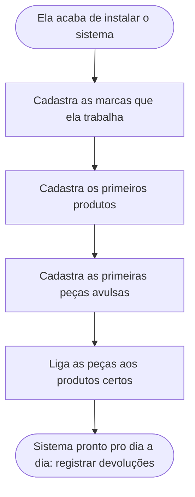
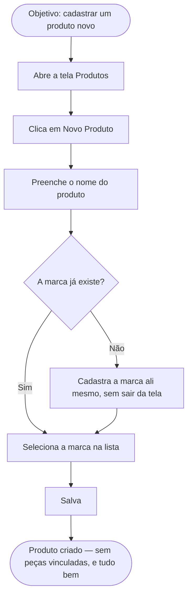
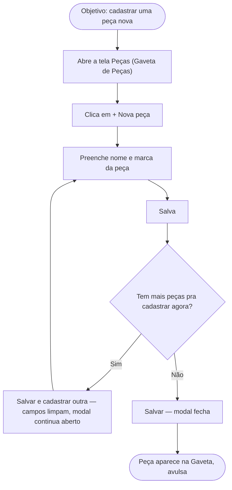
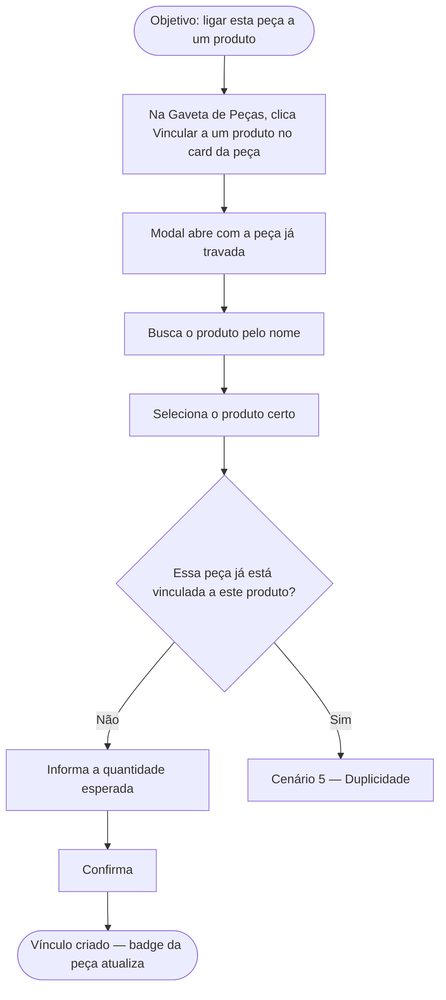
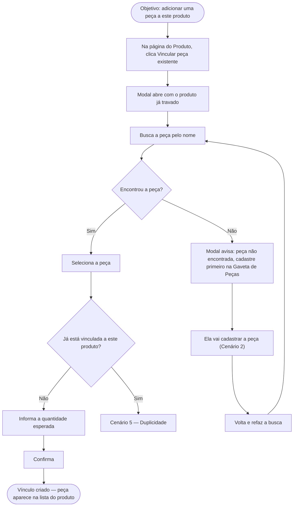
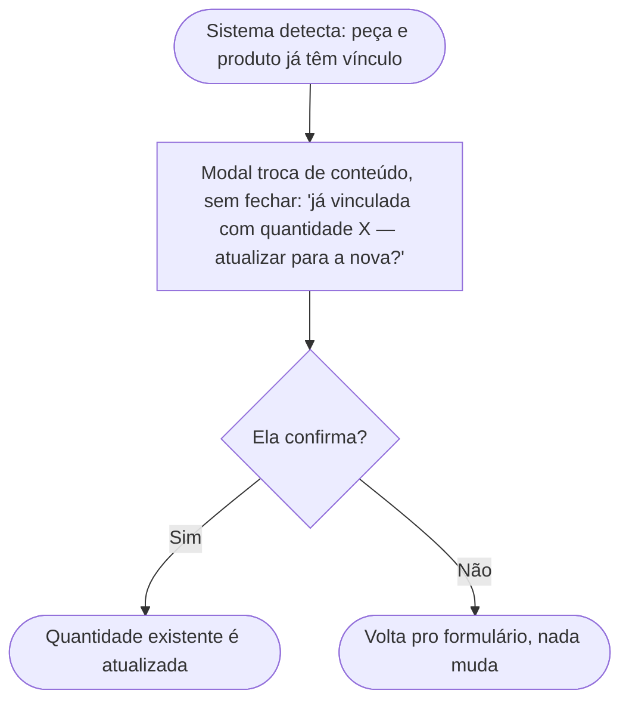
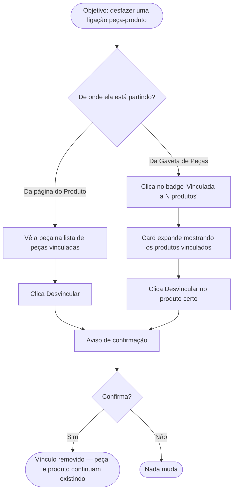
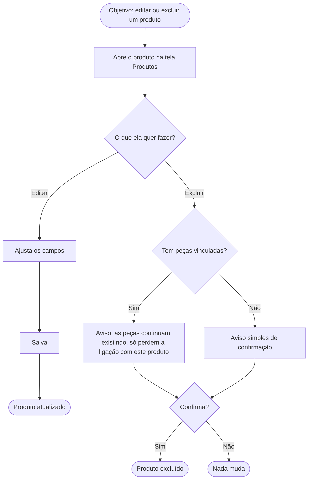
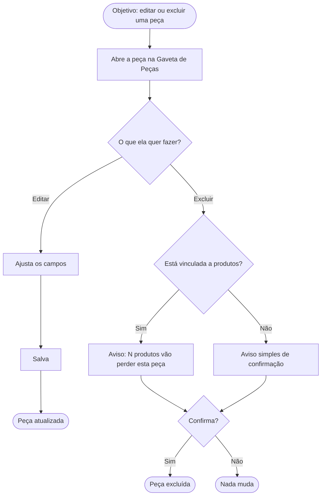

# Checkpoint - Desenho da Gaveta de Peças e Modais de Ação

Continuação direta de [[Análise do UX Flow da Responsável pela Devolução]]. Lá ficou definido o princípio ("objetos autossuficientes") e o diagnóstico do problema. Aqui entram as primeiras decisões concretas de tela — ainda nenhuma virou código.

> [!warning] Idealização em andamento
> Nenhuma linha de código foi escrita a partir desta nota ainda. É desenho de tela e decisão de fluxo, em texto.

## Contexto que originou esta etapa

Depois da análise de persona, Matheus trouxe uma dor mais técnica: "as telas não guiam o usuário... tem coisas que estão sendo abertas e forçadas a entrar na tela... talvez fosse melhor só abrir um modal". Isso deu origem a uma decisão de padrão de interação que passa a valer pra todo o sistema de Peças/Produtos, não só pra uma tela isolada.

## O critério: quando usar modal, quando manter inline

**O QUÊ:** um modal é uma janela que cobre a tela e exige que o usuário termine ou cancele a ação antes de voltar ao que estava fazendo. Inline é um trecho que aparece dentro da própria página, ao lado do que já estava sendo mostrado.

**POR QUÊ isso importava:** as telas atuais (`catalogo.html`) abrem painéis inline (`catalogo-painel-vincular`, `catalogo-painel-nova`, `catalogo-painel-peca-avulsa`) que empurram o resto do conteúdo pra baixo e competem por atenção com o que não tem relação com a ação — é isso que o usuário sente como "forçado a entrar na tela".

**PRA QUÊ resolver:** toda ação principal precisa de um limite visual claro — começo, meio, fim — sem o resto da tela mudar de tamanho ou disputar atenção.

**COMO decidir**, pergunta por pergunta:

| Pergunta | Se sim → | 
|---|---|
| A ação tem começo, meio e fim claros (formulário, confirmação, escolha)? | Modal |
| O usuário precisa de foco total, sem distração do resto da tela? | Modal |
| Depois de concluir, ele volta pro mesmo lugar de onde saiu? | Modal |
| É um ajuste rápido, de um campo só, sem decisão complexa? | Inline |
| A ação já nasce dentro de um componente que o usuário já está focado (apoio a uma decisão em andamento)? | Inline |

## A exceção confirmada: cadastro de Marca e Grupo Fornecedor fica inline

Matheus confirmou diretamente: "a parte de cadastrar marca e grupo está bem organizada e fácil de usar, não precisa virar modal".

Isso não quebra o critério acima — reforça a última linha da tabela. O cadastro de marca/grupo (hoje em `script_marca_widget.js`, caixa `caixa_nova_marca` dentro do próprio seletor) é uma **microação de apoio**: acontece dentro de um componente onde o usuário já está com o foco (escolhendo uma marca), não interrompe nada fora dali, e já tem limite visual próprio (a caixa que abre dentro do painel do seletor).

Isso vira a referência de "ação de apoio bem resolvida" — quando os modais de Peça e Vínculo forem desenhados, o seletor de marca entra dentro deles exatamente como entra hoje no formulário de produto, sem virar modal-dentro-de-modal.

## Mapeamento final de ações

| Ação | Tratamento | Por quê |
|---|---|---|
| Cadastrar peça | Modal | Ação principal, disparada da tela toda, hoje empurra o catálogo inteiro |
| Vincular peça a produto | Modal | Ação principal, hoje busca + confirmação espalhadas na mesma área pequena e confusa |
| Cadastrar marca nova | Inline (mantém como está) | Microação de apoio, já nasce contida dentro do seletor de marca |
| Cadastrar grupo fornecedor novo | Inline (mantém como está) | Mesma razão — apoio dentro do apoio, sem sair do seletor |

## A Gaveta de Peças (tela nova)

**O QUÊ:** uma tela própria, de nível principal na navegação, irmã de "Produtos" — não mais uma sub-tela dependurada em nenhum produto específico.

**POR QUÊ:** hoje não existe um lugar onde a responsável veja "todas as peças que eu já cadastrei", só telas amarradas a um produto (o que viola o princípio de Peça ser um objeto autossuficiente).

**PRA QUÊ:** dar à Peça o mesmo nível de CRUD completo e independente que Produto, Marca e Grupo Fornecedor já têm.

**COMO** ela se organiza:

- **Nome e posição:** "Peças", item de menu no mesmo nível de "Produtos", "Marcas", "Grupos Fornecedores".
- **O que mostra:** grade de cards — foto, nome, marca, e um indicador neutro de vínculo (`Vinculada a 3 produtos` ou `Avulsa`, só informação, sem bloquear nada).
- **Busca/filtro:** por nome, por marca, e por status (Todas / Vinculadas / Avulsas) — pra ela conseguir achar rápido, por exemplo, quais peças cadastrou mas ainda não usou em nenhum produto.
- **Ações por card, sempre disponíveis, independente do estado de vínculo:**
  - Editar
  - Excluir (mesma confirmação que já existe hoje, avisando quantos produtos perdem a peça)
  - Vincular a um produto (abre o modal de vínculo compartilhado)
- **Botão "+ Nova peça"** no topo, sempre visível, abre o modal "Cadastrar peça".

Isso fecha o buraco relatado no teste: "cadastro de peça avulsa OK, mas não dá pra excluir nem alterar" — porque a Gaveta não distingue avulsa de vinculada pra fins de CRUD, só pra fins de exibição do badge.

## O que muda na tela de Produto (fim do `catalogo.html` como está hoje)

**Causa raiz identificada:** `catalogo.html` hoje tenta ser 3 coisas ao mesmo tempo — gerenciar as peças deste produto, cadastrar peça avulsa solta, e buscar peça existente pra vincular. É essa mistura de responsabilidades que gera a confusão relatada nos testes ("MUITO CONFUSO, muito ruim mesmo" ao vincular peça avulsa a um produto).

**Nova proposta:** a página do produto passa a mostrar só as peças **já vinculadas a ele**, com uma ação:

- **"Vincular peça existente"** → abre o **mesmo modal de vínculo** usado na Gaveta de Peças, só que chegando com o produto já pré-selecionado — ela só busca e escolhe a peça.

Nenhum cadastro de peça nova acontece mais de dentro da tela de produto. Quem cadastra peça é sempre a Gaveta de Peças.

### Divisão de responsabilidade (resumo)

| Tela | Responsabilidade |
|---|---|
| Gaveta de Peças | Cadastrar, editar, excluir peça. Iniciar vínculo a partir da peça. |
| Página do Produto | Mostrar peças já vinculadas a ele. Iniciar vínculo a partir do produto. |
| Modal de Vínculo (compartilhado) | A ação de ligar peça↔produto, chamada dos dois lugares acima — mesmo componente, dois pontos de entrada. |

## O modal "Cadastrar peça" — primeiro modal desenhado em detalhe

**Ajuste de nome:** como toda peça passa a nascer avulsa (o vínculo virou uma ação separada e posterior, por escolha), "peça avulsa" deixa de ser um conceito à parte — é só "peça". O modal se chama **"Cadastrar peça"**.

**Campos, na ordem em que ela pensa:**

1. Nome genérico (obrigatório) — o que ela realmente usa no dia a dia
2. Marca (obrigatório) — reaproveita o seletor existente, sem mudança
3. Nome técnico (opcional)
4. Código do fabricante (opcional)
5. Imagem (opcional, com preview — igual já existe hoje)

**Comportamento ao salvar:**

- Erro de validação → modal continua aberto, erro aparece no campo certo, nada do que ela já preencheu se perde.
- Sucesso → dois botões de ação, não um só:
  - **"Salvar"** → salva, fecha o modal, volta pra Gaveta (peça nova aparece na grade)
  - **"Salvar e cadastrar outra"** → salva, confirma rápido ("Peça X cadastrada"), limpa os campos, mantém o modal aberto com foco no campo Nome

> [!example] Por que "Salvar e cadastrar outra" importa
> No cenário do primeiro dia (a responsável acabou de instalar o sistema e precisa cadastrar várias peças antes de vincular qualquer coisa), fechar e reabrir o modal a cada peça seria atrito repetido bem na primeira experiência dela com o sistema. Esse botão transforma um cadastro em massa de "abrir/fechar modal 20 vezes" em um fluxo contínuo.

## O modal "Vincular peça a produto" — segundo modal desenhado em detalhe

**Os dois pontos de entrada — o que já vem resolvido:**

| Chamado de... | Já vem preenchido e travado | O que ela ainda escolhe |
|---|---|---|
| Card de uma peça, na Gaveta de Peças | A peça | O produto |
| Página de um produto | O produto | A peça |

Título do modal muda conforme a origem — "Vincular [peça] a um produto" ou "Vincular peça a [produto]" — ela sempre sabe, pelo título, o que já está decidido e o que falta. Nunca existem os dois lados em aberto ao mesmo tempo — essa é a principal diferença em relação ao fluxo confuso de hoje.

**Busca do lado variável:** mesma experiência de busca ao vivo que já existe (`buscar_pecas`), sozinha no modal, sem painel de vínculo ou de cadastro competindo do lado. Resultado mostra foto + nome + "já usada em: X, Y" (mantém a transparência que já existe hoje, evita duplicar por engano). Clicar trava o campo, com opção de "trocar".

**Quantidade esperada:** campo obrigatório, aparece depois que peça e produto estão definidos. Sem código de barras — isso é coisa de Nova Devolução, não de organização de catálogo (decisão já registrada em [[Análise do UX Flow da Responsável pela Devolução]]).

**Por que cadastrar peça nova não entra aqui:** se ela buscar e não encontrar a peça, o modal não tenta resolver isso ali dentro — mostra "Peça não encontrada. Cadastre primeiro na Gaveta de Peças." com atalho pra lá. Bate com a ordem que ela mesma segue (cadastrar produtos, cadastrar peças, *depois* ligar) e evita modal-dentro-de-modal.

**Duplicidade:** se peça e produto escolhidos já têm vínculo, o modal troca de estado (sem fechar, sem empilhar outro modal) e mostra: "Esta peça já está vinculada a [Produto] com quantidade X. Atualizar para [nova quantidade]?" — confirmou, atualiza a quantidade existente; cancelou, volta pro formulário.

**Desvincular pela Gaveta de Peças:** pra manter simetria com o que já funciona na página do produto (lista de peças vinculadas, cada uma com desvincular — sem ser modal), o card da peça na Gaveta, ao ter o badge "Vinculada a N produtos" clicado, expande **na própria grade** (não é modal — é leitura de lista, não decisão complexa) mostrando os produtos vinculados, cada um com "Desvincular" e o mesmo aviso de confirmação que já existe hoje.

Com isso, o desenho deste modal está fechado.

## Diagramas de fluxo ponta a ponta — cada cenário possível

Antes de desenhar a aparência das telas, Matheus pediu um passo intermediário: mapear o fluxo ponta a ponta de cada cenário possível, pensando nela, no objetivo dela em cada um, e nas ações que ela precisaria tomar. Isso veio antes de qualquer decisão visual (cor, layout, posição de botão) — é o mapa de comportamento que a aparência vai ter que servir depois.

### Diagrama 0 — a jornada geral (o ponto de partida de todos os outros)

Cada seta desse diagrama vira um cenário detalhado abaixo.

### Cenário 1 — Cadastrar Produto

**Objetivo dela:** ter o produto no catálogo, mesmo sem nenhuma peça vinculada ainda.

### Cenário 2 — Cadastrar Peça

**Objetivo dela:** registrar uma peça que ela usa, mesmo sem saber ainda em quais produtos ela entra.

### Cenário 3 — Vincular, partindo da Peça

**Objetivo dela:** dizer em qual produto essa peça específica é usada.

### Cenário 4 — Vincular, partindo do Produto

**Objetivo dela:** montar a composição de peças de um produto específico.

### Cenário 5 — Duplicidade ao vincular

**Objetivo dela:** corrigir a quantidade de um vínculo que já existe, sem criar duplicado.

### Cenário 6 — Desvincular

**Objetivo dela:** remover uma ligação errada, sem apagar a peça nem o produto.

### Cenário 7 — Editar / Excluir Produto

**Objetivo dela:** corrigir dados de um produto ou removê-lo do catálogo.

### Cenário 8 — Editar / Excluir Peça

**Objetivo dela:** corrigir dados de uma peça ou removê-la do catálogo, mesmo se vinculada.

Esses 8 cenários cobrem os quatro pontos originais da persona (cadastrar produto, cadastrar peça, ligar, CRUD completo) mais os casos de borda decididos nas seções anteriores (peça não encontrada, duplicidade, desvincular simétrico).

## Aparência pensada pelo fluxo, não tela por tela

Matheus pediu um passo a mais antes de desenhar a aparência: não pensar em cada tela de forma única, mas em todo o fluxo, pensando em como ela caminha por cada um dos 8 cenários. O método adotado foi inverter a ordem: em vez de desenhar 8 telas, primeiro identificar os **componentes visuais que se repetem** nos cenários e dar a cada um os estados que ele precisa suportar — depois percorrer cada cenário narrando qual componente aparece, em qual estado, a cada passo. É o mesmo princípio de "objetos autossuficientes" aplicado à aparência: construir uma vez, reaproveitar em todo lugar, com consistência.

### Atlas de estados — a base reaproveitada em todos os cenários

**Gaveta de Peças**
- *Vazia (primeiro uso):* espaço central com um ícone/ilustração simples de "nada aqui ainda", frase curta explicando o que fazer, e o botão "+ Nova peça" como única ação em destaque — cor de ação primária, maior que qualquer outro botão da tela.
- *Cheia:* grade de cards em várias colunas, barra de busca/filtro fixa no topo, botão "+ Nova peça" sempre visível, sem precisar rolar a tela.
- *Filtrada:* mesma grade, só os cards que batem com a busca ou o filtro de status aparecem. Zero resultados → mensagem clara "Nenhuma peça encontrada para '[termo]'" no lugar da grade.

**Card de Peça**
- *Base:* foto (ou espaço reservado neutro), nome em destaque, marca embaixo em texto secundário.
- *Avulsa:* badge neutro "Avulsa" — cor cinza, não vermelha. É informação, não alerta.
- *Vinculada:* badge "Vinculada a N produtos" — mesma linguagem visual do badge avulsa, clicável (cursor indica isso).
- *Expandido:* o card cresce revelando a lista de produtos vinculados, cada um com nome + "Desvincular" ao lado; um "recolher" no topo pra fechar de volta.
- *Rodapé fixo, em qualquer estado:* Editar / Excluir / Vincular a um produto — sempre nessa ordem, sempre no mesmo lugar.

**Modal de Peça (criar/editar — mesmo componente, dois modos)**
- Título muda: "Cadastrar peça" ou "Editar peça: [nome]". Fundo da tela atrás esmaecido. "x"/"Cancelar" no canto.
- Campos, na ordem: Nome → Seletor de Marca → Nome técnico → Código do fabricante → Imagem com preview.
- *Erro:* campo com problema ganha borda de alerta + mensagem curta embaixo — o que já foi preenchido continua intacto.
- *Rodapé:* modo criar tem dois botões ("Salvar" em destaque principal, "Salvar e cadastrar outra" em destaque secundário); modo editar tem só "Salvar alterações".

**Modal de Vínculo**
- Título muda conforme a origem: "Vincular [peça] a um produto" ou "Vincular peça a [produto]".
- *Lado travado:* um "chip" — cartão pequeno, não editável, com foto pequena + nome.
- *Lado de busca:* campo abaixo do chip, resultados em lista enquanto ela digita (foto pequena + nome + "já usada em: X, Y").
- *Depois de escolher:* o resultado vira outro chip, campo "Quantidade esperada" aparece embaixo.
- *Duplicidade:* no lugar do campo de quantidade normal, aviso com fundo de atenção (amarelo, não vermelho de erro) mostrando a quantidade atual e um campo pra nova quantidade — botão de confirmar muda de "Vincular" pra "Atualizar quantidade".

**Seletor de Marca** (padrão já existente, referência de bom comportamento)
- Caixa fechada mostrando a marca escolhida, ou "Selecione a marca" quando vazio.
- Clicar abre painel embaixo com busca + lista de marcas (nome + grupo fornecedor em texto secundário).
- "Cadastrar marca nova" no rodapé do painel revela os campos de cadastro rápido sem fechar o painel.

**Aviso de confirmação** (um padrão único, reaproveitado em 3 cenários)
- Caixa central pequena, texto direto sobre a consequência específica — nunca um "tem certeza?" genérico. Botão destrutivo visualmente mais discreto que o Cancelar, pra não incentivar clique acidental.

### Os 8 cenários, com a caminhada completa

**Cenário 1 — Cadastrar Produto**
1. Abre "Produtos" → lista/grade de produtos (ou estado vazio, se for o primeiro produto de todos)
2. Clica "Novo Produto" → abre a página própria de cadastro (Produto sempre teve tela dedicada — isso não muda), foco no campo Nome
3. Preenche nome → clica no Seletor de Marca → painel abre embaixo
4. Marca não existe → "Cadastrar marca nova" revela os campos extras sem fechar o painel
5. Marca escolhida → caixa do seletor fecha mostrando o nome dela
6. Salva → volta pra lista de Produtos, produto novo aparece, sem nenhum aviso de alerta por não ter peça ainda — estado normal, não um erro

**Cenário 2 — Cadastrar Peça**
1. Abre a Gaveta de Peças, no estado vazio ou cheio conforme o caso
2. Clica "+ Nova peça" → Modal de Peça abre no modo criar, foco no Nome
3. Preenche nome → Seletor de Marca abre dentro do modal
4. Salva
5. "Salvar e cadastrar outra" → campos limpam na hora, foco volta pro Nome, modal nem pisca
6. "Salvar" → modal fecha, Gaveta reaparece com a peça nova, com destaque temporário nela confirmando visualmente que funcionou

**Cenário 3 — Vincular, partindo da Peça**
1. Na Gaveta, clica "Vincular a um produto" no rodapé do card
2. Modal de Vínculo abre — a peça já aparece como chip travado
3. Busca o produto → lista de resultados aparece abaixo
4. Escolhe → resultado vira chip, campo "Quantidade esperada" aparece
5. Sem duplicidade → preenche quantidade, confirma
6. Modal fecha, badge do card muda de "Avulsa" pra "Vinculada a 1 produto" na hora

**Cenário 4 — Vincular, partindo do Produto**
1. Na página do Produto, clica "Vincular peça existente"
2. Modal de Vínculo abre — o produto já aparece como chip travado
3. Busca a peça
4. Encontrou → mesmo caminho do Cenário 3 a partir daqui
5. Não encontrou → aviso único dentro do modal: "Peça não encontrada. Cadastre primeiro na Gaveta de Peças" com um link
6. Ela cadastra a peça (Cenário 2 completo) e volta — a busca no modal de Vínculo continua de onde parou

**Cenário 5 — Duplicidade**
1. Confirma peça + produto que já têm vínculo
2. No lugar do campo de quantidade normal, aparece o aviso de atenção com a quantidade atual visível
3. Botão de ação muda de texto pra "Atualizar quantidade"
4. Confirma → quantidade atualizada, modal fecha
5. Cancela → volta pro estado anterior do modal, nada muda

**Cenário 6 — Desvincular**
1. Pela página do Produto: peça aparece na lista de vinculadas, com "Desvincular" ao lado
2. Pela Gaveta: clica no badge "Vinculada a N produtos" → card expande, mostra a lista de produtos, cada um com "Desvincular"
3. Nos dois casos, aparece o Aviso de confirmação padrão
4. Confirma → vínculo some da lista/card na hora, sem recarregar a tela toda

**Cenário 7 — Editar / Excluir Produto**
1. Abre o produto → mesma página de cadastro, agora preenchida
2. Editar: ajusta campos, salva, volta pra lista com o produto atualizado
3. Excluir: Aviso de confirmação, com a frase específica sobre as peças vinculadas continuarem existindo
4. Confirma → produto sai da lista

**Cenário 8 — Editar / Excluir Peça**
1. Na Gaveta, clica "Editar" no card → Modal de Peça abre no modo editar, já preenchido, título "Editar peça: [nome]"
2. Ajusta, clica "Salvar alterações" (único botão nesse modo) → modal fecha, card atualiza na Gaveta
3. Excluir: Aviso de confirmação, com a frase específica sobre quantos produtos perdem a peça
4. Confirma → card some da Gaveta

## Em aberto

- [ ] Desenhar visualmente o card de peça na Gaveta (grade vs. lista, o que o badge de vínculo mostra exatamente)
- [ ] Decidir a navegação: onde exatamente "Peças" entra no menu em relação a "Produtos"
- [ ] Nenhuma linha de código foi escrita ainda

## Relacionado

- [[Análise do UX Flow da Responsável pela Devolução]]
- [[Checkpoint - Repensando o Catalogo de Pecas (Peca Independente de Produto)]]
- [[Checkpoint - Catálogo de Peças e Tela de Produtos]]
- [[Ciclo de Trabalho Calmo (Idealizar Planejar Executar Analisar Corrigir Otimizar Validar)]]
